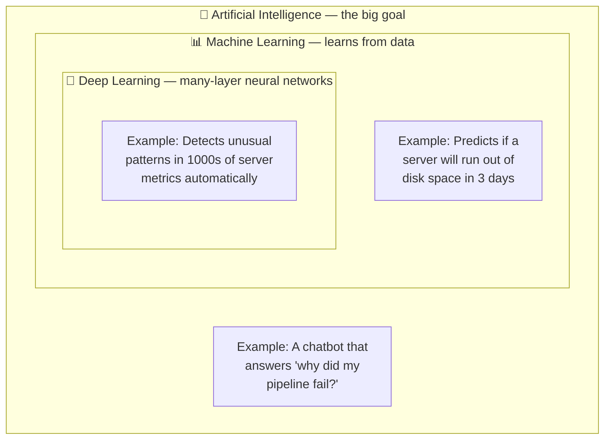
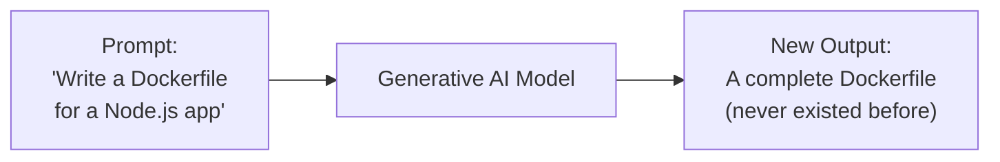
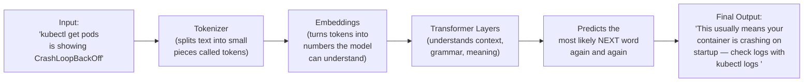
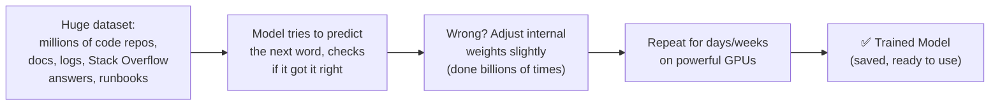
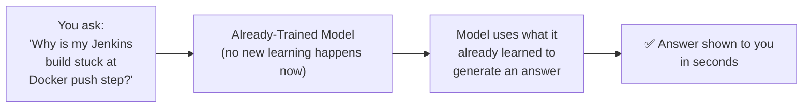
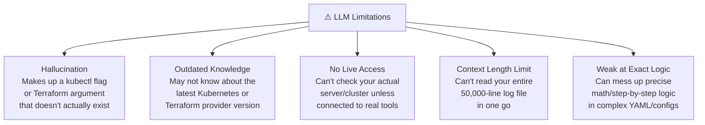
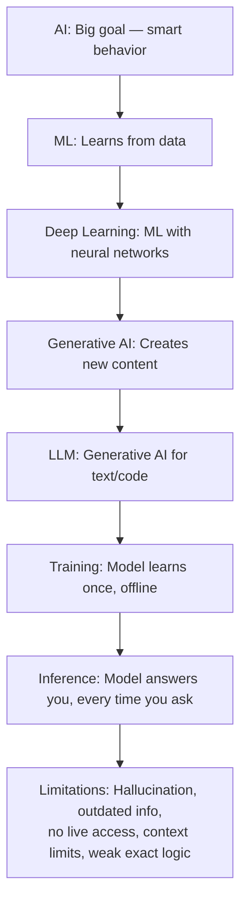

# Day 1 — AI / ML / GenAI Basics
### (Explained in simple language, with DevOps examples only)

---

## 1. AI vs ML vs Deep Learning

Think of it like **three boxes, one inside the other.**

- **AI (Artificial Intelligence)** = the big goal → make a machine act "smart" like a human.
- **ML (Machine Learning)** = one way to achieve AI → the machine **learns from data** instead of being told exact rules.
- **Deep Learning (DL)** = a special type of ML that uses **neural networks with many layers**, good at very complex patterns (like understanding language or images).

**DevOps way to remember it:**
| Term | Simple meaning | DevOps Example |
|---|---|---|
| AI | Smart behavior, however achieved | An assistant that answers on-call questions |
| ML | Learns patterns from past data | Predicts server crash before it happens, using past CPU logs |
| DL | ML using deep neural networks | Detects weird log patterns across thousands of microservices at once |

**Rule of thumb:** All Deep Learning is ML. All ML is AI. Not all AI is ML (some AI is just hardcoded rules, like a simple `if-else` alert script).

---

## 2. Generative AI

Regular ML/AI often **predicts a number or a label** (e.g., "will this deployment fail? Yes/No").

**Generative AI** is different — it **creates new content**: text, code, images, etc.

**DevOps examples of Generative AI:**
- Ask it to **write a Terraform script** for an S3 bucket → it generates one from scratch.
- Ask it to **write a postmortem report** after an outage → it drafts the whole document.
- Ask it to **explain a cryptic Jenkins error log** → it generates a plain-English explanation.

So: Generative AI doesn't just classify or predict — it **produces new stuff** based on a prompt.

---

## 3. LLMs (Large Language Models)

An LLM is a **Generative AI model that specializes in text/code**. It's "large" because it's trained on a huge amount of text (docs, code, books, forums) and has billions of internal parameters.

**How it processes your input (simple flow):**

**Key idea:** An LLM doesn't "think" like a human. It's really good at predicting **"what word/token comes next"** based on patterns it saw during training — but it does this so well that it feels like understanding.

**DevOps example:** You paste a Jenkins pipeline error into an LLM chatbot. It doesn't magically "know" your server — it recognizes the **pattern** of the error text (because it has seen millions of similar errors during training) and predicts a helpful explanation.

---

## 4. Training vs Inference

This is one of the most important concepts — and a great DevOps analogy is **onboarding a new engineer vs that engineer being on-call.**

### Training = Learning phase (happens once, offline, very expensive)

*Like a new DevOps engineer spending weeks reading internal wikis, past incident reports, and shadowing calls — slowly building understanding.*

### Inference = Using the trained model (happens every time you ask it something, fast & cheap)

*Like that same engineer, now fully onboarded, answering an on-call page using what they already learned — they aren't studying a new wiki page mid-incident.*

| | Training | Inference |
|---|---|---|
| When | Once (or occasionally, to update model) | Every single time you send a prompt |
| Cost | Very expensive, takes days/weeks, huge GPU clusters | Cheap and fast, seconds |
| DevOps analogy | New engineer's onboarding period | Engineer answering a live on-call ticket |
| Does it "learn" from your question? | N/A | ❌ No — it doesn't permanently learn from your one chat |

---

## 5. LLM Limitations

LLMs are powerful, but they are **not perfect**. Important to know these before trusting them blindly in production DevOps work.

**DevOps examples of each:**

1. **Hallucination** — It confidently suggests `kubectl scale deployment --auto` (not a real flag) because it *sounds* plausible.
2. **Outdated knowledge** — It might recommend a deprecated GitHub Actions syntax if it was trained before an update was released.
3. **No live access** — It can't tell you *your* actual pod status unless it's connected to a real tool/plugin that queries your cluster.
4. **Context limit** — If you paste a massive log file, it may only "see" and use part of it.
5. **Weak exact logic** — It might miscount indentation levels in a long YAML file, causing a broken manifest.

**Golden rule for DevOps use:** Always **verify AI-generated scripts, configs, and commands** in a safe/staging environment before running them in production — never trust and deploy blindly.

---

## Quick Recap (Day 1)

**[Day 2 — How LLMs Work:](https://github.com/saghosh8/AI-For-DevOps/blob/main/Week%201%20%E2%80%94%20LLM%20%26%20GenAI%20Foundations/Day%202%20%E2%80%94%20How%20LLMs%20Work.md)** Prompt Engineering, Embeddings, and how DevOps teams actually use LLMs (chatbots, copilot in IDE, RCA/postmortem generation, ChatOps).
