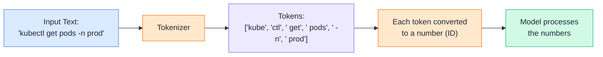
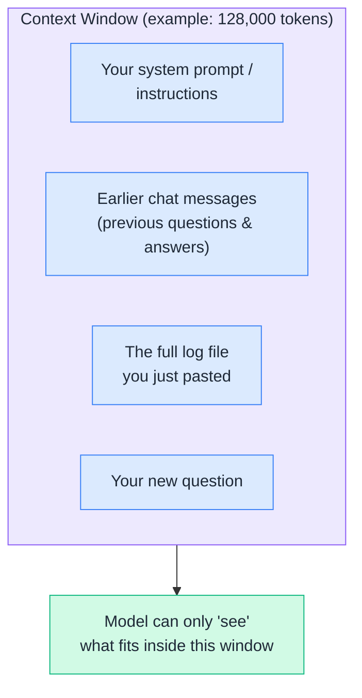
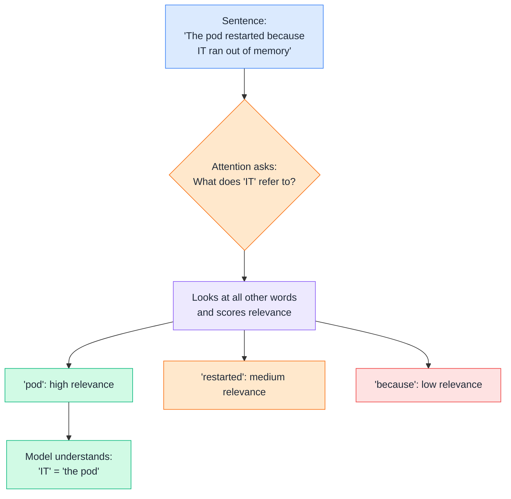
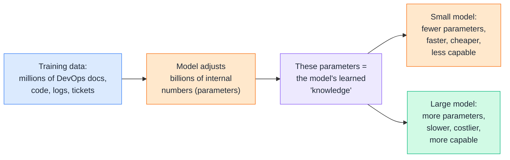
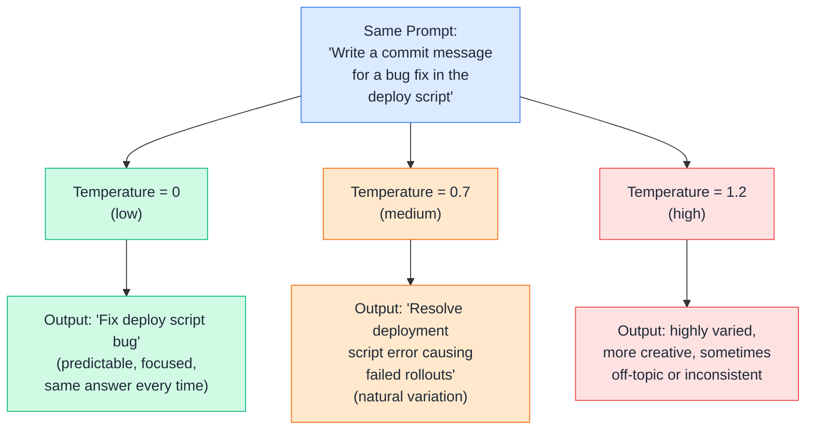
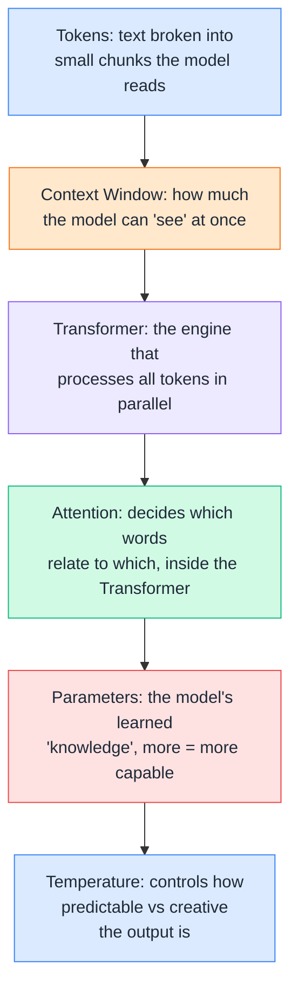

# Day 2 — How LLMs Work

---

## 1. Tokens

An LLM doesn't read words the way humans do. It breaks text into small chunks called **tokens**. A token can be a full word, part of a word, a symbol, or even a space.

**Why it matters for DevOps:**
- Long commands, YAML files, and stack traces get split into **many** tokens — a single 200-line `values.yaml` file could be 2,000+ tokens.
- Most LLM APIs (and pricing) are based on **tokens in + tokens out**, not "words" or "characters."
- Weird strings like Kubernetes pod hashes (`nginx-7d8f8c9c6-xk2pl`) get chopped into several odd tokens, which is why LLMs sometimes get confused by long random IDs.

**DevOps example:** If you paste a huge Terraform plan output asking "why did this fail?", you're sending thousands of tokens — this affects both cost and whether it fits in the model's memory (see next topic).

---

## 2. Context Window

The **context window** is the **maximum number of tokens** the model can "see" at once — think of it as the model's short-term memory for a single conversation.

**DevOps example:**
- You're debugging a production incident and keep pasting logs into the same chat.
- Once the total conversation (old messages + new logs) crosses the context window limit, the **oldest messages get pushed out** — the model literally can't "remember" them anymore, even though they're still visible on your screen.
- This is why for a huge 50,000-line log file, it's better to **share only the relevant error section**, not the entire file.

**Simple analogy:** Context window = the size of a whiteboard. You can only write so much on it. If you keep adding new notes, old notes at the edge get erased to make room.

---

## 3. Transformer Basics

The **Transformer** is the core architecture (the "engine") behind almost all modern LLMs. Its key innovation: it looks at **all the words in the input at once** (in parallel) and figures out how they relate to each other — instead of reading one word at a time like older models did.

```mermaid
flowchart LR
    A["Input tokens:\n'Pod crashed because\nmemory limit exceeded'"] --> B["Step 1: Embeddings\n(tokens to numbers)"]
    B --> C["Step 2: Attention\n(figure out which words\nrelate to which)"]
    C --> D["Step 3: Feed-Forward Layers\n(process the info further)"]
    D --> E["Repeat Steps 2-3\nmany times (many layers)"]
    E --> F["Output: predicts next token,\nbuilds full answer\nword by word"]

    classDef blue fill:#DBEAFE,stroke:#3B82F6,color:#1F2937
    classDef orange fill:#FFE8CC,stroke:#F97316,color:#1F2937
    classDef purple fill:#EDE9FE,stroke:#8B5CF6,color:#1F2937
    classDef green fill:#D1FAE5,stroke:#10B981,color:#1F2937

    class A blue
    class B orange
    class C purple
    class D orange
    class E purple
    class F green
```

**DevOps analogy:** Imagine a senior SRE reading an entire incident timeline **all at once** (not line by line, forgetting earlier lines) — instantly connecting "memory limit exceeded" in line 3 with "OOMKilled" in line 47. That's what the Transformer's parallel processing lets the model do.

---

## 4. Attention — High Level

**Attention** is the mechanism inside the Transformer that decides: *"For this word, which other words in the input matter most?"*

**DevOps example:** In the sentence *"The deployment failed because the image tag was wrong, so it rolled back"* — attention helps the model correctly link **"it"** back to **"the deployment"**, not to "the image tag." This is how the model keeps track of what's being talked about across a long paragraph or log trace, even with many technical terms in between.

**Simple way to remember it:** Attention = the model highlighting the most relevant earlier words in yellow marker before deciding what to say next.

---

## 5. Model Parameters

**Parameters** are the internal "settings" (numbers/weights) the model learned during training. More parameters generally means the model can capture more complex patterns — but also needs more compute to run.

**DevOps analogy:** Think of parameters like the number of **runbooks + past-incident patterns** an engineer has memorized.
- A **junior engineer** (small model) knows the basics — fast to consult, but may miss subtle issues.
- A **principal SRE with 15 years of experience** (large model) has seen far more edge cases — slower to "think it through" and more expensive to hire, but handles complex, unusual failures better.

**Practical DevOps note:** This is why teams often use a **smaller/cheaper model** for simple tasks (like formatting a YAML file) and a **larger model** for complex tasks (like root-causing a multi-service outage).

---

## 6. Temperature

**Temperature** is a setting that controls how "random" or "creative" the model's output is, when picking the next token.

**DevOps examples:**
- **Low temperature (0 – 0.3):** Best for generating **Terraform/Kubernetes YAML, shell scripts, or exact configs** — you want consistent, predictable, "safe" output every time you run it.
- **Higher temperature (0.7 – 1.0+):** Better for **brainstorming**, like generating multiple different postmortem summary drafts or naming ideas for a new microservice — variety is welcome there.

**Rule of thumb for DevOps automation:** If you're generating code/configs that will actually run in production, **keep temperature low** — you want the same, reliable, boring answer every single time, not creative surprises.

---

## Quick Recap (Day 2)

---

## ⭐ Support

If you found this repository useful:

---
