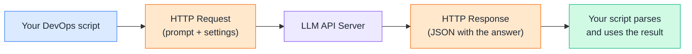
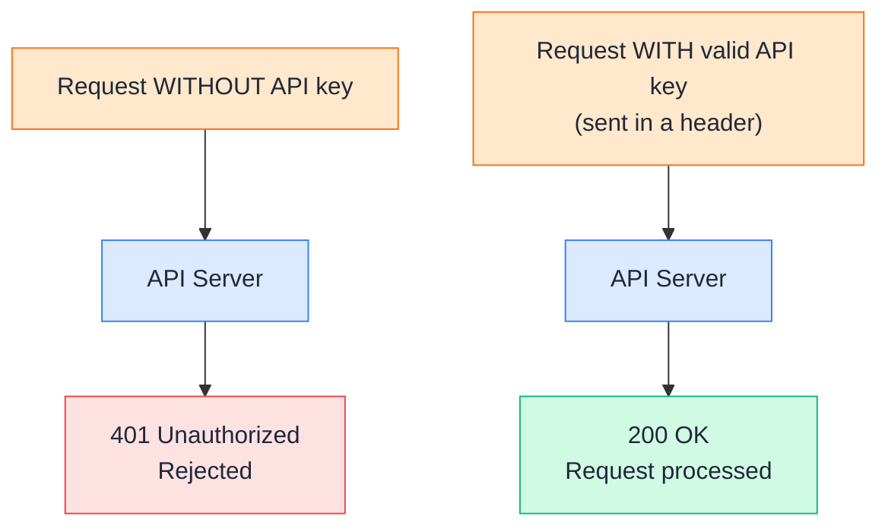
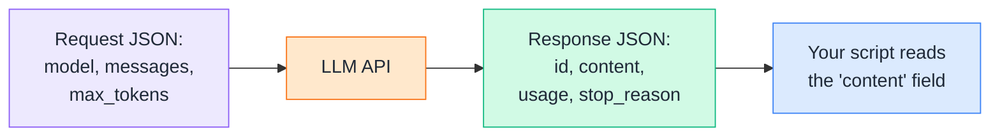
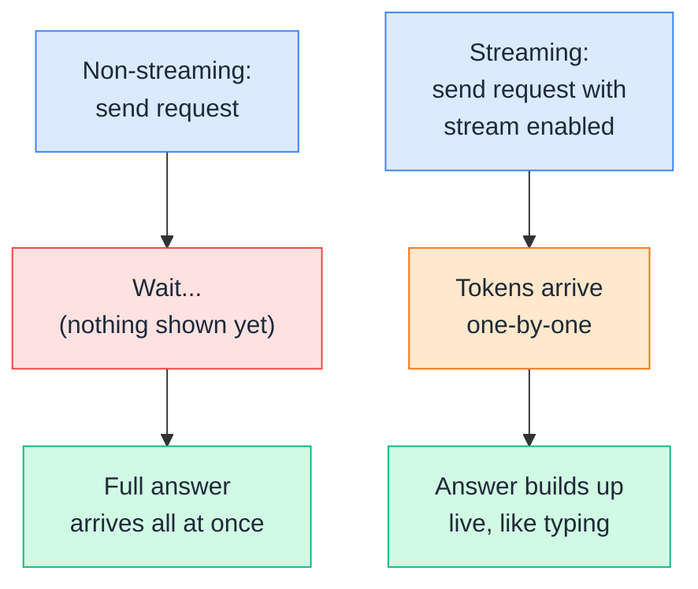
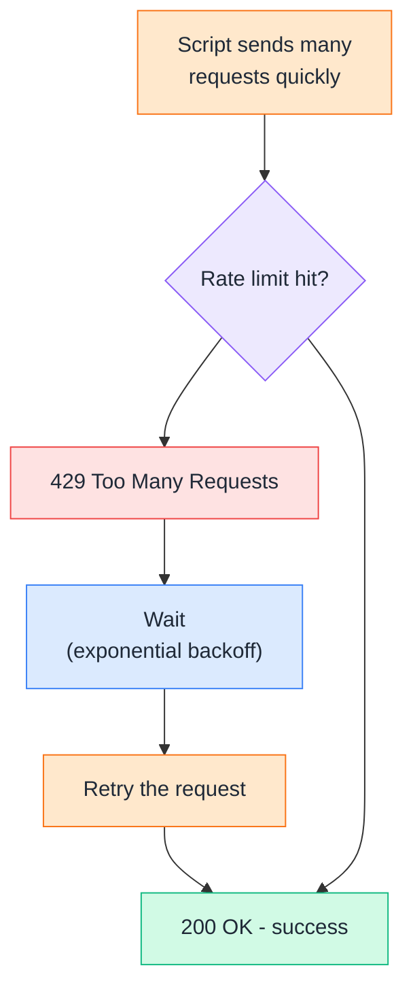
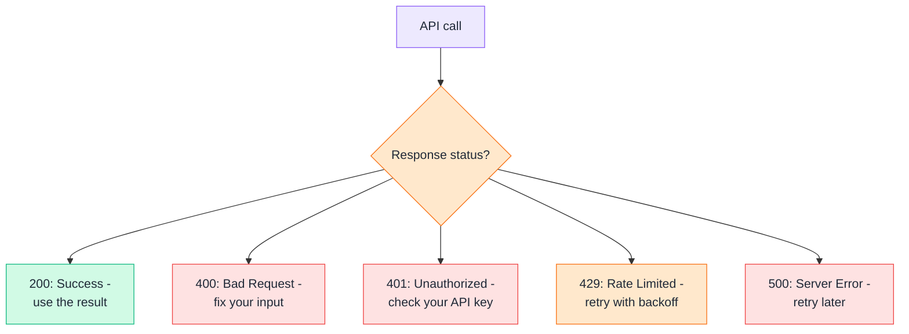
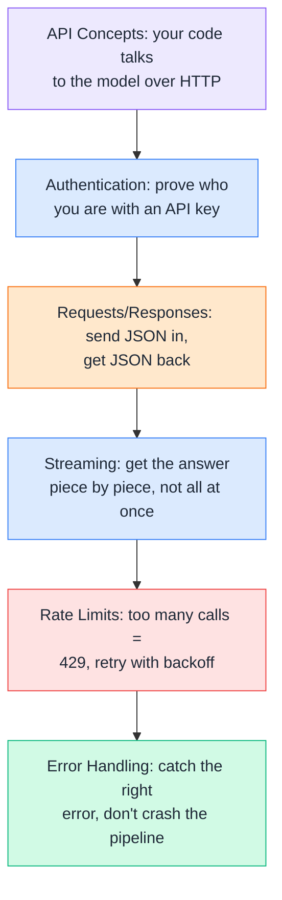

# Day 4 — LLM APIs

---

## 1. API Concepts
### 📖 Theory

An **LLM API** lets your code talk to a model over the internet, instead of you typing into a chat window. Your script sends a request (a prompt + settings), and the API sends back a response (the model's answer) — the same request/response pattern as any other web API you've called in DevOps work (like a Kubernetes API server or a cloud provider's API).



**DevOps example:** Instead of copy-pasting error logs into a chatbot by hand every time an alert fires, you write a script that automatically sends the log to the LLM API and posts the explanation straight into your Slack incident channel — the API is what makes that automation possible.

> Theory-only — this is the mental model for everything else in this chapter. The actual "doing" starts in the next sections.

---

## 2. Authentication
### 🧪 Practical

Every request to an LLM API needs to prove **who is calling** — this is done with an **API key**, sent in a request header. No valid key, no response.



**DevOps example:** Just like you'd never hardcode a database password into a script, you should never hardcode an API key into code — store it as a **secret** (environment variable, Kubernetes Secret, Vault, GitHub Actions secret) and load it at runtime.

**🧪 Try it yourself:**
```python
import os
from anthropic import Anthropic

# Good practice: read the key from an environment variable,
# never hardcode it directly in your script.
client = Anthropic(api_key=os.environ["ANTHROPIC_API_KEY"])

print("Client created — key was loaded from the environment, not the code.")
```
```
1. Set the key in your terminal first:
   export ANTHROPIC_API_KEY="your-real-key-here"
2. Run the script above.
3. Now try removing the export and re-running it -
   you'll get an authentication error, which is exactly
   the "no key, no access" behavior shown in the diagram.
```

---

## 3. Requests & Responses
### 🧪 Practical

A request has a defined shape (which model to use, your message, how long the reply can be). The response comes back as **JSON** with the model's reply plus metadata like token usage.



**DevOps example:** A monitoring script sends a request asking the model to explain a Kubernetes event, then reads just the `content` field of the JSON response and drops it into a ticket description — everything else in the response (token counts, IDs) can be ignored or logged for cost tracking.

**🧪 Try it yourself:**
```python
from anthropic import Anthropic

client = Anthropic()

response = client.messages.create(
    model="claude-sonnet-4-5",
    max_tokens=100,
    messages=[
        {"role": "user", "content": "Explain 'kubectl rollout status' in one line"}
    ]
)

print("Answer:", response.content[0].text)
print("Tokens used:", response.usage)
```
```
1. Run this and look at the two printed lines.
2. Notice the answer text and the usage numbers come
   from two different parts of the same JSON response.
3. Change max_tokens to a very small number (like 5) and
   run again - see how the answer gets cut off.
```

---

## 4. Streaming
### 🧪 Practical

By default, an API call waits until the **entire** answer is ready before sending anything back. **Streaming** sends the answer back **piece by piece** as it's generated — useful for long answers, so the user (or your terminal/UI) sees progress immediately instead of a long silent wait.



**DevOps example:** A CLI tool that explains build failures feels much more responsive if it prints the explanation live, word by word, instead of the terminal sitting frozen for 10 seconds while a long root-cause analysis is generated behind the scenes.

**🧪 Try it yourself:**
```python
from anthropic import Anthropic

client = Anthropic()

with client.messages.stream(
    model="claude-sonnet-4-5",
    max_tokens=200,
    messages=[
        {"role": "user", "content": "List 3 common causes of a Jenkins build failure"}
    ]
) as stream:
    for text in stream.text_stream:
        print(text, end="", flush=True)
```
```
1. Run this and watch the answer print out gradually,
   piece by piece, instead of all at once.
2. Compare this to the non-streaming example from
   Section 3, where the full answer appeared in one go.
```

---

## 5. Rate Limits
### 🧪 Practical

Every API enforces **rate limits** — a cap on how many requests (or tokens) you can send per minute. Send too many too fast, and you get a `429 Too Many Requests` error instead of an answer. The standard fix is **retrying with backoff** — wait a little longer after each failed attempt.



**DevOps example:** A batch job that summarizes 5,000 log entries overnight will almost certainly hit rate limits if it fires all requests at once — the fix is the same pattern you'd use for any flaky downstream dependency: retry with exponential backoff, plus a small delay between calls.

**🧪 Try it yourself:**
```python
import time
from anthropic import Anthropic, RateLimitError

client = Anthropic()

for attempt in range(5):
    try:
        response = client.messages.create(
            model="claude-sonnet-4-5",
            max_tokens=50,
            messages=[{"role": "user", "content": "Summarize: disk usage at 95%"}]
        )
        print(response.content[0].text)
        break
    except RateLimitError:
        wait = 2 ** attempt
        print(f"Rate limited, retrying in {wait}s...")
        time.sleep(wait)
```
```
1. This loop tries up to 5 times.
2. Each time it hits a rate limit, it waits LONGER than
   the last attempt before trying again (1s, 2s, 4s...).
3. This "exponential backoff" pattern is the same one
   used for retrying flaky calls to any external service,
   not just LLM APIs.
```

---

## 6. Error Handling
### 🧪 Practical

API calls fail for many reasons — bad input, network issues, server problems, rate limits. Good error handling means catching the **right** error type and reacting appropriately, instead of letting your whole script crash.



**DevOps example:** An automation pipeline that calls the LLM API as one step should never let a single bad response take down the whole pipeline — wrap the call in proper error handling so a `429` triggers a retry, a `401` triggers a clear "check your secret" alert, and a `500` gets logged and skipped rather than crashing the job.

**🧪 Try it yourself:**
```python
from anthropic import Anthropic, APIError, APIConnectionError, RateLimitError

client = Anthropic()

try:
    response = client.messages.create(
        model="claude-sonnet-4-5",
        max_tokens=50,
        messages=[{"role": "user", "content": "Explain OOMKilled in one line"}]
    )
    print(response.content[0].text)
except RateLimitError:
    print("Too many requests — back off and retry.")
except APIConnectionError:
    print("Network issue — check connectivity and retry.")
except APIError as e:
    print(f"API error: {e}")
```
```
1. Run this normally - it should succeed and print an answer.
2. Now break your API key on purpose (add extra characters
   to it) and run again - see which except block catches it.
3. This pattern - specific error types before a general
   catch-all - is the same style you'd use handling errors
   from any cloud SDK (AWS boto3, kubernetes client, etc).
```

---

## Quick Recap (Day 4)



---

## ⭐ Support

If you found this repository useful:

<a href="https://github.com/saghosh8/AI-For-DevOps">
  
</a>

---

## 💬 Have a Query

Have a question, suggestion, or idea?

<a href="https://github.com/saghosh8/AI-For-DevOps/discussions/3">
  
</a>

---

| 📘 Next — Day 5: Models & Model Selection.md | [](https://github.com/saghosh8/AI-For-DevOps/blob/main/Week%201%20%E2%80%94%20LLM%20%26%20GenAI%20Foundations/Day%205%20%E2%80%94%20Models%20%26%20Model%20Selection.md) |
| ---------------------------------- | -------------------------------------------------------------------------------------------------------------------------------------------------------------------------------------------------------- |
