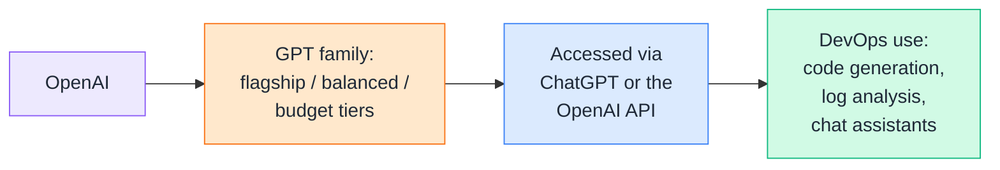
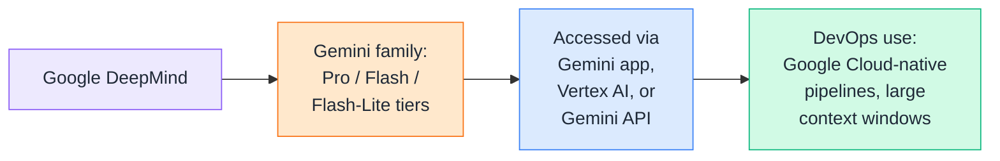
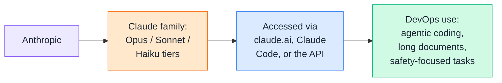
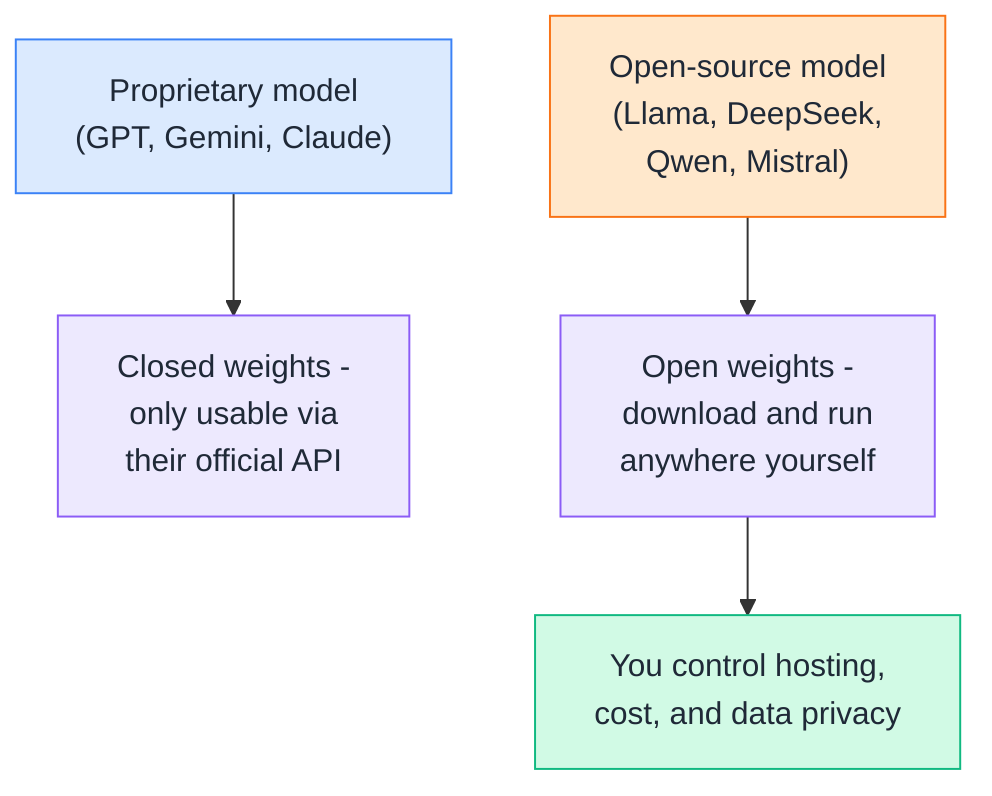
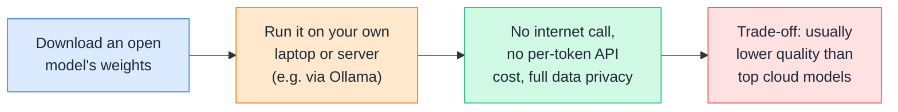
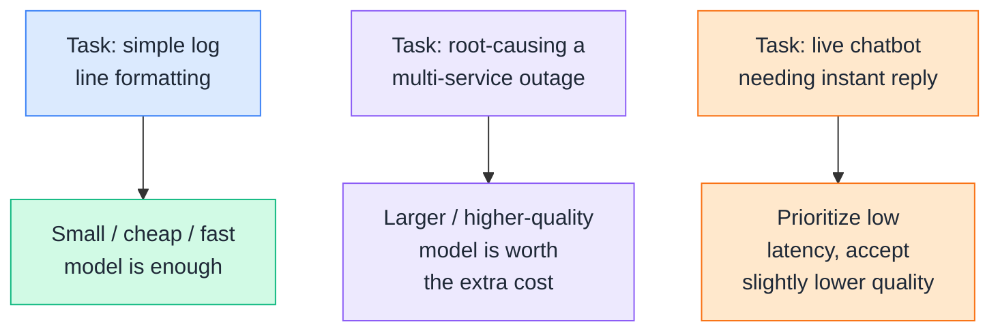
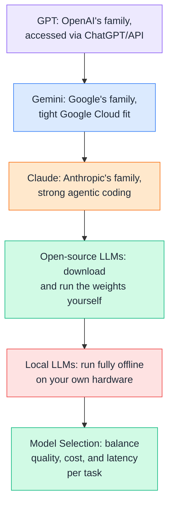

# Day 5 — Models & Model Selection

---

## 1. GPT
### 📖 Theory

**GPT** is OpenAI's model family, accessed through ChatGPT or the OpenAI API. Like most providers, OpenAI ships models in tiers — a flagship model for the hardest tasks, a balanced mid-tier model, and a cheaper/faster budget model for high-volume, simpler work.



**DevOps example:** A team might use OpenAI's flagship-tier model for generating complex Terraform modules from scratch, but switch to the budget-tier model for simpler, high-volume tasks like formatting commit messages — same provider, different tier depending on the job's difficulty.

**Note:** Exact model names and version numbers change frequently (new releases every few months) — always check OpenAI's own model documentation for the current lineup rather than memorizing a specific version number.

---

## 2. Gemini
### 📖 Theory

**Gemini** is Google's model family, built by Google DeepMind. It's accessed through the Gemini app, Google's Vertex AI platform, or the Gemini API — and tends to integrate tightly with the rest of Google Cloud.



**DevOps example:** A team already running everything on Google Cloud (GKE, Cloud Build, BigQuery) often reaches for Gemini first, since it plugs into Vertex AI alongside their existing infrastructure and IAM setup — no extra vendor to onboard.

**Note:** Just like GPT, Gemini's exact model names shift often (Pro/Flash/Flash-Lite naming and version numbers get updated regularly) — check Google's Gemini API docs for what's current.

---

## 3. Claude
### 📖 Theory

**Claude** is Anthropic's model family, accessed through claude.ai, Claude Code, Claude apps (like Claude for Excel or Chrome), or the Anthropic API. Anthropic also ships in tiers — larger models for complex reasoning and coding, smaller ones for fast, cheap, high-volume work.



**DevOps example:** A platform team building an internal "explain this Terraform plan" bot might use Claude through Claude Code or the API specifically because of its strong agentic coding ability — letting it read a repo, understand context across many files, and suggest a fix, not just answer a single isolated question.

**Note:** As with the other providers, exact Claude model names and tiers get updated over time — check Anthropic's own documentation for the current lineup.

---

## 4. Open-Source LLMs
### 🧪 Practical

**GPT, Gemini, and Claude are closed/proprietary** — you can only use them through their official app or API; you never get the actual model file. **Open-source (open-weight) LLMs** are different — the model's weights are published publicly, so you can download them and run them yourself.



**DevOps example:** A company with strict data-residency rules (e.g. healthcare or government workloads) can't send sensitive logs to any external API — so they self-host an open-source model like Llama or DeepSeek inside their own VPC, keeping every request within their own network boundary.

**Popular open-source families right now:** Meta's Llama, DeepSeek, Alibaba's Qwen, Mistral, and Zhipu's GLM — the leaderboard shifts fast, so treat any specific "best one" ranking as temporary.

**🧪 Try it yourself:**
```
1. Search "Ollama" (a free tool for running open models locally).
2. Look at its list of supported models (Llama, Qwen,
   DeepSeek, Mistral, and others are usually available).
3. Notice you can pick a small model (a few GB) that runs
   on a laptop, versus a huge one that needs a serious GPU -
   open-source gives you that size/hardware choice, which
   closed APIs don't.
```

---

## 5. Local LLMs
### 🧪 Practical

Running a **local LLM** means the model runs entirely on hardware you control — your laptop, an on-prem server, or a private cloud VM — instead of calling out to someone else's API over the internet.



**DevOps example:** A CI/CD pipeline that runs inside an air-gapped environment (no outbound internet access allowed, common in defense or banking) can't call any cloud LLM API at all — a local model is the *only* way to add AI-assisted log analysis to that pipeline.

**🧪 Try it yourself:**
```
1. Install Ollama on your machine (ollama.com).
2. Run: ollama pull llama3.2
3. Run: ollama run llama3.2
4. Ask it: "Explain what CrashLoopBackOff means in
   Kubernetes."
5. Notice this works completely offline once the model
   is downloaded - no API key, no internet needed, and
   nothing you type ever leaves your machine.
```

---

## 6. Model Selection: Quality vs Cost vs Latency
### 🧪 Practical

Picking a model is always a **trade-off between three things**: how good the answer is (quality), how much it costs per request (cost), and how fast it replies (latency). You rarely get all three maxed out at once — a bigger, smarter model usually costs more and replies slower; a smaller, cheaper model replies fast but may miss subtle issues.



**DevOps example:** A real pipeline often uses **more than one model tier on purpose** — a cheap/fast model classifies every incoming alert as low/medium/high severity (thousands of alerts a day, needs to be cheap and fast), while only the high-severity ones get escalated to a bigger, higher-quality model for a full root-cause writeup (a handful a day, worth paying more for accuracy).

**🧪 Try it yourself:**
```python
def pick_model(task_type: str) -> str:
    """
    A simple router: cheap/fast model for routine
    classification, bigger model for deep analysis.
    """
    routine_tasks = {"classify_severity", "format_log", "tag_ticket"}
    complex_tasks = {"root_cause_analysis", "postmortem_draft"}

    if task_type in routine_tasks:
        return "small-fast-model"   # optimize for cost + latency
    elif task_type in complex_tasks:
        return "large-quality-model"  # optimize for quality
    else:
        return "balanced-model"     # reasonable default

print(pick_model("classify_severity"))       # -> small-fast-model
print(pick_model("root_cause_analysis"))     # -> large-quality-model
```
```
1. Run this function with a few different task names.
2. Notice this is exactly the kind of decision real DevOps
   automation makes - not "which model is best overall,"
   but "which model is the right trade-off for THIS task."
```

---

## Quick Recap (Day 5)



---

## ⭐ Support

If you found this repository useful:

<a href="https://github.com/saghosh8/AI-For-DevOps">
  
</a>

---

## 💬 Have a Query

Have a question, suggestion, or idea?

<a href="https://github.com/saghosh8/AI-For-DevOps/discussions/3">
  
</a>

---

| 📘 Next — Day 6 | <a href="https://github.com/saghosh8/AI-For-DevOps/blob/main/Week%201%20%E2%80%94%20LLM%20%26%20GenAI%20Foundations/Day%206.md"></a> |
| ------------------------------ | -------------------------------------------------------------------------------------------------------------------------------------------------------------------------------------------------------------------------------------------------------------------------------- |
