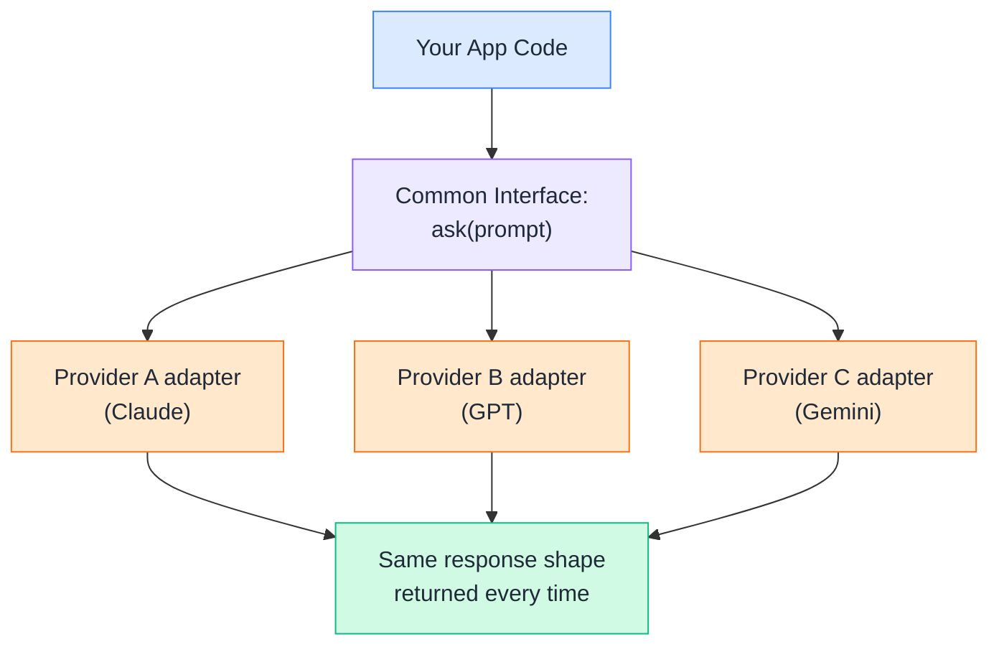
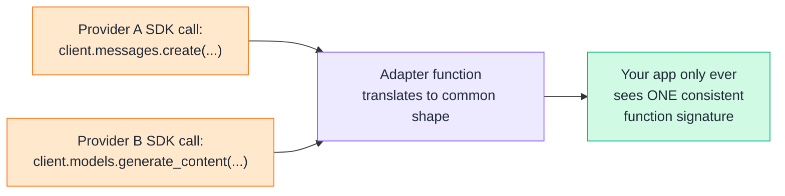
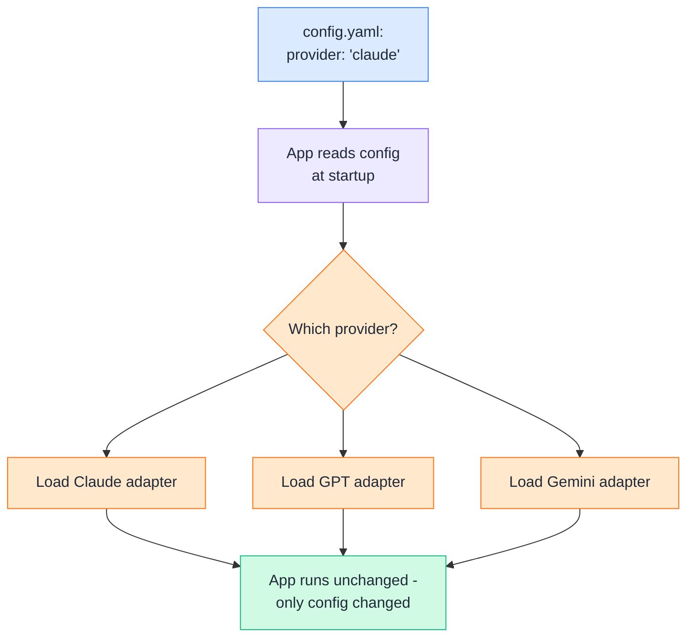
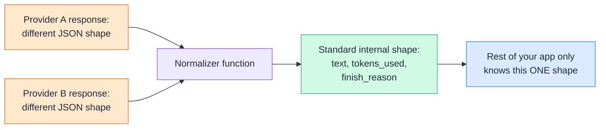
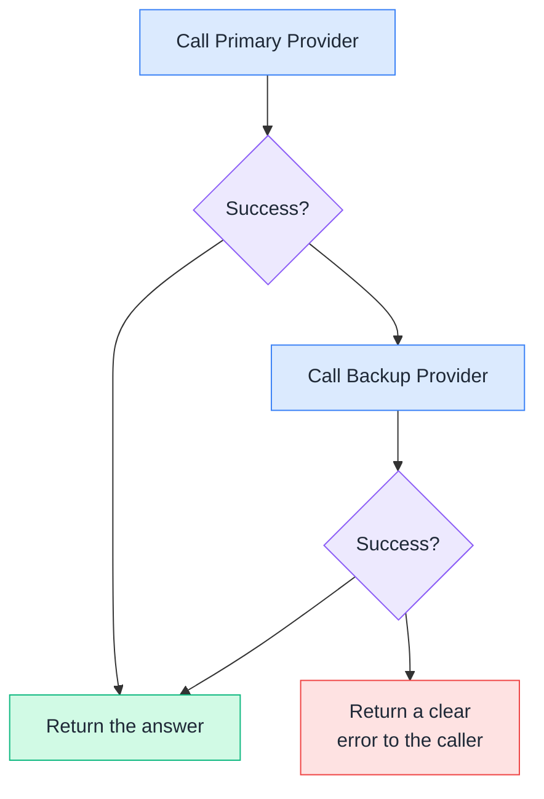
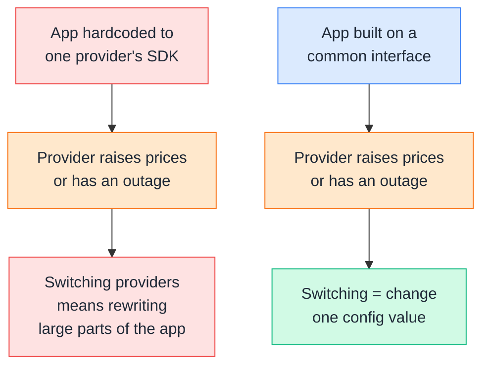
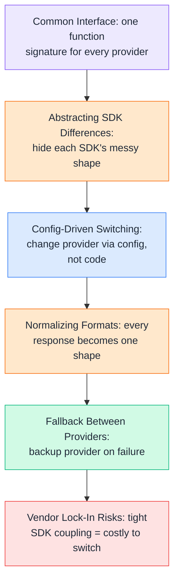

# Day 5 — Provider-Agnostic Integration Basics

---

## 1. Common Interface Across Providers
### 🧪 Practical

A **common interface** means every provider (Claude, GPT, Gemini) is called through the exact same function signature in your code — `ask(prompt)` — even though each provider's real SDK looks completely different underneath.



**DevOps example:** A Slack bot that explains errors shouldn't need a `if provider == "claude"` check scattered across every file that calls the model — the rest of your app just calls `ask(prompt)` and never needs to know or care which provider answered.

**🧪 Try it yourself:**
```python
from abc import ABC, abstractmethod

class LLMProvider(ABC):
    @abstractmethod
    def ask(self, prompt: str) -> str:
        """Every provider adapter must implement this exact method."""
        pass

class ClaudeProvider(LLMProvider):
    def ask(self, prompt: str) -> str:
        # a real call to the Anthropic API would go here
        return f"[Claude] Answer to: {prompt}"

class GeminiProvider(LLMProvider):
    def ask(self, prompt: str) -> str:
        # a real call to the Gemini API would go here
        return f"[Gemini] Answer to: {prompt}"

def run(provider: LLMProvider, prompt: str):
    print(provider.ask(prompt))

run(ClaudeProvider(), "Explain kubectl rollout status")
run(GeminiProvider(), "Explain kubectl rollout status")
```
```
1. Run this and notice both calls use the exact same
   run(provider, prompt) function.
2. The rest of your app only ever talks to LLMProvider -
   it has zero idea which real provider is underneath.
```

---

## 2. Abstracting SDK Differences
### 🧪 Practical

Every provider's real SDK returns data in a **different shape**. An adapter function's whole job is to hide that mess — take whatever weird structure the SDK returns, and translate it into your app's own simple format.



**DevOps example:** Anthropic's SDK nests the reply under `content[0].text` and the token count under `usage.output_tokens`, while Gemini's SDK exposes the reply directly as `response.text` and the token count under `usage_metadata.candidates_token_count` — without an adapter, every part of your app that reads the answer needs to know which provider it's talking to. With one, that messy detail lives in exactly one place.

**🧪 Try it yourself:**
```python
def call_claude_sdk(prompt):
    # pretend this is a real Anthropic-style SDK response
    return {"content": [{"text": f"Claude says: {prompt}"}],
            "usage": {"output_tokens": 12}}

def call_gemini_sdk(prompt):
    # pretend this is a real Gemini-style SDK response
    return {"text": f"Gemini says: {prompt}",
            "usage_metadata": {"candidates_token_count": 15}}

def claude_adapter(prompt):
    raw = call_claude_sdk(prompt)
    return {"text": raw["content"][0]["text"],
            "tokens": raw["usage"]["output_tokens"]}

def gemini_adapter(prompt):
    raw = call_gemini_sdk(prompt)
    return {"text": raw["text"],
            "tokens": raw["usage_metadata"]["candidates_token_count"]}

print(claude_adapter("status check"))
print(gemini_adapter("status check"))
```
```
1. Run this and compare the two print statements.
2. Even though call_claude_sdk() and call_gemini_sdk() return
   totally different shapes, both adapters output the SAME
   {text, tokens} structure - that's the abstraction at work.
```

---

## 3. Config-Driven Provider Switching
### 🧪 Practical

Instead of hardcoding which provider your app uses, you read it from a **config file**. Switching providers becomes a one-line config change — no code edits, no redeploy of app logic, just a different value.



**DevOps example:** This is the exact same pattern as switching a Terraform backend or a Kubernetes context — you change one config value (a `provider:` field, an env var, a `--context` flag) and the same automation now targets something different, with zero code changes.

**🧪 Try it yourself:**
```python
import yaml

config_text = "provider: claude"
config = yaml.safe_load(config_text)

def ask_claude(prompt):
    return f"[Claude] {prompt}"

def ask_gemini(prompt):
    return f"[Gemini] {prompt}"

PROVIDERS = {"claude": ask_claude, "gemini": ask_gemini}

def ask_llm(prompt):
    fn = PROVIDERS[config["provider"]]
    return fn(prompt)

print(ask_llm("Summarize this deploy log"))
```
```
1. Run this - it should print the Claude version.
2. Change config_text to "provider: gemini" and run again.
3. Notice ask_llm() itself never changed - only the config
   value did. That's config-driven switching.
```

---

## 4. Normalizing Request/Response Formats
### 🧪 Practical

**Normalizing** means every provider's raw response gets converted into one standard internal shape — usually something like `{text, tokens_used, finish_reason}` — so the rest of your app only ever needs to understand ONE format, no matter which provider actually answered.



**DevOps example:** A logging/cost-tracking pipeline that records `tokens_used` for every request only needs to work against ONE field name — not `output_tokens` for Claude and `candidates_token_count` for Gemini — because normalization already flattened that difference out.

**🧪 Try it yourself:**
```python
def normalize_claude_response(raw):
    return {
        "text": raw["content"][0]["text"],
        "tokens_used": raw["usage"]["output_tokens"],
        "finish_reason": raw.get("stop_reason", "unknown"),
    }

def normalize_gemini_response(raw):
    return {
        "text": raw["text"],
        "tokens_used": raw["usage_metadata"]["candidates_token_count"],
        "finish_reason": raw.get("finish_reason", "unknown"),
    }

claude_raw = {"content": [{"text": "pod restarted"}],
              "usage": {"output_tokens": 3}, "stop_reason": "end_turn"}
gemini_raw = {"text": "pod restarted",
              "usage_metadata": {"candidates_token_count": 3}, "finish_reason": "STOP"}

print(normalize_claude_response(claude_raw))
print(normalize_gemini_response(gemini_raw))
```
```
1. Run this and compare the two printed dictionaries.
2. Both have the exact same keys (text, tokens_used,
   finish_reason) even though the raw inputs looked
   nothing alike.
```

---

## 5. Fallback Between Providers
### 🧪 Practical

**Fallback** means if your primary provider fails (outage, rate limit, timeout), your app automatically retries the same request against a backup provider — instead of the whole feature just breaking.



**DevOps example:** An on-call assistant that depends on a single provider becomes a single point of failure during an incident — if that provider has an outage at the exact moment you need it most, a fallback provider keeps the assistant working instead of going dark.

**🧪 Try it yourself:**
```python
def call_primary(prompt):
    raise ConnectionError("Primary provider is down")  # simulate an outage

def call_backup(prompt):
    return f"[Backup] {prompt}"

def ask_with_fallback(prompt):
    try:
        return call_primary(prompt)
    except Exception as e:
        print(f"Primary failed ({e}), falling back...")
        return call_backup(prompt)

print(ask_with_fallback("Explain ImagePullBackOff"))
```
```
1. Run this - the primary call is set up to always fail.
2. Notice the app doesn't crash - it catches the failure
   and automatically retries with the backup provider.
```

---

## 6. Vendor Lock-In Risks
### 📖 Theory

**Vendor lock-in** happens when your app is written so tightly around one provider's specific SDK, response shapes, and quirks that switching providers later means rewriting large chunks of code — not just changing a config value.



**DevOps example:** This is the same lock-in risk as building a pipeline entirely around one cloud provider's proprietary APIs instead of portable tools — it's not that using a single provider is wrong, it's that building *without any abstraction layer* is what makes switching later expensive and risky.

**Why it matters even if you don't pick the provider:** As we discussed for the old Day 5 topic — the business usually decides *which* provider to use, not the engineer. But *how tightly your code depends on that one provider's SDK* is entirely something you control, and it's what determines whether a future provider change is a one-line config edit or a multi-week rewrite.

---

## Quick Recap (Day 5)



---

## ⭐ Support

If you found this repository useful:

<a href="https://github.com/saghosh8/AI-For-DevOps">
  
</a>
<a href="https://github.com/saghosh8/AI-For-DevOps/fork">
  
</a>

---

## 💬 Have a Query

Have a question, suggestion, or idea?

<a href="https://github.com/saghosh8/AI-For-DevOps/discussions/3">
  
</a>

---

| 📘 Next — Day 6: AI Application Architecture | <a href="https://github.com/saghosh8/AI-For-DevOps/blob/main/Week%201%20%E2%80%94%20LLM%20%26%20GenAI%20Foundations/Day%206%20%E2%80%94%20AI%20Application%20Architecture.md"></a> |
| ------------------------------ | -------------------------------------------------------------------------------------------------------------------------------------------------------------------------------------------------------------------------------------------------------------------------------- |
