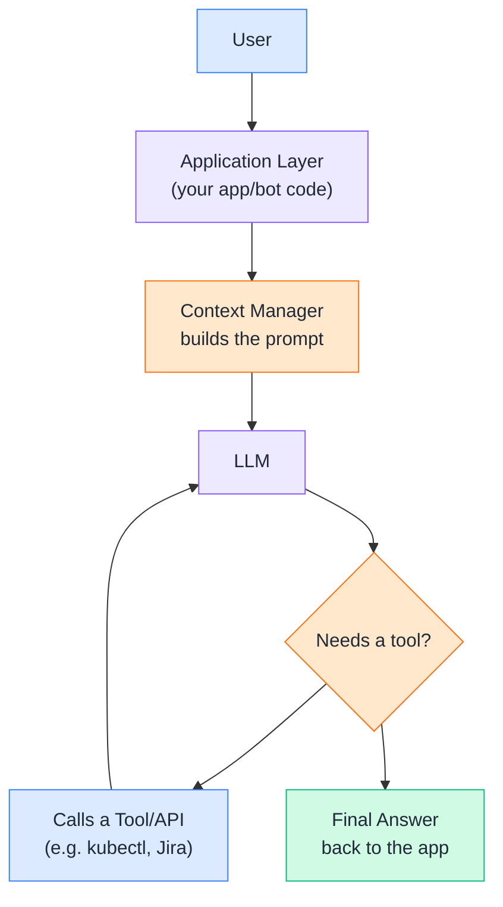
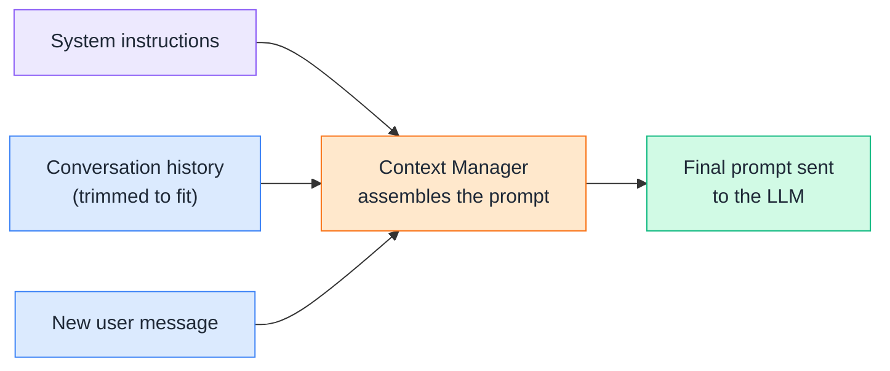
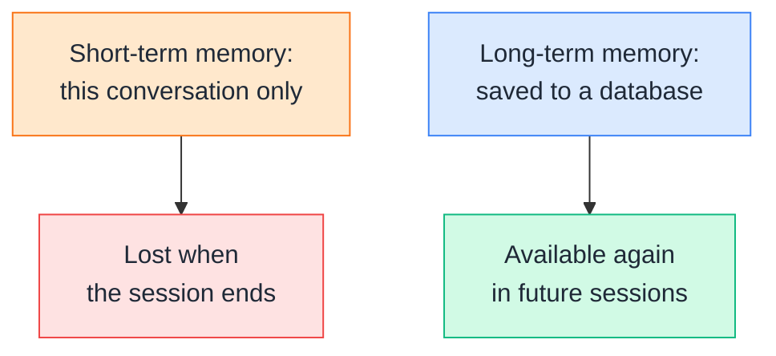
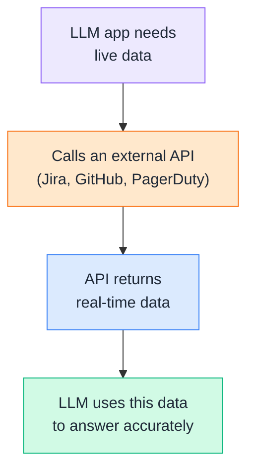
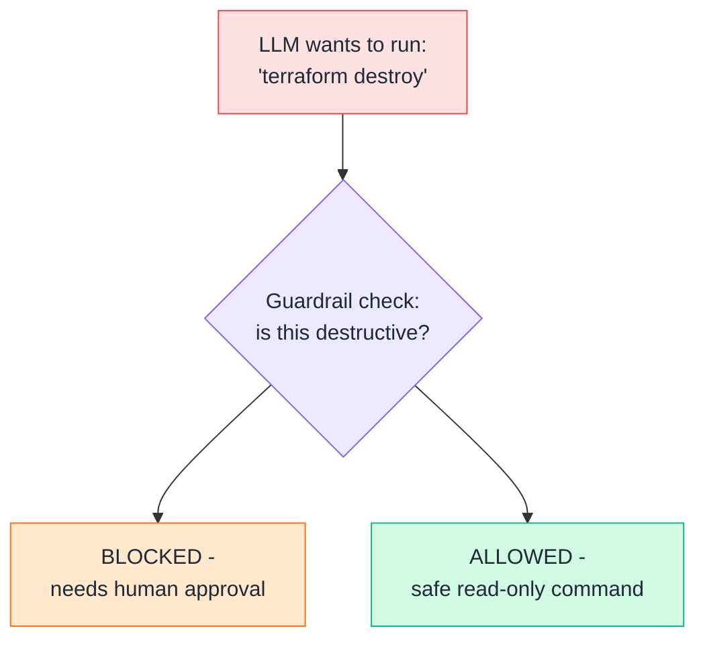
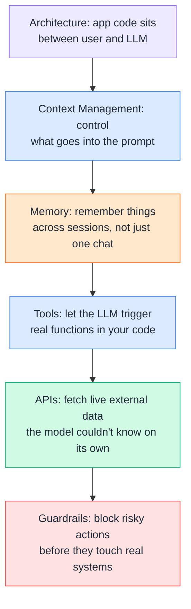

# Day 6 — AI Application Architecture

---

## 1. LLM Application Architecture
### 📖 Theory

A real LLM-powered application is more than just "send a prompt, get an answer." It's a small system: your app code sits between the user and the LLM, manages what context gets sent, lets the LLM call tools/APIs when needed, and applies safety checks before anything real happens.



**DevOps example:** A Slack bot that answers "why is my deployment stuck?" isn't just calling an LLM once — it's an application: it gathers the relevant kubectl output (context), sends it to the LLM, lets the LLM call a "get pod logs" tool if it needs more detail, and only then replies in the Slack thread. Every topic in this chapter is one piece of that pipeline.

---

## 2. Context Management
### 🧪 Practical

**Context management** means deciding exactly what goes into the prompt sent to the LLM — system instructions, relevant history, and the new question — while staying within the context window limit from Day 2.



**DevOps example:** An on-call chatbot that's been running for 3 hours during a long incident can't just keep appending every single log line to the conversation forever — it needs to trim older, less relevant messages so the prompt stays within the model's context window and the LLM doesn't lose track of the actual current question.

**🧪 Try it yourself:**
```python
def build_context(system_prompt, history, new_message, max_messages=10):
    """Keep only the most recent messages so the prompt
    doesn't grow forever and blow past the context window."""
    trimmed_history = history[-max_messages:]
    messages = [{"role": "system", "content": system_prompt}]
    messages.extend(trimmed_history)
    messages.append({"role": "user", "content": new_message})
    return messages

history = [{"role": "user", "content": f"log line {i}"} for i in range(50)]
context = build_context("You are a DevOps assistant.", history, "What failed?")
print("Messages sent to the model:", len(context))
```
```
1. Run this with 50 fake history messages.
2. Notice only the most recent 10 (plus the system prompt
   and new question) actually get sent - the rest are
   dropped to keep the prompt small.
3. Try lowering max_messages to 3 and see the count change.
```

---

## 3. Memory
### 🧪 Practical

**Memory** lets an LLM app remember things *across* separate conversations, not just within one. Short-term memory is just the current chat history (gone once the session ends). Long-term memory is saved somewhere (a database, a file) so it's still there next time.



**DevOps example:** An internal assistant that remembers "this engineer always works on the `payments` service" across sessions can skip re-asking which service you mean every single time — that preference has to be saved somewhere persistent, not just held in the current chat.

**🧪 Try it yourself:**
```python
memory_store = {}

def remember(user_id, key, value):
    memory_store.setdefault(user_id, {})[key] = value

def recall(user_id, key):
    return memory_store.get(user_id, {}).get(key)

remember("engineer_42", "favorite_cluster", "prod-us-east-1")
print(recall("engineer_42", "favorite_cluster"))
```
```
1. Run this and see the saved value come back on recall.
2. In a real app, memory_store would be a database (like
   Redis or Postgres) instead of a Python dict, so it
   actually survives after your script stops running.
```

---

## 4. Tools
### 🧪 Practical

**Tools** (also called "function calling") let an LLM go beyond just talking — it can decide *when* to call a real function in your code, with real arguments, and use the result to keep answering. The LLM never runs anything itself — it just says "call this function with these arguments," and your code does the actual work.

```mermaid
flowchart LR
    A["User: 'Restart the\nnginx pod'"] --> B["LLM decides:\nthis needs a tool call"]
    B --> C["Calls function:\nrestart_pod(name='nginx')"]
    C --> D["Your code actually\nruns kubectl"]
    D --> E["Result sent\nback to the LLM"]
    E --> F["LLM replies to user\nwith confirmation"]

    classDef blue fill:#DBEAFE,stroke:#3B82F6,color:#1F2937
    classDef purple fill:#EDE9FE,stroke:#8B5CF6,color:#1F2937
    classDef orange fill:#FFE8CC,stroke:#F97316,color:#1F2937
    classDef green fill:#D1FAE5,stroke:#10B981,color:#1F2937

    class A blue
    class B purple
    class C orange
    class D orange
    class E purple
    class F green
```



**DevOps example:** Instead of an LLM just describing "you should run `kubectl rollout restart deployment/nginx`," a tool-enabled assistant can actually trigger that restart itself (after your code approves it) and then tell the user "done, it's restarting now" — turning advice into action.

**🧪 Try it yourself:**
```python
def restart_pod(name: str) -> str:
    # In real life this would call kubectl or the Kubernetes API.
    return f"Pod {name} restarted successfully."

tools = [
    {
        "name": "restart_pod",
        "description": "Restart a Kubernetes pod by name",
        "input_schema": {
            "type": "object",
            "properties": {"name": {"type": "string"}},
            "required": ["name"]
        }
    }
]

# The LLM decides WHEN to call restart_pod based on the
# conversation - your code is what actually executes it.
print(restart_pod("nginx"))
```
```
1. This shows the shape of a tool definition an LLM API
   expects (name, description, input_schema).
2. In a real integration, when the LLM decides to use this
   tool, your code receives the request, runs restart_pod()
   for real, and sends the result back to the model.
```

---

## 5. APIs
### 🧪 Practical

In an LLM application, **APIs** are how the app reaches outside itself to get live, real-world data — things the model could never know on its own, like your current open incidents or today's deployment status. This is different from the LLM API itself (Day 4) — here, the LLM *app* is calling *other* systems' APIs.



**DevOps example:** "What's our current on-call status?" can't be answered from the model's training data — the app has to call the PagerDuty API first to fetch the real, current answer, then hand that data to the LLM to phrase into a friendly reply.

**🧪 Try it yourself:**
```python
import requests

def get_open_incidents():
    response = requests.get(
        "https://api.pagerduty.com/incidents",
        headers={"Authorization": "Token token=YOUR_KEY"}
    )
    return response.json()

# The LLM app calls this function first to fetch live data,
# then hands the result to the LLM to summarize for the user.
```
```
1. This won't run without a real API key/account, but read
   through the shape of it.
2. Notice the pattern: fetch real data with a normal API
   call FIRST, then let the LLM turn that raw data into a
   readable answer - the LLM is the "writer," not the
   "data source."
```

---

## 6. Guardrails
### 🧪 Practical

**Guardrails** are safety checks that sit between the LLM's decision and anything actually happening — especially important once an LLM can call tools that touch real infrastructure (see Day 3's Prompt Security topic). A guardrail blocks or requires approval for anything risky, no matter how confidently the model suggests it.



**DevOps example:** An AI assistant wired up to your infrastructure should never be allowed to run `terraform destroy` or `kubectl delete namespace prod` just because it "decided" it was the right fix — a guardrail intercepts destructive commands and routes them to a human for approval, no matter how the LLM phrases its reasoning.

**🧪 Try it yourself:**
```python
DESTRUCTIVE_KEYWORDS = ["delete", "destroy", "drop", "terminate", "rm -rf"]

def is_destructive(command: str) -> bool:
    return any(word in command.lower() for word in DESTRUCTIVE_KEYWORDS)

def run_with_guardrail(command: str) -> str:
    if is_destructive(command):
        return "BLOCKED: this command needs human approval first."
    return f"Running: {command}"

print(run_with_guardrail("terraform destroy"))
print(run_with_guardrail("kubectl get pods"))
```
```
1. Run this with a few different commands.
2. Notice the destructive one gets blocked automatically,
   before it ever reaches real infrastructure.
3. This simple keyword check is a basic guardrail - real
   systems often add more layers (permissions, approval
   workflows, audit logs) on top of this idea.
```

---

## Quick Recap (Day 6)



---

## ⭐ Support

If you found this repository useful:

<a href="https://github.com/saghosh8/AI-For-DevOps">
  
</a>
<a href="https://github.com/saghosh8/AI-For-DevOps/fork">
  
</a>

---

## 💬 Have a Query

Have a question, suggestion, or idea?

<a href="https://github.com/saghosh8/AI-For-DevOps/discussions/3">
  
</a>

---

| 📘 Next — Day 7: Mini Project | [](https://github.com/saghosh8/AI-For-DevOps/blob/main/Week%201%20%E2%80%94%20LLM%20%26%20GenAI%20Foundations/Day%207%20%E2%80%94%20Mini%20Project.md) |
| ---------------------------------- | -------------------------------------------------------------------------------------------------------------------------------------------------------------------------------------------------------- |
