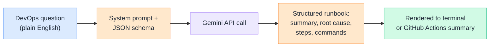
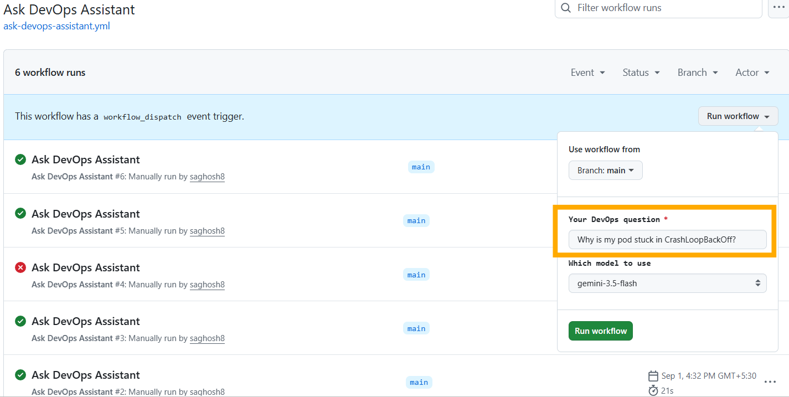
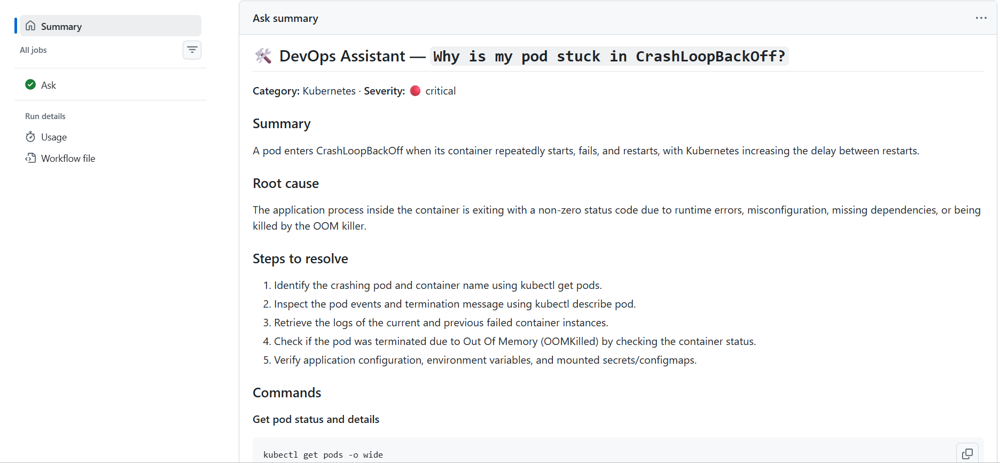
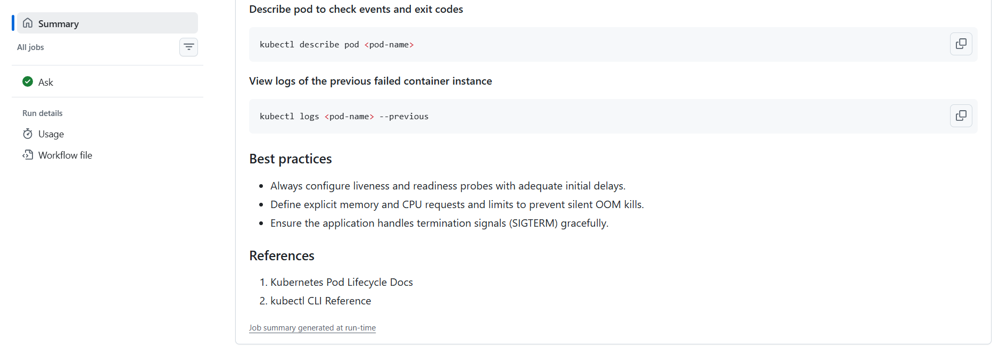

# Day 7 — Mini Project: AI DevOps Assistant

📦 **Project repo:** [ai-devops-release-assistant](https://github.com/saghosh8/ai-devops-release-assistant)

This day is different from Days 1–6: instead of small snippets you run inline, you run a **complete project** that lives in its own repo — tests, CI, a README, a roadmap. This same repo is also where Day 14 (RAG) and Day 21 (the final agent project) get built on top, not rewritten from scratch. See the repo's `ROADMAP.md` for the full plan.

---

## Problem Statement

On-call engineers don't need a chatbot — they need something they can act on at 3am without re-reading it three times. A plain chat reply gives you a paragraph. This project turns a plain-English DevOps question into a **structured runbook**: category, severity, root cause, numbered steps, ready-to-run commands, and best practices — generated by an LLM, rendered straight into a GitHub Actions run summary.

It's also the first project where the ideas from Days 1–6 stop being isolated concepts and get wired together into one working thing:

- A **system prompt** (Day 3) forces structured JSON output instead of prose
- A real **authenticated API call** (Day 4) with retries and streaming
- A chosen **model** (Day 5)
- A small **application architecture** (Day 6) — memory, a tool, and a guardrail

---

## What You Need

- A **free Gemini API key** — [aistudio.google.com/apikey](https://aistudio.google.com/apikey), no credit card required
- A GitHub account (to fork/clone the repo and run it via Actions — or run it locally with Python)
- That's it. No server, no local setup required if you run it through Actions

> **Why Gemini, not GPT or Claude?** Day 5 covers all three conceptually, but Gemini is currently the only one of the three with a genuinely free API key. That matters here — this project is meant to be something you actually run, not just read about.

The repo itself has a full concept-by-concept file breakdown (which file maps to which Day 3–6 concept) in its own README — no need to duplicate that here.

---

## Running It — via GitHub Actions (no local setup)

1. Go to [aistudio.google.com/apikey](https://aistudio.google.com/apikey), sign in with a Google account, click **Create API key** — no credit card needed
2. In the `ai-devops-release-assistant` repo: **Settings → Secrets and variables → Actions → New repository secret**
   Name: `GEMINI_API_KEY`, Value: (paste the key)
3. **Actions tab → "Ask DevOps Assistant" → Run workflow**
4. Type a question — e.g. *"why is my pod stuck in CrashLoopBackOff?"*
5. Open the completed run — the structured runbook is in the **Summary**

Prefer running it locally? The repo's own README has the equivalent `pip install` + `python -m devops_assistant ask "..."` steps.

---

# Input → Output

**Input** (typed into the `question` field when running the workflow):

**Output** (rendered automatically in the GitHub Actions run Summary):

---

## ⭐ Support

If you found this repository useful:

---

## 💬 Have a Query

Have a question, suggestion, or idea?

---

| 📘 Next — Day 8: RAG Fundamentals |  |
| ------------------------------ | -------------------------------------------------------------------------------------------------------------------------------------------------------------------------------------------------------------------------------------------------------------------------------- |
