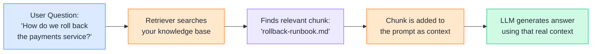
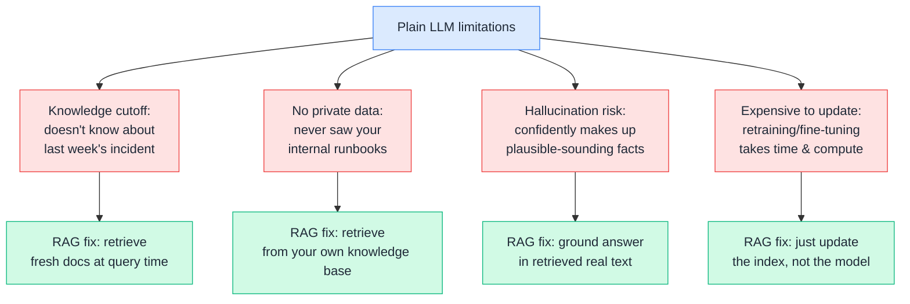
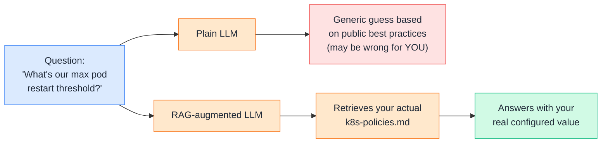
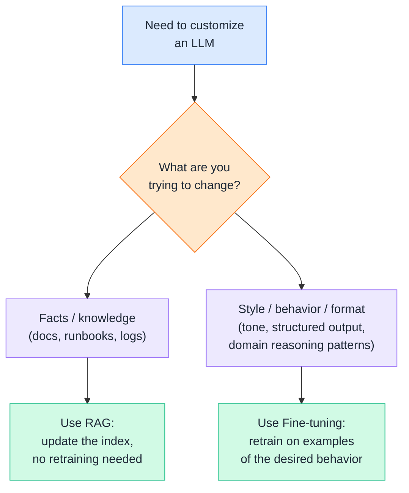
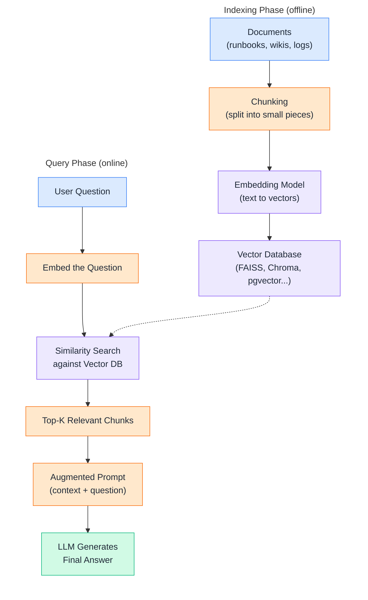
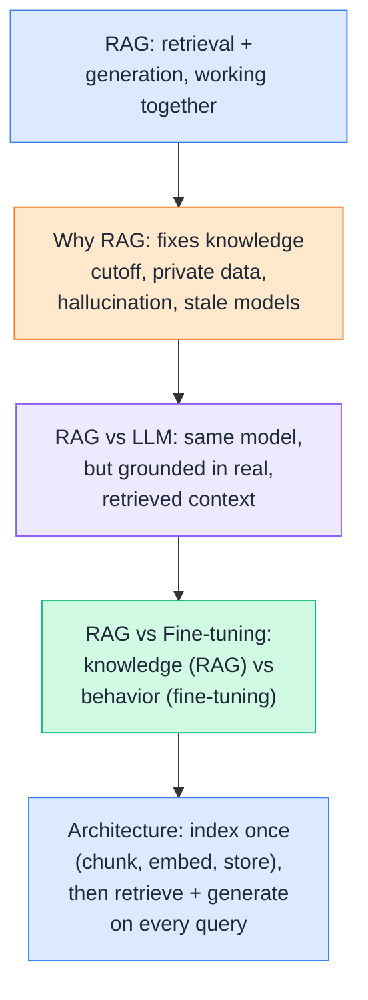

# Day 8 — RAG Fundamentals

---

## 1. What is RAG?
### 📖 Theory

**Retrieval-Augmented Generation (RAG)** is a pattern where an LLM doesn't answer purely from what it memorized during training — instead, it first **retrieves** relevant information from an external source (your documents, logs, runbooks, wikis), and then **generates** an answer using that retrieved content as context.



**DevOps analogy:** Instead of asking a new engineer to answer an incident question purely from memory, you hand them the **actual runbook page** before they answer. RAG is that "here, read this first" step — done automatically, in milliseconds, for every query.

**DevOps example:** You ask an internal chatbot *"What's our process for rotating a leaked AWS key?"* A plain LLM might guess a generic AWS answer. A RAG-backed chatbot retrieves your **actual internal security runbook** and answers based on your team's real process — including your specific Slack channel to notify and your specific IAM role names.

> Theory-only here — the "try it yourself" part comes in Section 3 and 5, where we actually build a tiny retrieval step.

---

## 2. Why RAG?
### 📖 Theory

Plain LLMs have a few structural limitations. RAG exists specifically to patch these gaps without touching the model itself.



**DevOps examples:**

- A postmortem was written **yesterday**. A plain LLM has never seen it. A RAG system can retrieve it the moment it's indexed.
- Your **Terraform module naming conventions** are internal and undocumented publicly — no public LLM was ever trained on them. RAG lets the model "learn" them at query time, straight from your repo.
- Without RAG, an LLM asked "what's our on-call escalation policy" might **invent** a plausible-sounding but wrong policy. With RAG, it quotes your actual PagerDuty escalation doc.

**Rule of thumb:** If the answer depends on information that is **private, recent, or frequently changing**, you need RAG — retraining the model every time a runbook changes is not realistic.

> Theory-only — "why" is a conceptual comparison, best understood before writing any code.

---

## 3. RAG vs LLM
### 🧪 Practical

A plain LLM answers from its frozen training data. A RAG-augmented LLM answers using retrieved context you supply at query time — same model, very different accuracy on your own data.



**DevOps example:** Ask a plain LLM "what's our restart threshold policy" and it'll confidently produce a generic Kubernetes default. Ask the RAG version, and it pulls the line straight from your `k8s-policies.md` — including the exact number your team configured.

**🧪 Try it yourself**

```python
from google import genai

client = genai.Client()

question = "What is our pod restart backoff limit policy?"

# Simulate the "knowledge base" — this would normally be your internal doc
internal_doc = """
k8s-policies.md:
Our clusters use backoffLimit: 6 for Jobs, and pods exceeding
5 restarts in 10 minutes trigger a PagerDuty alert to #sre-oncall.
"""

# 1. Plain LLM — no context, answers from training data only
plain_response = client.models.generate_content(
    model="gemini-2.5-flash",
    contents=question
)
print("Plain LLM:\n", plain_response.text, "\n")

# 2. RAG-style — retrieved context injected into the prompt
rag_prompt = f"""Answer using ONLY the context below. If it's not in the context, say so.

Context:
{internal_doc}

Question: {question}
"""
rag_response = client.models.generate_content(
    model="gemini-2.5-flash",
    contents=rag_prompt
)
print("RAG-augmented LLM:\n", rag_response.text)
```

Example output:
```
Plain LLM:
 Typically, teams set backoffLimit based on... (generic Kubernetes defaults, no mention of your PagerDuty flow)

RAG-augmented LLM:
 Your backoff limit for Jobs is 6. Pods restarting more than 5 times
 in 10 minutes trigger a PagerDuty alert to #sre-oncall.
```

👉 Same model, same question — the only difference is whether real context was retrieved and injected. That gap **is** RAG.

---

## 4. RAG vs Fine-tuning
### 📖 Theory

Both RAG and fine-tuning customize an LLM for your use case, but they solve **different problems** — RAG injects knowledge, fine-tuning changes behavior.



**DevOps analogy:** RAG is like handing an engineer the **latest runbook** before they answer — the engineer's skills don't change, just what they can reference. Fine-tuning is like **training** that engineer over months to always respond in your team's specific incident-report format — their underlying habits change.

**DevOps examples:**

- Want the model to know about **this week's new microservice**? → **RAG** (just index the new service's docs).
- Want the model to always output postmortems in **your exact 5-section template**, using your team's tone? → **Fine-tuning** (or strong prompting first, before reaching for fine-tuning).
- Want both — up-to-date facts **and** your team's specific tone? → Many production systems **combine** RAG (for facts) with a fine-tuned or heavily-prompted model (for style).

**Rule of thumb:** If the problem is "the model doesn't know X," reach for RAG first — it's cheaper and faster than fine-tuning, and most "knowledge" problems don't actually need retraining at all.

> Theory-only — this is a decision-framework topic, not something with a standalone code snippet.

---

## 5. RAG Architecture
### 🧪 Practical

A production RAG pipeline has two distinct phases: an **offline indexing phase** (done once, or whenever docs change) and an **online query phase** (done on every user question).



**Core components, DevOps-flavored:**

- 🗂️ **Document Loader** — pulls in runbooks, Confluence pages, past incident tickets, Terraform READMEs.
- ✂️ **Chunker** — splits a 50-page infra doc into small, retrievable pieces (e.g., 300–500 tokens each).
- 🧬 **Embedding Model** — converts each chunk into a vector capturing its meaning.
- 🗃️ **Vector Store** — indexes vectors for fast similarity search (FAISS, Chroma, pgvector, Pinecone, Weaviate).
- 🔎 **Retriever** — given a query, finds the top-K most similar chunks.
- ✍️ **Prompt Constructor** — merges retrieved chunks + the user's question into one final prompt.
- 🤖 **LLM (Generator)** — writes the final answer grounded in that context.

**🧪 Try it yourself**

```python
from google import genai
import numpy as np

client = genai.Client()

# --- Indexing phase: a tiny "knowledge base" of DevOps docs ---
docs = [
    "Rollback procedure: use `kubectl rollout undo deployment/payments` to revert to the previous version.",
    "On-call escalation: if unacknowledged after 15 minutes, PagerDuty escalates to the secondary engineer.",
    "Terraform state locking uses DynamoDB to prevent concurrent applies from corrupting state.",
]

def embed(texts):
    result = client.models.embed_content(model="text-embedding-004", contents=texts)
    return [np.array(e.values) for e in result.embeddings]

doc_vectors = embed(docs)

# --- Query phase ---
query = "How do I revert the payments deployment?"
query_vector = embed([query])[0]

# Similarity search: cosine similarity against each doc
scores = [np.dot(query_vector, d) / (np.linalg.norm(query_vector) * np.linalg.norm(d)) for d in doc_vectors]
best_idx = int(np.argmax(scores))
retrieved_chunk = docs[best_idx]

print("Retrieved chunk:", retrieved_chunk)

# --- Augment + generate ---
prompt = f"Context:\n{retrieved_chunk}\n\nQuestion: {query}\nAnswer using only the context."
response = client.models.generate_content(model="gemini-2.5-flash", contents=prompt)
print("\nAnswer:", response.text)
```

Example output:
```
Retrieved chunk: Rollback procedure: use `kubectl rollout undo deployment/payments` to revert to the previous version.

Answer: Run `kubectl rollout undo deployment/payments` to revert the payments deployment to its previous version.
```

👉 This is a minimal but *real* RAG loop — embed, store, retrieve, augment, generate. Production systems just swap the in-memory list for a real vector database and add chunking, re-ranking, and caching on top.

---

## Quick Recap (Day 8)



---

## ⭐ Support

If you found this repository useful:

[](https://github.com/saghosh8/AI-For-DevOps)
<a href="https://github.com/saghosh8/AI-For-DevOps/fork">
  
</a>

---

## 💬 Have a Query

Have a question, suggestion, or idea?

[](https://github.com/saghosh8/AI-For-DevOps/discussions/3)

---

| 📘 Next — Day 9: Chunking Strategies & Embeddings Deep Dive | [](https://github.com/saghosh8/AI-For-DevOps/blob/main/Week%202%20%E2%80%94%20RAG/Day%2009%20%E2%80%94%20Documents%20%26%20Ingestion.md) |
| ---------------------------------- | -------------------------------------------------------------------------------------------------------------------------------------------------------------------------------------------------------- |
