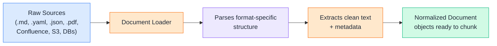
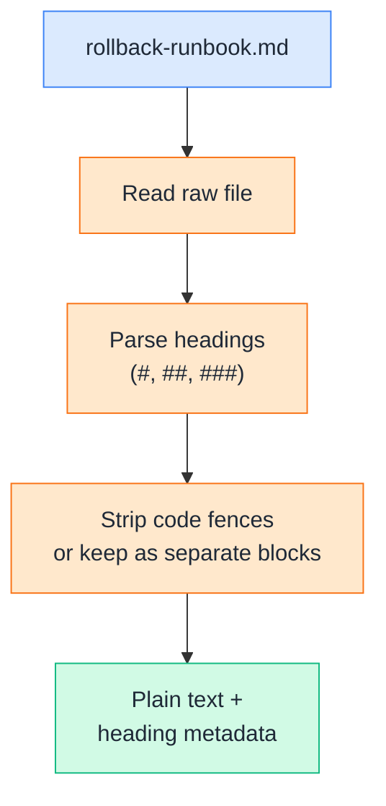
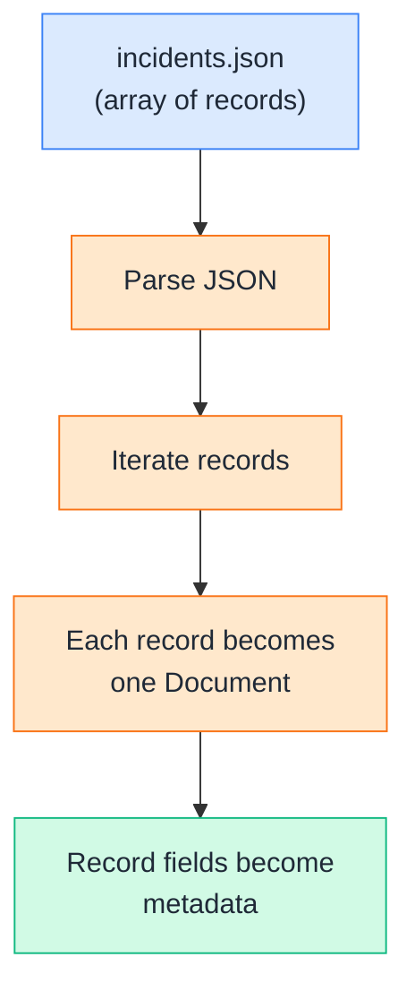
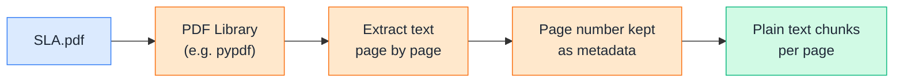
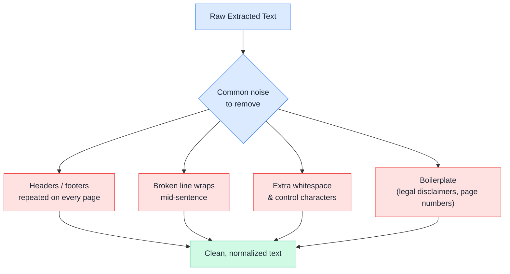
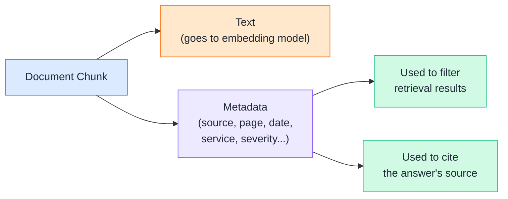
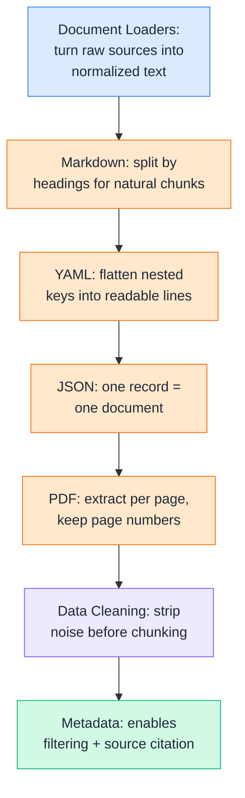

# Day 9 — Documents & Ingestion

---

## 1. Document Loaders

### 📖 Theory

A **document loader** is the very first stage of a RAG pipeline — the piece that reaches into the messy real world (files, wikis, APIs, buckets) and turns whatever it finds into plain text your chunker and embedding model can actually work with. Get this stage wrong and everything downstream — chunking, retrieval, answers — inherits the mess.




**DevOps analogy:** A loader is like the intake step of an incident review — someone has to go pull the Slack thread, the PagerDuty log, and the deploy history into one place *before* anyone can start analyzing the incident. RAG can't retrieve from a Confluence page or a `.tf` file directly — a loader has to read it and hand back plain text first.

**DevOps example:** Your knowledge base is scattered — `runbooks/*.md`, `config/*.yaml`, exported `incidents.json` from your ticketing tool, and vendor `SLA.pdf` files. A document loader is the layer that knows how to open each of these formats and pull out usable text, regardless of how different their internal structure is.

> Theory-only here — each format below (Markdown, YAML, JSON, PDF) gets its own hands-on loader in the next sections.

---

## 2. Loading Markdown

### 🧪 Practical

Markdown is the most common format for runbooks and docs — but it isn't plain text. Headings, code fences, and links carry structure worth preserving (or stripping deliberately) before you chunk.




**DevOps example:** A 40-section `runbooks.md` file mixes prose, YAML config snippets, and shell commands. If you don't separate headings from body text, you lose the ability to later say "this chunk came from the *Rollback* section" — which matters a lot when the retriever hands the LLM a chunk with no context.

**🧪 Try it yourself**

```
import re

def load_markdown(path):
    with open(path, "r", encoding="utf-8") as f:
        raw = f.read()

    # Split on markdown headings, keep the heading as metadata per section
    sections = re.split(r"\n(?=#{1,6}\s)", raw)

    docs = []
    for section in sections:
        section = section.strip()
        if not section:
            continue
        heading_match = re.match(r"(#{1,6})\s+(.*)", section)
        heading = heading_match.group(2) if heading_match else "Untitled"
        docs.append({
            "text": section,
            "metadata": {"source": path, "heading": heading, "type": "markdown"}
        })
    return docs

docs = load_markdown("rollback-runbook.md")
print(f"Loaded {len(docs)} sections")
print(docs[0])
```

Example output:

```
Loaded 4 sections
{'text': '# Rollback Runbook\n\nUse this doc when...', 'metadata': {'source': 'rollback-runbook.md', 'heading': 'Rollback Runbook', 'type': 'markdown'}}
```

👉 Splitting by heading — instead of blindly loading the whole file as one blob — gives you natural, meaningful chunk boundaries almost for free.

---

## 3. Loading YAML

### 🧪 Practical

YAML files (Kubernetes manifests, CI pipelines, config) are structured data, not prose. A naive text dump loses the relationships between keys — RAG works better when you **flatten** YAML into readable statements first.


**DevOps example:** A raw dump of `values.yaml` looks like noise to an LLM: `{'jobs': {'backoffLimit': 6}}`. Flattened into `"jobs.backoffLimit: 6"`, it reads like a sentence — and an LLM can quote it directly in an answer instead of guessing what the nesting means.

**🧪 Try it yourself**

```
import yaml

def flatten(d, prefix=""):
    lines = []
    for key, value in d.items():
        full_key = f"{prefix}.{key}" if prefix else key
        if isinstance(value, dict):
            lines.extend(flatten(value, full_key))
        else:
            lines.append(f"{full_key}: {value}")
    return lines

def load_yaml(path):
    with open(path, "r", encoding="utf-8") as f:
        data = yaml.safe_load(f)

    flat_lines = flatten(data)
    text = "\n".join(flat_lines)

    return {"text": text, "metadata": {"source": path, "type": "yaml"}}

doc = load_yaml("k8s-policies.yaml")
print(doc["text"])
```

Example output:

```
jobs.backoffLimit: 6
alerts.restartThreshold: 5
alerts.channel: #sre-oncall
```

👉 Flattening turns config structure into something an embedding model — and an LLM reading the retrieved chunk — can actually reason about in natural language.

---

## 4. Loading JSON

### 🧪 Practical

JSON exports (ticketing systems, API dumps, incident logs) are usually **lists of records**. The right loading strategy is almost always "one record → one document," not "whole file → one giant blob."




**DevOps example:** `incidents.json` has 500 past incidents. If you embed the whole file as one chunk, a query about "database failover incidents" retrieves either everything or nothing useful. If each incident becomes its own document, the retriever can zero in on the 3 incidents that actually match.

**🧪 Try it yourself**

```
import json

def load_json(path, text_field="summary"):
    with open(path, "r", encoding="utf-8") as f:
        records = json.load(f)

    docs = []
    for record in records:
        text = record.get(text_field, "")
        metadata = {k: v for k, v in record.items() if k != text_field}
        metadata["source"] = path
        metadata["type"] = "json"
        docs.append({"text": text, "metadata": metadata})
    return docs

docs = load_json("incidents.json", text_field="summary")
print(f"Loaded {len(docs)} incident records")
print(docs[0])
```

Example output:

```
Loaded 500 incident records
{'text': 'Payments DB failed over to replica after primary disk pressure alert.', 'metadata': {'id': 'INC-2311', 'severity': 'SEV2', 'service': 'payments-db', 'source': 'incidents.json', 'type': 'json'}}
```

👉 One JSON record → one document keeps retrieval precise, and the leftover fields (`id`, `severity`, `service`) become metadata you can filter on later — more on that in Section 6.

---

## 5. Loading PDFs

### 🧪 Practical

PDFs (vendor SLAs, compliance docs, architecture diagrams exported as slides) are the messiest source — there's no reliable structure, just visually laid-out text that a PDF library has to reconstruct page by page.




**DevOps example:** A vendor's `SLA.pdf` promises "99.95% uptime, credits issued if breached." If your loader keeps the page number as metadata, a RAG answer can say "see SLA.pdf, page 4" — letting an engineer verify the source instead of just trusting the LLM's word.

**🧪 Try it yourself**

```
from pypdf import PdfReader

def load_pdf(path):
    reader = PdfReader(path)
    docs = []
    for i, page in enumerate(reader.pages):
        text = page.extract_text() or ""
        text = text.strip()
        if not text:
            continue
        docs.append({
            "text": text,
            "metadata": {"source": path, "page": i + 1, "type": "pdf"}
        })
    return docs

docs = load_pdf("SLA.pdf")
print(f"Loaded {len(docs)} pages of text")
print(docs[3]["metadata"], "->", docs[3]["text"][:120])
```

Example output:

```
Loaded 12 pages of text
{'source': 'SLA.pdf', 'page': 4, 'type': 'pdf'} -> Uptime Commitment: Provider guarantees 99.95% monthly uptime. Credits issued per the schedule in Section 6...
```

👉 PDF extraction is never perfect (columns, tables, and scanned images can break it) — but keeping page numbers as metadata means every retrieved chunk stays traceable back to its exact source.

---

## 6. Data Cleaning

### 📖 Theory

Raw extracted text is full of noise — headers, footers, page numbers, repeated boilerplate, broken line breaks from PDF wrapping. Cleaning removes this noise **before** chunking, so embeddings represent meaning, not formatting artifacts.




**DevOps analogy:** It's like scrubbing log files before feeding them into a monitoring dashboard — raw logs are full of timestamps, ANSI color codes, and duplicate heartbeat lines that would drown out the signal if you graphed them as-is.

**DevOps examples:**

- A PDF export repeats `"Confidential — Internal Use Only — Page X"` on every single page. Left in, that phrase pollutes every chunk's embedding with irrelevant boilerplate.
- PDF text extraction often breaks `"database\nfailover"` across a line wrap — cleaning re-joins it so the embedding model reads it as one term, not two unrelated words.
- Markdown exported from Confluence sometimes carries leftover HTML tags (`<br>`, `&nbsp;`) — these need stripping or they show up verbatim in an LLM's answer.

**Rule of thumb:** If a human skimming the chunk would silently ignore something, your cleaner should strip it out explicitly — because the embedding model won't ignore it; it treats every character as signal.

> Theory-only — cleaning is a set of principles applied *inside* each loader above, not a separate standalone tool.

---

## 7. Metadata

### 🧪 Practical

Metadata is everything you know about a chunk **besides** its text — source file, page number, heading, timestamp, severity, service name. It's what turns retrieval from "find similar text" into "find similar text *and* filter by what actually matters."




**DevOps example:** Someone asks "what happened in payments incidents last month?" With metadata (`service: payments`, `date: 2026-08`), the retriever can filter to the right subset **before** running similarity search — instead of hoping the vector search alone figures out "recent" and "payments" from meaning alone.

**🧪 Try it yourself**

```
from datetime import datetime

def attach_metadata(docs, extra_fields=None):
    """Enrich a list of loaded documents with consistent, queryable metadata."""
    enriched = []
    for doc in docs:
        meta = dict(doc.get("metadata", {}))
        meta.setdefault("ingested_at", datetime.utcnow().isoformat())
        if extra_fields:
            meta.update(extra_fields)
        enriched.append({"text": doc["text"], "metadata": meta})
    return enriched

# Reuse the JSON-loaded incident docs from Section 4
docs = load_json("incidents.json", text_field="summary")
enriched = attach_metadata(docs, extra_fields={"team": "sre"})

# Simple metadata filter, done before any similarity search
payments_only = [d for d in enriched if d["metadata"].get("service") == "payments-db"]
print(f"Filtered down to {len(payments_only)} payments-related incidents")
print(payments_only[0]["metadata"])
```

Example output:

```
Filtered down to 47 payments-related incidents
{'id': 'INC-2311', 'severity': 'SEV2', 'service': 'payments-db', 'source': 'incidents.json', 'type': 'json', 'ingested_at': '2026-09-05T10:12:03', 'team': 'sre'}
```

👉 Good metadata is what lets a production RAG system say "here's the answer, sourced from `rollback-runbook.md`, section *Rollback Procedure*, ingested yesterday" — instead of a chunk of text with no way to verify where it came from.

---

## Quick Recap (Day 9)




---

## ⭐ Support

If you found this repository useful:

[](https://github.com/saghosh8/AI-For-DevOps) [](https://github.com/saghosh8/AI-For-DevOps/fork)

---

## 💬 Have a Query

Have a question, suggestion, or idea?

[](https://github.com/saghosh8/AI-For-DevOps/discussions/3)

---

| 📘 Next — Day 10: Chunking & Embeddings | [](https://github.com/saghosh8/AI-For-DevOps/blob/main/Week%202%20%E2%80%94%20RAG/Day%2010%20%E2%80%94%20Chunking%20%26%20Embeddings.md) |
| ---------------------------------------------------------- | ------------------------------------------------------------------------------------------------------------------------------ |
