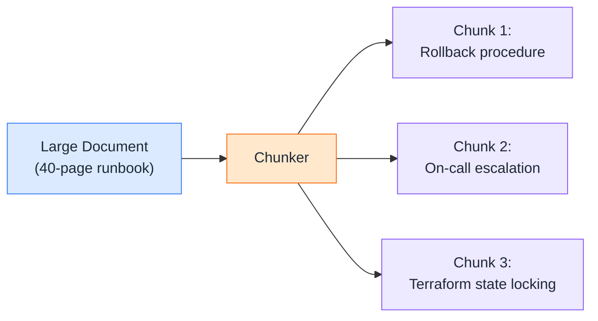
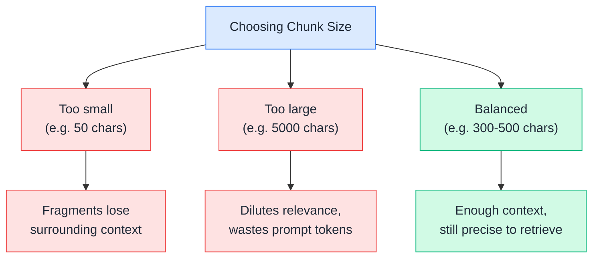
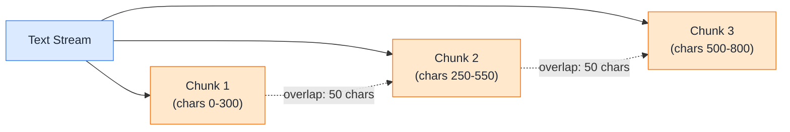
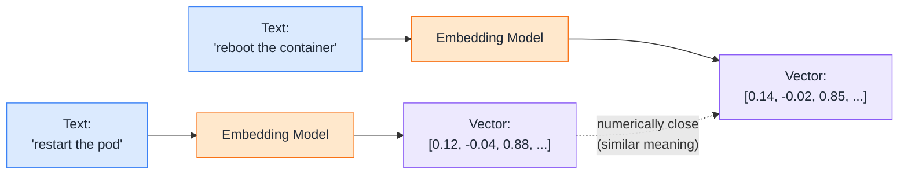
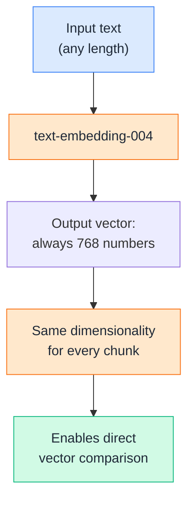
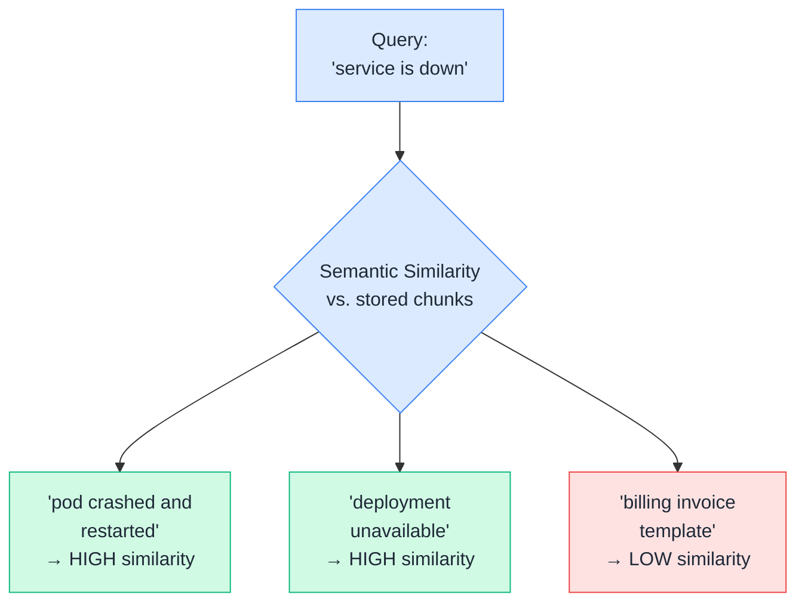
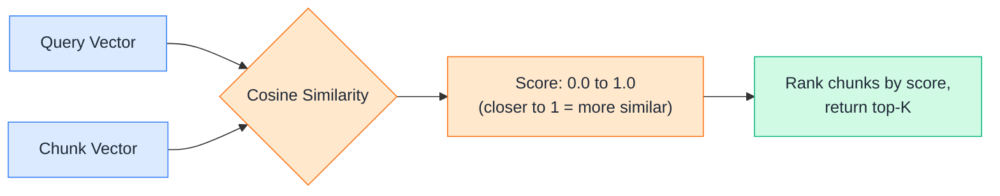
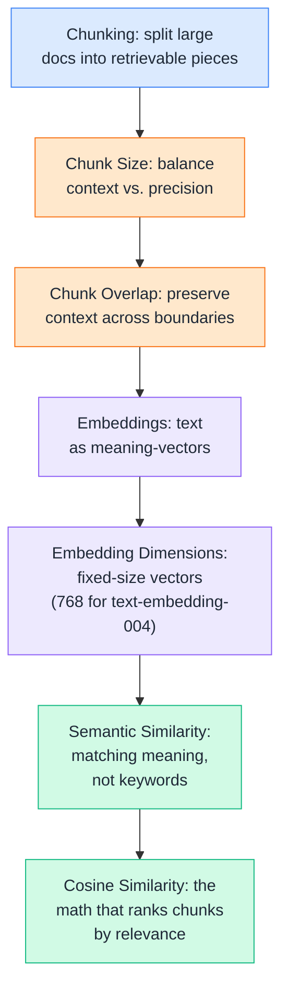

# Day 10 — Chunking & Embeddings

---

## 1. Chunking

### 📖 Theory

**Chunking** is the process of splitting a large document into smaller pieces before embedding and storing them. You can't embed and retrieve a 40-page runbook as one giant block — the embedding would blur together dozens of unrelated topics, and the LLM would get way more irrelevant text than it needs.



**DevOps analogy:** Think of chunking like breaking a giant monolithic deploy into small, independently deployable services. A retriever working with one giant chunk is like a load balancer that can only route to a single monolith — no precision, no isolation. Small chunks let the retriever route a query to *exactly* the right piece of information.

**DevOps example:** Your `incident-postmortems.md` file has 30 postmortems stacked in one file. Without chunking, asking "what caused the payments outage in March" retrieves the *entire* file — all 30 postmortems — burying the one relevant answer in noise the LLM has to wade through.

> Theory-only here — chunk size and overlap (Sections 2 and 3) are the two knobs you actually tune when chunking for real.

---

## 2. Chunk Size

### 🧪 Practical

Chunk size is the first real decision you make: how many characters (or tokens) go into each chunk. Too small and you lose context; too large and you dilute relevance and waste tokens.



**DevOps example:** A runbook step reads *"Run `kubectl rollout undo deployment/payments`. This reverts to the last stable ReplicaSet."* If your chunk size cuts this mid-sentence — the command in one chunk, the explanation in the next — the retriever might return the command with no explanation of what it actually does.

**🧪 Try it yourself**

```python
def chunk_by_size(text, chunk_size=300):
    chunks = []
    for i in range(0, len(text), chunk_size):
        chunk = text[i:i + chunk_size].strip()
        if chunk:
            chunks.append(chunk)
    return chunks

runbook = """Rollback procedure: use kubectl rollout undo deployment/payments to revert
to the previous version. This restores the last known-good ReplicaSet within seconds.
On-call escalation: if unacknowledged after 15 minutes, PagerDuty escalates to the
secondary engineer, then the team lead after another 15 minutes."""

chunks = chunk_by_size(runbook, chunk_size=120)
for i, c in enumerate(chunks):
    print(f"--- Chunk {i+1} ({len(c)} chars) ---")
    print(c)
```

Example output:
```
--- Chunk 1 (120 chars) ---
Rollback procedure: use kubectl rollout undo deployment/payments to revert
to the previous version. This restores
--- Chunk 2 (120 chars) ---
the last known-good ReplicaSet within seconds.
On-call escalation: if unacknowledged after 15
--- Chunk 3 (63 chars) ---
minutes, PagerDuty escalates to the
secondary engineer...
```

👉 Notice how Chunk 1 cuts off mid-sentence ("This restores") — a hard character-count split ignores sentence boundaries. This is exactly the problem chunk overlap (next section) partially fixes, and why production chunkers usually split on sentences or paragraphs instead of raw character counts.

---

## 3. Chunk Overlap

### 🧪 Practical

Chunk overlap means consecutive chunks share a small window of repeated text at their boundary. It's a safety net against the exact problem you just saw — important context getting severed right at a chunk boundary.



**DevOps example:** If the sentence *"backoffLimit controls retry attempts before a Job is marked Failed"* gets split right between "before" and "a Job," overlap ensures the second chunk still starts a little earlier — carrying "...retry attempts before a Job is marked Failed" intact, instead of orphaning half a sentence in each chunk.

**🧪 Try it yourself**

```python
def chunk_with_overlap(text, chunk_size=120, overlap=30):
    chunks = []
    start = 0
    while start < len(text):
        end = start + chunk_size
        chunk = text[start:end].strip()
        if chunk:
            chunks.append(chunk)
        start += chunk_size - overlap  # step forward, minus the overlap
    return chunks

runbook = """Rollback procedure: use kubectl rollout undo deployment/payments to revert
to the previous version. This restores the last known-good ReplicaSet within seconds."""

chunks = chunk_with_overlap(runbook, chunk_size=120, overlap=30)
for i, c in enumerate(chunks):
    print(f"--- Chunk {i+1} ---")
    print(c)
```

Example output:
```
--- Chunk 1 ---
Rollback procedure: use kubectl rollout undo deployment/payments to revert
to the previous version. This restores
--- Chunk 2 ---
version. This restores the last known-good ReplicaSet within seconds.
```

👉 See how "version. This restores" appears in *both* chunks now — that repeated slice is the overlap doing its job. A typical starting point is **10–20% of your chunk size** as overlap; more than that wastes storage and retrieval budget re-embedding the same text repeatedly.

---

## 4. Embeddings

### 📖 Theory

An **embedding** is a list of numbers (a vector) that represents the *meaning* of a piece of text. Texts with similar meaning end up with vectors that are numerically close together — even if they don't share a single word in common.



**DevOps analogy:** It's like converting every server's health metrics (CPU, memory, disk, latency) into a single point in multi-dimensional space — servers under similar stress cluster together, even if the exact numbers differ. Embeddings do the same thing for meaning: "restart the pod" and "reboot the container" land close together, even though they don't share a single word.

**DevOps example:** A user asks *"how do I bounce the service back up?"* — a runbook titled *"Restarting a crashed deployment"* shares almost no exact vocabulary with the query. Keyword search would miss it entirely. Embedding-based search catches it, because both phrases map to nearby points in vector space.

> Theory-only here — the actual embedding call happens in Section 5, once you know what dimensions to expect back.

---

## 5. Embedding Dimensions

### 🧪 Practical

**Dimensions** are simply how many numbers make up each embedding vector. Gemini's `text-embedding-004` returns **768-dimensional** vectors by default — every chunk of text, short or long, becomes exactly 768 floating-point numbers.



**DevOps example:** Whether you embed a one-line log message or a 500-word incident summary, both come back as 768 numbers. This fixed size is what makes them storable in a regular vector index (FAISS, pgvector) — the database just needs to know the dimension count once, upfront.

**🧪 Try it yourself**

```python
from google import genai

client = genai.Client()

texts = [
    "Restart the crashed deployment using kubectl rollout restart.",
    "PagerDuty escalates to the secondary on-call after 15 minutes.",
]

result = client.models.embed_content(model="text-embedding-004", contents=texts)

for text, embedding in zip(texts, result.embeddings):
    vector = embedding.values
    print(f"Text: {text[:40]}...")
    print(f"Dimensions: {len(vector)}")
    print(f"First 5 values: {vector[:5]}\n")
```

Example output:
```
Text: Restart the crashed deployment using k...
Dimensions: 768
First 5 values: [0.0123, -0.0456, 0.0891, 0.0234, -0.0678]

Text: PagerDuty escalates to the secondary o...
Dimensions: 768
First 5 values: [0.0198, -0.0312, 0.0754, 0.0301, -0.0521]
```

👉 Every chunk — no matter its content or length — collapses down to the *same* fixed-size vector. That consistency is what lets you compare any two chunks mathematically, which is exactly what similarity search does next.

---

## 6. Semantic Similarity

### 📖 Theory

**Semantic similarity** is the idea that two pieces of text can be "close in meaning" even if their wording is completely different. This is the entire reason embeddings are useful for retrieval — you're not matching keywords, you're matching *meaning*.



**DevOps analogy:** It's like an experienced on-call engineer instantly recognizing that "the app is throwing 503s" and "upstream service unreachable" describe the *same underlying problem*, even though a junior engineer scanning for exact keyword matches might miss the connection entirely.

**DevOps example:** A user searches your knowledge base for *"database is slow."* A chunk titled *"Diagnosing high query latency on Postgres"* contains zero overlapping words with the query — yet it's the most relevant result in the entire knowledge base. Semantic similarity is what makes that match possible.

> Theory-only — semantic similarity is the concept; cosine similarity (next) is the actual math used to measure it.

---

## 7. Cosine Similarity

### 🧪 Practical

**Cosine similarity** is the standard formula for measuring how close two embedding vectors are. It compares the *angle* between two vectors, not their length — a score of `1.0` means identical direction (near-identical meaning), `0` means unrelated, and negative values mean opposite meaning.



**DevOps example:** You embed the query *"how do I roll back a bad deploy?"* alongside three runbook chunks: rollback procedure, on-call escalation, and Terraform state locking. Cosine similarity scores the rollback chunk highest (say `0.87`), on-call escalation moderately (`0.41`), and Terraform locking lowest (`0.19`) — letting the retriever confidently pick the top match.

**🧪 Try it yourself**

```python
from google import genai
import numpy as np

client = genai.Client()

def embed(texts):
    result = client.models.embed_content(model="text-embedding-004", contents=texts)
    return [np.array(e.values) for e in result.embeddings]

def cosine_similarity(a, b):
    return np.dot(a, b) / (np.linalg.norm(a) * np.linalg.norm(b))

chunks = [
    "Rollback procedure: use kubectl rollout undo deployment/payments to revert to the previous version.",
    "On-call escalation: unacknowledged pages escalate to the secondary engineer after 15 minutes.",
    "Terraform state locking uses DynamoDB to prevent concurrent applies from corrupting state.",
]

query = "how do I roll back a bad deploy?"

chunk_vectors = embed(chunks)
query_vector = embed([query])[0]

scores = [cosine_similarity(query_vector, cv) for cv in chunk_vectors]

for chunk, score in sorted(zip(chunks, scores), key=lambda x: x[1], reverse=True):
    print(f"{score:.4f}  {chunk[:60]}...")
```

Example output:
```
0.8721  Rollback procedure: use kubectl rollout undo deployment/pa...
0.4103  On-call escalation: unacknowledged pages escalate to the ...
0.1892  Terraform state locking uses DynamoDB to prevent concurre...
```

👉 This is the actual math behind "similarity search" from Day 8 — cosine similarity is what ranks chunks by relevance before the top-K get handed to the LLM as context.

---

## Quick Recap (Day 10)



---

## ⭐ Support

If you found this repository useful:

[](https://github.com/saghosh8/AI-For-DevOps)
<a href="https://github.com/saghosh8/AI-For-DevOps/fork">
  
</a>

---

## 💬 Have a Query

Have a question, suggestion, or idea?

[](https://github.com/saghosh8/AI-For-DevOps/discussions/3)

---

| 📘 Next — Day 11: Vector Databases | [](https://github.com/saghosh8/AI-For-DevOps/blob/main/Week%202%20%E2%80%94%20RAG/Day%2011%20%E2%80%94%20Vector%20Databases.md) |
| ----------------------------------- | ------------------------------------------------------------------------------------------------------------------------------------------------------------------------------------------------ |
