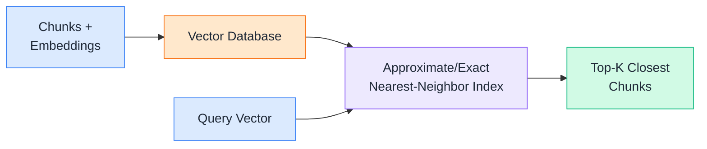
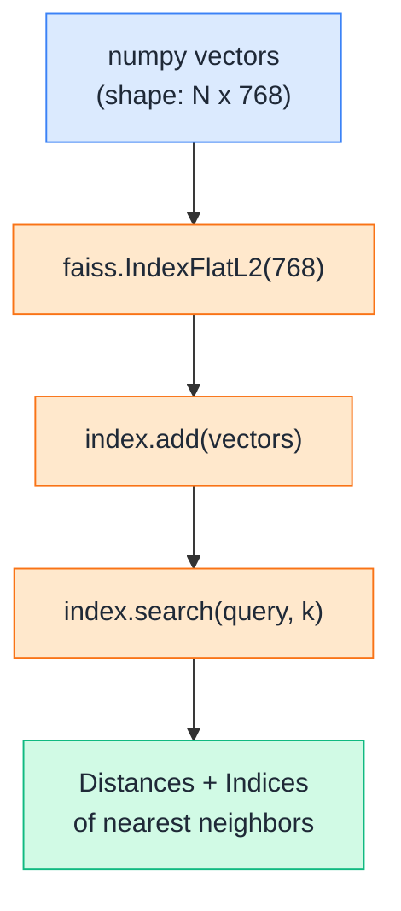
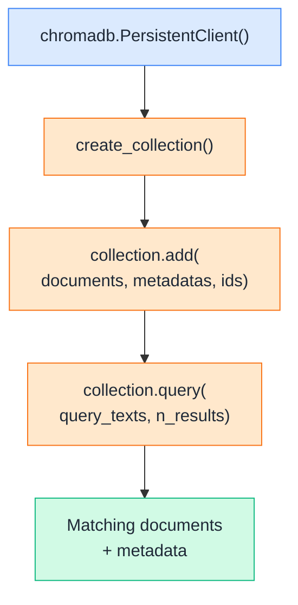
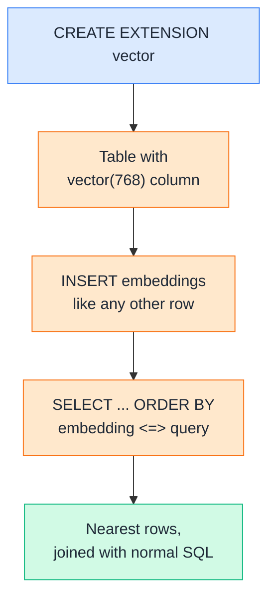
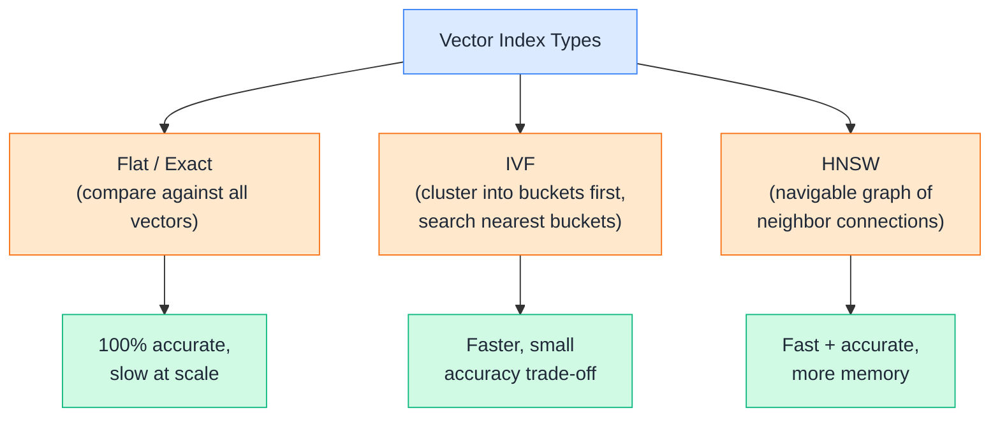
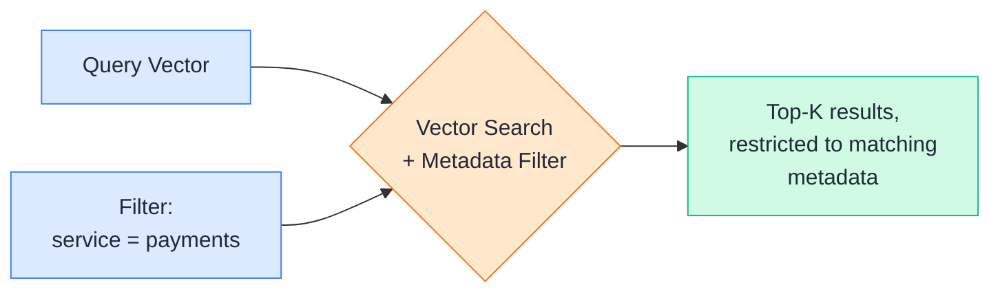
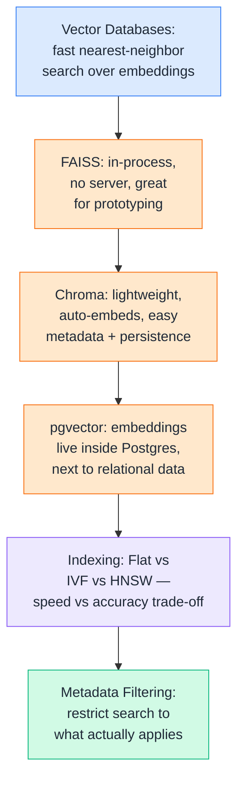

# Day 11 — Vector Databases

---

## 1. Vector Databases

### 📖 Theory

A **vector database** is purpose-built storage for embeddings — instead of indexing rows by exact keys or keywords, it indexes them by *position in vector space*, so it can answer "which stored vectors are closest to this one?" fast, even across millions of entries.



**DevOps analogy:** A regular database is like `grep`-ing log files for an exact string — fast, but only if you know the exact text. A vector database is like an APM tool that clusters similar traces together automatically — it finds things that are *conceptually* alike, not just textually identical.

**DevOps example:** You've embedded 5,000 past incident postmortems. A new alert fires: *"payments service returning 503s."* A vector database lets you instantly pull the 5 most semantically similar past incidents — without anyone having to tag or keyword-index them in advance.

**Why not just loop over a Python list and compute cosine similarity (like Day 10)?** That works for 3 chunks. It falls apart at 100,000 chunks — a linear scan becomes too slow. Vector databases use specialized indexing structures (Section 5) to make this fast at scale.

> Theory-only here — Sections 2 to 4 walk through three real vector databases you'd actually reach for.

---

## 2. FAISS

### 🧪 Practical

**FAISS** (Facebook AI Similarity Search) is a lightweight, in-process library for vector search — no server to run, just a Python library you `import`. It's the go-to choice for local prototyping or embedding search directly inside an application.



**DevOps example:** A CLI tool that searches your local `runbooks/` folder offline — no database server, no network call, just a FAISS index built once at startup and queried in-process. Perfect for a small, self-contained tool that ships as a single binary or script.

**🧪 Try it yourself**

```python
from google import genai
import faiss
import numpy as np

client = genai.Client()

chunks = [
    "Rollback procedure: use kubectl rollout undo deployment/payments to revert to the previous version.",
    "On-call escalation: unacknowledged pages escalate to the secondary engineer after 15 minutes.",
    "Terraform state locking uses DynamoDB to prevent concurrent applies from corrupting state.",
]

def embed(texts):
    result = client.models.embed_content(model="text-embedding-004", contents=texts)
    return np.array([e.values for e in result.embeddings], dtype="float32")

chunk_vectors = embed(chunks)          # shape: (3, 768)
dimension = chunk_vectors.shape[1]

index = faiss.IndexFlatL2(dimension)   # exact L2 (Euclidean) distance index
index.add(chunk_vectors)

query = "how do I roll back a bad deploy?"
query_vector = embed([query])          # shape: (1, 768)

k = 2
distances, indices = index.search(query_vector, k)

for rank, (dist, idx) in enumerate(zip(distances[0], indices[0])):
    print(f"#{rank+1}  distance={dist:.4f}  {chunks[idx][:60]}...")
```

Example output:
```
#1  distance=0.3421  Rollback procedure: use kubectl rollout undo deployment/pa...
#2  distance=1.1287  On-call escalation: unacknowledged pages escalate to the ...
```

👉 Note FAISS returns **distance**, not similarity — lower means closer. That's the opposite direction from the cosine similarity scores in Day 10, so don't mix up which way "better" points when switching between them.

---

## 3. Chroma

### 🧪 Practical

**Chroma** is an open-source vector database designed to feel like a lightweight document store — it can embed text for you automatically, stores metadata alongside vectors natively, and persists to disk with almost no setup.



**DevOps example:** An internal "ask the runbooks" Slack bot backed by Chroma — new runbooks get `collection.add()`-ed as they're written, persisted to disk between restarts, and every question in Slack becomes a `collection.query()` call. No separate database server to provision or maintain.

**🧪 Try it yourself**

```python
import chromadb

client = chromadb.PersistentClient(path="./chroma_db")
collection = client.get_or_create_collection(name="runbooks")

collection.upsert(
    ids=["rb-001", "rb-002", "rb-003"],
    documents=[
        "Rollback procedure: use kubectl rollout undo deployment/payments to revert to the previous version.",
        "On-call escalation: unacknowledged pages escalate to the secondary engineer after 15 minutes.",
        "Terraform state locking uses DynamoDB to prevent concurrent applies from corrupting state.",
    ],
    metadatas=[
        {"service": "payments", "type": "runbook"},
        {"service": "on-call", "type": "policy"},
        {"service": "infra", "type": "runbook"},
    ],
)

results = collection.query(
    query_texts=["how do I roll back a bad deploy?"],
    n_results=2,
)

for doc, meta, dist in zip(results["documents"][0], results["metadatas"][0], results["distances"][0]):
    print(f"distance={dist:.4f}  service={meta['service']}  {doc[:60]}...")
```

Example output:
```
distance=0.4108  service=payments  Rollback procedure: use kubectl rollout undo deployment/pa...
distance=0.9873  service=on-call  On-call escalation: unacknowledged pages escalate to the ...
```

👉 Chroma embedded these documents itself using its own default embedding model — you didn't call `embed_content` at all. That's convenient for quick prototyping, but note it means these vectors *aren't* directly comparable to ones you generate with Gemini's `text-embedding-004` unless you explicitly pass your own embeddings in instead.

---

## 4. pgvector

### 🧪 Practical

**pgvector** is a PostgreSQL extension that adds a native `vector` column type — meaning your embeddings live in the *same* database as the rest of your app's relational data, queryable with regular SQL plus special distance operators.



**DevOps example:** Your incident-tracking system already stores tickets in Postgres — `service`, `severity`, `assignee`, `created_at`. Adding a `vector(768)` column lets you `JOIN` semantic search directly against that existing relational data in a single SQL query, instead of running a separate vector database and stitching results together in application code.

**🧪 Try it yourself**

```python
from google import genai
import psycopg2
from pgvector.psycopg2 import register_vector

client = genai.Client()

def embed(texts):
    result = client.models.embed_content(model="text-embedding-004", contents=texts)
    return [e.values for e in result.embeddings]

conn = psycopg2.connect("dbname=devops_kb user=postgres")
cur = conn.cursor()
cur.execute("CREATE EXTENSION IF NOT EXISTS vector")
register_vector(conn)

cur.execute("""
    CREATE TABLE IF NOT EXISTS runbook_chunks (
        id SERIAL PRIMARY KEY,
        text TEXT,
        service TEXT,
        embedding VECTOR(768)
    )
""")

chunks = [
    ("Rollback procedure: use kubectl rollout undo deployment/payments to revert to the previous version.", "payments"),
    ("On-call escalation: unacknowledged pages escalate to the secondary engineer after 15 minutes.", "on-call"),
]
vectors = embed([c[0] for c in chunks])

for (text, service), vector in zip(chunks, vectors):
    cur.execute(
        "INSERT INTO runbook_chunks (text, service, embedding) VALUES (%s, %s, %s)",
        (text, service, vector),
    )
conn.commit()

query_vector = embed(["how do I roll back a bad deploy?"])[0]
cur.execute(
    "SELECT text, service, embedding <=> %s AS distance FROM runbook_chunks ORDER BY distance LIMIT 2",
    (query_vector,),
)
for text, service, distance in cur.fetchall():
    print(f"distance={distance:.4f}  service={service}  {text[:60]}...")
```

Example output:
```
distance=0.1279  service=payments  Rollback procedure: use kubectl rollout undo deployment/pa...
distance=0.5897  service=on-call  On-call escalation: unacknowledged pages escalate to the ...
```

👉 The `<=>` operator is pgvector's **cosine distance** operator (`<->` is L2, `<#>` is negative inner product). If you already run Postgres in production, pgvector often means one less system to operate — your embeddings live right next to the relational data they describe.

---

## 5. Indexing

### 📖 Theory

**Indexing** is how a vector database avoids comparing your query against *every single stored vector* one by one. Instead, it pre-organizes vectors into a structure that lets it skip most of the search space — trading a small amount of accuracy for a large amount of speed.



**DevOps analogy:** It's the difference between scanning every log line in a directory (`grep -r`) versus querying a properly indexed log aggregator like Elasticsearch — both find the answer, but only one scales to millions of entries without timing out.

**DevOps examples:**

- **Flat/Exact** (`IndexFlatL2` in FAISS): compares the query against *every* vector — perfectly accurate, but scales linearly. Fine for the 3-chunk examples above; painful at 500,000 incident records.
- **IVF** (Inverted File Index): clusters vectors into buckets ahead of time, then only searches the closest few buckets at query time — much faster, with a small chance of missing a true nearest neighbor near a bucket boundary.
- **HNSW** (Hierarchical Navigable Small World): builds a multi-layer graph connecting each vector to its nearby neighbors, letting search "hop" toward the answer — this is what pgvector and Chroma use under the hood by default for larger datasets, balancing speed and accuracy well.

**Rule of thumb:** Start with exact/flat indexing for anything under ~100K vectors — it's simpler and the speed difference won't matter yet. Move to HNSW or IVF once search latency actually becomes a problem.

> Theory-only — the index type is usually a config choice on the databases you already saw in Sections 2 to 4, not a separate tool to learn.

---

## 6. Metadata Filtering

### 🧪 Practical

**Metadata filtering** means narrowing the search space *before or alongside* the similarity search — "find the closest vectors, but only among chunks where `service = payments`." This is where the metadata you attached back in Day 9 finally pays off.



**DevOps example:** Without filtering, "how do I roll back a bad deploy?" might return a similar-sounding chunk from the *wrong* service's runbook. Filtering to `service = payments` first guarantees every result is actually relevant to the system the on-call engineer is dealing with right now — not just semantically similar text from somewhere else.

**🧪 Try it yourself**

```python
import chromadb

client = chromadb.PersistentClient(path="./chroma_db")
collection = client.get_or_create_collection(name="runbooks")

collection.upsert(
    ids=["rb-001", "rb-002", "rb-003"],
    documents=[
        "Rollback procedure: use kubectl rollout undo deployment/payments to revert.",
        "Rollback procedure: use helm rollback for the notifications service.",
        "On-call escalation: unacknowledged pages escalate after 15 minutes.",
    ],
    metadatas=[
        {"service": "payments"},
        {"service": "notifications"},
        {"service": "on-call"},
    ],
)

# Without filtering — could match either rollback runbook
results = collection.query(query_texts=["how do I roll back a deploy?"], n_results=2)
print("Unfiltered:", [m["service"] for m in results["metadatas"][0]])

# With metadata filtering — restricted to the payments service only
filtered = collection.query(
    query_texts=["how do I roll back a deploy?"],
    n_results=2,
    where={"service": "payments"},
)
print("Filtered:", [m["service"] for m in filtered["metadatas"][0]])
```

Example output:
```
Unfiltered: ['payments', 'notifications']
Filtered: ['payments']
```

👉 Metadata filtering is what turns a general-purpose retriever into one that respects real-world boundaries — team ownership, environment (`prod` vs `staging`), document recency, or access control — without needing a separate embedding model to somehow "know" those rules.

---

## Quick Recap (Day 11)



---

## ⭐ Support

If you found this repository useful:

[](https://github.com/saghosh8/AI-For-DevOps)
<a href="https://github.com/saghosh8/AI-For-DevOps/fork">
  
</a>

---

## 💬 Have a Query

Have a question, suggestion, or idea?

[](https://github.com/saghosh8/AI-For-DevOps/discussions/3)

---

| 📘 Next — Day 12: Retrieval Strategies | [](https://github.com/saghosh8/AI-For-DevOps/blob/main/Week%202%20%E2%80%94%20RAG/Day%2012%20%E2%80%94%20Retrieval%20Strategies.md) |
| --------------------------------------- | -------------------------------------------------------------------------------------------------------------------------------------------------------------------------------------------------- |
