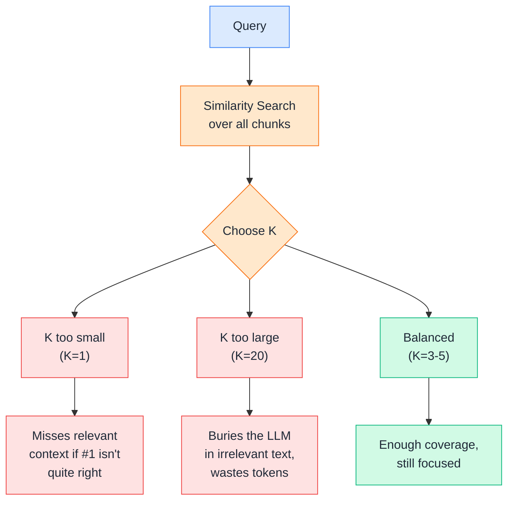
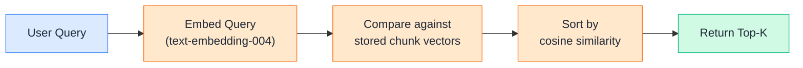
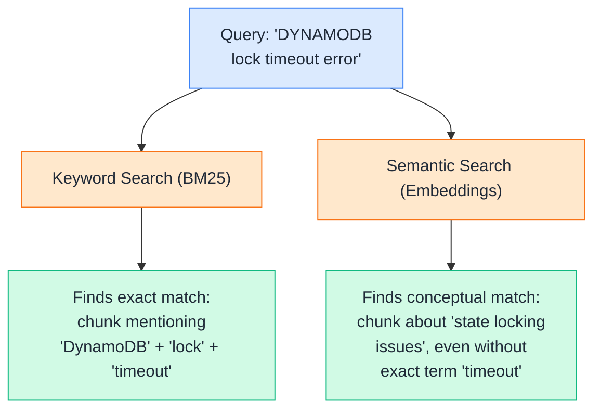
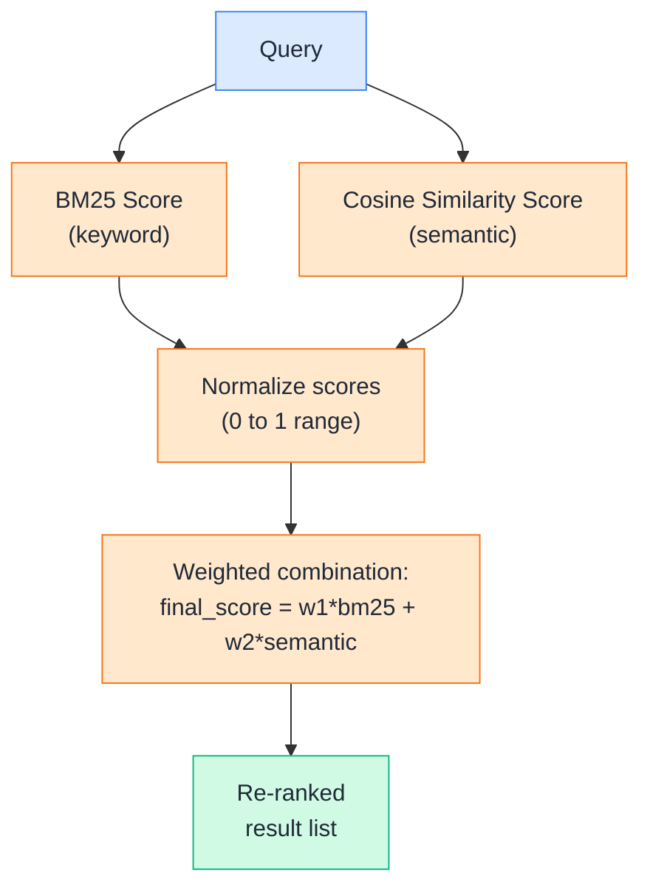
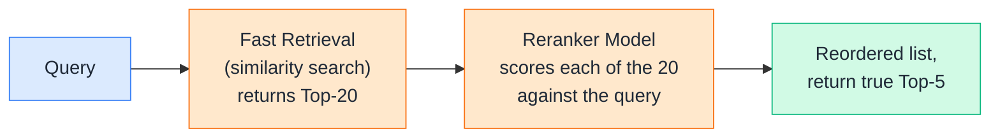
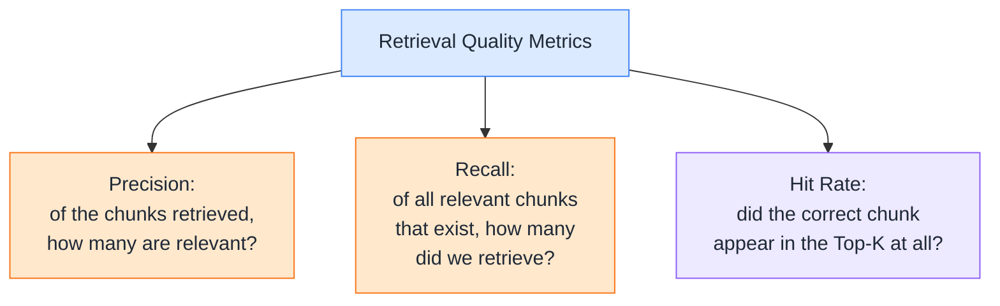
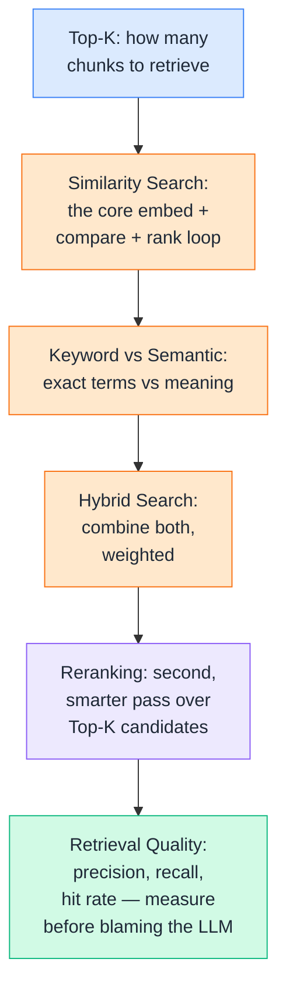

# Day 12 — Retrieval

---

## 1. Top-K

### 📖 Theory

**Top-K** simply means "return the K most relevant results," where K is a number you choose — top-3, top-5, top-10. Every retrieval step you've seen so far (Day 10's cosine similarity, Day 11's FAISS/Chroma/pgvector searches) ends by picking some Top-K, but the choice of K itself is a real design decision with trade-offs.



**DevOps analogy:** It's like deciding how many past incidents to hand an on-call engineer during a new outage. Show them just the single closest match, and they might miss a relevant edge case from a slightly different incident. Show them 20, and they'll spend more time reading than fixing. A curated 3–5 is usually the sweet spot.

**DevOps example:** A question like *"how do I roll back a bad deploy?"* usually has one clearly-best runbook chunk — `K=3` is plenty. A vaguer question like *"why do deployments keep failing this week?"* might genuinely need context spread across `K=8-10` different incident chunks to piece together a pattern.

**Rule of thumb:** Start with `K=3-5` for focused, factual questions. Increase K for broader or more exploratory questions — but every increase in K also increases prompt size and cost, so it's not a free lever.

> Theory-only here — you'll set K directly in the practical retrieval calls throughout this file.

---

## 2. Similarity Search

### 🧪 Practical

**Similarity search** is the retrieval step you already built in Days 10 and 11 — embed the query, compare it against stored vectors, return the closest ones. This section reuses that exact machinery, now explicitly wired up with a Top-K parameter.



**DevOps example:** Given the query *"pods keep crash-looping,"* similarity search doesn't need the exact phrase "crash-loop" to appear anywhere in your docs — a chunk about *"container restarts repeatedly due to failing liveness probes"* still surfaces near the top, because the embeddings capture the shared meaning.

**🧪 Try it yourself**

```python
from google import genai
import numpy as np

client = genai.Client()

def embed(texts):
    result = client.models.embed_content(model="text-embedding-004", contents=texts)
    return [np.array(e.values) for e in result.embeddings]

def cosine_similarity(a, b):
    return np.dot(a, b) / (np.linalg.norm(a) * np.linalg.norm(b))

def similarity_search(query, chunks, chunk_vectors, k=3):
    query_vector = embed([query])[0]
    scores = [cosine_similarity(query_vector, cv) for cv in chunk_vectors]
    ranked = sorted(zip(chunks, scores), key=lambda x: x[1], reverse=True)
    return ranked[:k]

chunks = [
    "Pods stuck in CrashLoopBackOff usually indicate a failing liveness probe or OOMKilled container.",
    "On-call escalation: unacknowledged pages escalate to the secondary engineer after 15 minutes.",
    "Rollback procedure: use kubectl rollout undo deployment/payments to revert to the previous version.",
    "Terraform state locking uses DynamoDB to prevent concurrent applies from corrupting state.",
]
chunk_vectors = embed(chunks)

results = similarity_search("pods keep crash-looping", chunks, chunk_vectors, k=2)
for text, score in results:
    print(f"{score:.4f}  {text[:65]}...")
```

Example output:
```
0.8114  Pods stuck in CrashLoopBackOff usually indicate a failing liv...
0.3382  Rollback procedure: use kubectl rollout undo deployment/paym...
```

👉 This is the exact core loop every vector database from Day 11 runs internally — they just make it faster at scale via indexing. The next sections build *around* this core step to make retrieval smarter, not just faster.

---

## 3. Keyword vs. Semantic Search

### 📖 Theory

**Keyword search** (like BM25) matches based on exact or near-exact word overlap — fast, precise, but blind to synonyms or paraphrasing. **Semantic search** (embeddings) matches based on meaning — catches paraphrases, but can occasionally miss an exact technical term that really matters.



**DevOps analogy:** Keyword search is like `grep "ERROR 503"` in your logs — precise, but only if you type the exact string. Semantic search is like an APM tool grouping "gateway timeout," "upstream unavailable," and "503" together as the same underlying failure class — useful, but it might also loop in things that are only loosely related.

**DevOps examples:**

- A user searches for the exact error code `ETIMEDOUT`. Keyword search nails this instantly. Semantic search might rank a chunk about *general* network flakiness above the chunk that literally contains `ETIMEDOUT`, because "network flakiness" sounds conceptually similar but isn't the precise match.
- A user asks *"why does my service keep restarting?"* — no exact keyword overlap with a runbook titled *"CrashLoopBackOff diagnosis."* Semantic search finds it; keyword search likely misses it entirely.

**Rule of thumb:** Exact identifiers (error codes, resource names, config keys, IDs) favor keyword search. Natural-language questions and paraphrased troubleshooting favor semantic search. Real systems rarely pick one — which is exactly what hybrid search (next) is for.

> Theory here, with keyword search implemented hands-on in the hybrid section below.

---

## 4. Hybrid Search

### 🧪 Practical

**Hybrid search** runs keyword search and semantic search *together*, then combines their scores — getting the precision of exact matches and the flexibility of meaning-based matches in one ranked list.



**DevOps example:** Querying *"DynamoDB lock timeout"* against a mixed knowledge base — hybrid search lets the exact term "DynamoDB" pull in the Terraform locking runbook via BM25, while the semantic score simultaneously ranks up a paraphrased chunk about *"state file conflicts during concurrent applies"* that never actually says "DynamoDB" at all.

**🧪 Try it yourself**

```python
from google import genai
from rank_bm25 import BM25Okapi
import numpy as np

client = genai.Client()

def embed(texts):
    result = client.models.embed_content(model="text-embedding-004", contents=texts)
    return [np.array(e.values) for e in result.embeddings]

def cosine_similarity(a, b):
    return np.dot(a, b) / (np.linalg.norm(a) * np.linalg.norm(b))

def normalize(scores):
    scores = np.array(scores, dtype="float64")
    if scores.max() == scores.min():
        return np.zeros_like(scores)
    return (scores - scores.min()) / (scores.max() - scores.min())

chunks = [
    "Terraform state locking uses DynamoDB to prevent concurrent applies from corrupting state.",
    "If two engineers run terraform apply at the same time, one will see a state conflict error.",
    "Rollback procedure: use kubectl rollout undo deployment/payments to revert to the previous version.",
]

query = "DynamoDB lock timeout"

# --- Keyword search (BM25) ---
tokenized_corpus = [c.lower().split() for c in chunks]
bm25 = BM25Okapi(tokenized_corpus)
bm25_scores = bm25.get_scores(query.lower().split())

# --- Semantic search (embeddings) ---
chunk_vectors = embed(chunks)
query_vector = embed([query])[0]
semantic_scores = [cosine_similarity(query_vector, cv) for cv in chunk_vectors]

# --- Combine (weighted hybrid) ---
bm25_norm = normalize(bm25_scores)
semantic_norm = normalize(semantic_scores)
hybrid_scores = 0.4 * bm25_norm + 0.6 * semantic_norm

for chunk, score in sorted(zip(chunks, hybrid_scores), key=lambda x: x[1], reverse=True):
    print(f"{score:.4f}  {chunk[:65]}...")
```

Example output:
```
1.0000  Terraform state locking uses DynamoDB to prevent concurrent ...
0.5123  If two engineers run terraform apply at the same time, one w...
0.0000  Rollback procedure: use kubectl rollout undo deployment/paym...
```

👉 The 0.4/0.6 weighting is a tunable knob — lean more toward BM25 (higher weight) when your queries tend to include exact identifiers; lean toward semantic when queries are typically natural-language questions.

---

## 5. Reranking

### 🧪 Practical

**Reranking** is a second, more expensive pass applied only to your initial Top-K candidates — using a stronger model to re-score and reorder them by *actual* relevance to the query, catching cases where fast similarity search got the ranking slightly wrong.



**DevOps analogy:** Fast retrieval is like a triage nurse doing a quick scan of symptoms to pull 20 possibly-relevant past cases. Reranking is the senior doctor actually reading each of those 20 case notes and reordering them by true relevance to the current patient. The first pass is optimized for speed and recall; the second pass is optimized for precision.

**DevOps example:** A query like *"service returns 502 intermittently under load"* might get an initial Top-10 from embedding search that includes both a highly relevant chunk about connection pool exhaustion *and* a loosely-related chunk that just happens to mention "502" in passing. Reranking, given the full query and full chunk text together, is much better at telling these apart than the original single-vector similarity score.

**🧪 Try it yourself**

```python
from google import genai
import json

client = genai.Client()

def llm_rerank(query, chunks, top_k=2):
    numbered = "\n".join(f"{i}: {c}" for i, c in enumerate(chunks))
    prompt = f"""Score each chunk's relevance to the query from 0-10.
Query: {query}

Chunks:
{numbered}

Respond ONLY with JSON: a list of objects like {{"index": 0, "score": 7}}, one per chunk."""

    response = client.models.generate_content(model="gemini-2.5-flash", contents=prompt)
    scores = json.loads(response.text.strip().strip("```json").strip("```"))
    ranked = sorted(scores, key=lambda x: x["score"], reverse=True)
    return [(chunks[r["index"]], r["score"]) for r in ranked[:top_k]]

# Candidates already returned by a fast first-pass similarity search
candidates = [
    "502 errors can appear in load balancer logs even for unrelated DNS resolution failures.",
    "Under sustained load, connection pool exhaustion causes intermittent 502s from the app servers.",
    "Restarting the pod usually clears a stuck 502 caused by a hung upstream connection.",
]

query = "service returns 502 intermittently under load"
top = llm_rerank(query, candidates, top_k=2)
for chunk, score in top:
    print(f"score={score}  {chunk[:65]}...")
```

Example output:
```
score=9  Under sustained load, connection pool exhaustion causes inte...
score=6  Restarting the pod usually clears a stuck 502 caused by a hu...
```

👉 Reranking is deliberately applied *after* a cheap first-pass retrieval, not instead of it — running an LLM call over your entire knowledge base for every query would be far too slow and expensive. Retrieve broad and fast, then rerank narrow and careful.

---

## 6. Retrieval Quality

### 📖 Theory

**Retrieval quality** is how you measure whether your pipeline is actually finding the right chunks — separate from whether the final LLM answer sounds good. A great-sounding answer built on the wrong retrieved chunk is still a broken pipeline; it just failed silently.



**DevOps analogy:** It's the same tension as alerting thresholds. Too sensitive (low precision) and every retrieval floods the LLM with noise, the way an over-eager alert floods on-call with false positives. Too conservative (low recall) and you miss the one chunk that actually mattered, the way a too-strict alert threshold misses a real outage.

**DevOps examples:**

- **Precision problem:** A query about "payments rollback" retrieves 5 chunks, but only 2 are actually about payments — the other 3 are generic rollback text from unrelated services. Low precision means the LLM has to sift through noise.
- **Recall problem:** The one chunk that explains *exactly* why the March payments outage happened exists in your knowledge base, but your retriever never surfaces it in the Top-5 for any phrasing of the question. Low recall means the answer is guaranteed to be incomplete, no matter how good the LLM is.
- **Hit rate in practice:** Build a small test set of 20 real questions your team has actually asked, each with a known correct source chunk. Run retrieval and check: did the correct chunk show up in the Top-K? A hit rate consistently below ~80% is a signal to revisit chunk size, embedding choice, or add hybrid search / reranking — not to blame the LLM for a "bad answer."

**Rule of thumb:** Debug a disappointing RAG answer by looking at what actually got retrieved *before* touching the prompt or the generation model. Most "the AI gave a wrong answer" problems in production RAG systems are retrieval problems wearing a generation costume.

> Theory-only — this is an evaluation practice you apply across the whole pipeline, not a single line of code to run.

---

## Quick Recap (Day 12)



---

## ⭐ Support

If you found this repository useful:

[](https://github.com/saghosh8/AI-For-DevOps)
<a href="https://github.com/saghosh8/AI-For-DevOps/fork">
  
</a>

---

## 💬 Have a Query

Have a question, suggestion, or idea?

[](https://github.com/saghosh8/AI-For-DevOps/discussions/3)

---

| 📘 Next — Day 13: Building RAG | [](https://github.com/saghosh8/AI-For-DevOps/blob/main/Week%202%20%E2%80%94%20RAG/Day%2013%20%E2%80%94%20Building%20RAG.md) |
| --------------------------------------------------- | ---------------------------------------------------------------------------------------------------------------------------------------------------------------------------------------------------------------------------------------------- |
