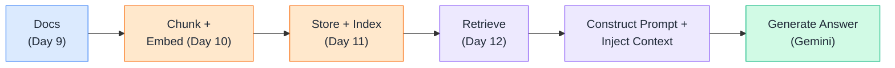
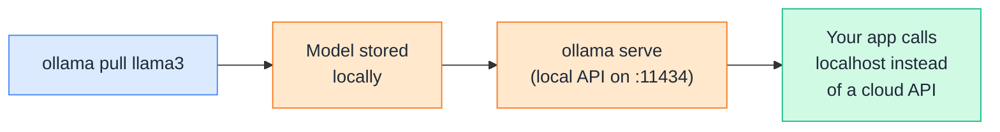
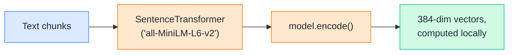
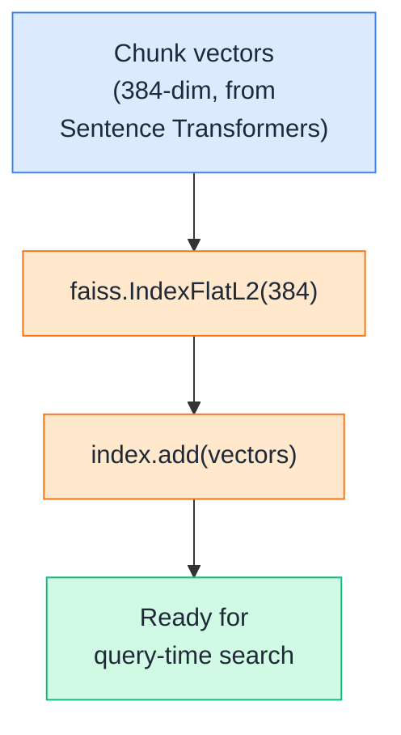
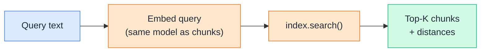
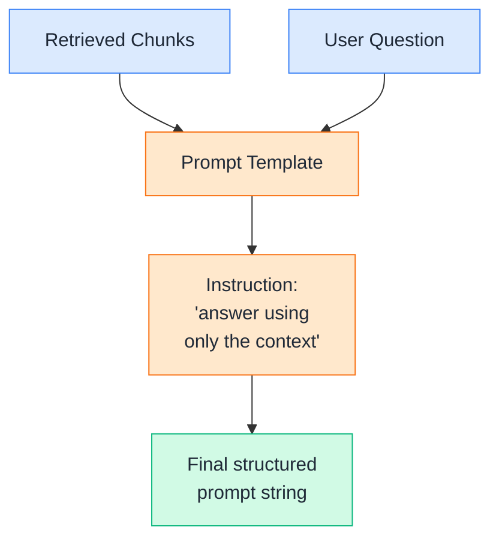
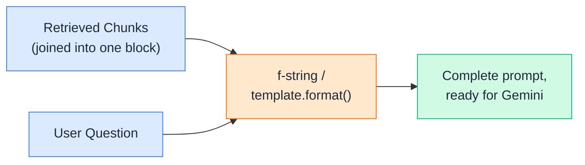
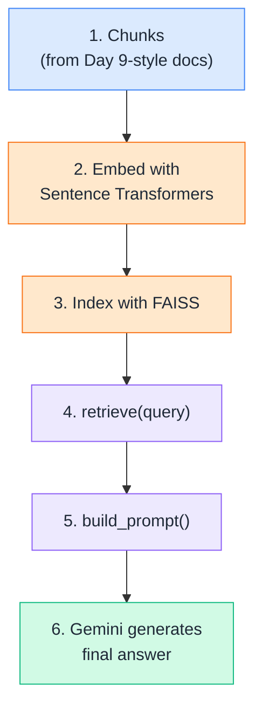
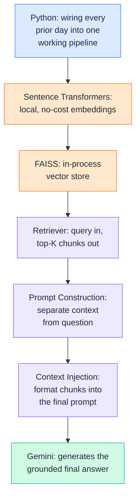

# Day 13 — Building RAG

---

## 1. Python

### 📖 Theory

Everything in this course so far has been building toward this: a **complete, working RAG pipeline**, written in plain Python, stitching together the pieces from Days 8–12 into one script that actually answers questions from your own documents.



**DevOps analogy:** Every prior day was one microservice — the loader, the chunker, the embedder, the vector store, the retriever. Today is the deploy: wiring those independent pieces into one pipeline that actually runs end-to-end, the way you'd stitch individual CI stages into a single working pipeline YAML.

**DevOps example:** Today's build target is an "ask your runbooks" tool — point it at a folder of DevOps docs, ask a plain-English question, and get back an answer grounded in your team's actual runbooks, not the model's general training knowledge.

**Stack for today:**

| Piece | Tool | Role |
|---|---|---|
| Embeddings | Sentence Transformers | Turn chunks + queries into vectors, locally, no API cost |
| Vector store | FAISS | Fast in-process similarity search |
| Generation | Gemini (`gemini-2.5-flash`) | Writes the final grounded answer |

> Theory-only — the rest of this file builds each piece, then wires them together in Section 8.

---

## 2. Ollama

### 📖 Theory

**Ollama** is a tool for running open-source LLMs (Llama, Mistral, Gemma, and others) directly on your own machine — pull a model once, then serve it locally behind a simple API, no cloud account or per-token billing required.



**DevOps analogy:** It's the difference between calling out to a managed cloud service and running that same workload as a container on your own box — same interface, but now it's local, private, and doesn't show up on a usage bill.

**DevOps example:** For a RAG tool that queries internal runbooks — think incident response docs, credentials setup, infra notes — routing generation through Ollama means none of that sensitive context ever leaves the machine, which matters a lot more than it does for, say, summarizing public blog posts.

### 🧪 Practical

**🧪 Try it yourself**

```bash
# Pull a model once (downloaded and cached locally)
ollama pull llama3

# Ollama now runs a local server on http://localhost:11434
```

```python
import requests

response = requests.post(
    "http://localhost:11434/api/generate",
    json={
        "model": "llama3",
        "prompt": "In one sentence, what does 'kubectl rollout undo' do?",
        "stream": False,
    },
)

print(response.json()["response"])
```

Example output:
```
`kubectl rollout undo` reverts a deployment to its previous revision,
rolling back a bad or unwanted rollout.
```

👉 Ollama slots into the same spot Gemini fills later in this pipeline — the generation step. Swapping between them is mostly a matter of swapping which function `ask()` calls at the end: Gemini when you want a strong hosted model, Ollama when you want everything running fully local and offline.

---

## 3. Sentence Transformers

### 🧪 Practical

You already met FAISS in Day 11 — today it plays its actual role: the in-process vector store holding every embedded chunk from your knowledge base, ready for fast similarity search at query time.

**Sentence Transformers** is a Python library for generating embeddings *locally* — no API calls, no per-request cost, runs entirely on your own machine. It's a great fit for the embedding step of a self-contained tool, keeping the only external API call reserved for the final generation step.



**DevOps example:** A CLI tool that indexes and searches thousands of internal runbooks needs to run that embedding step over and over as docs change — doing it locally with Sentence Transformers avoids per-call API costs and network latency for what's essentially an internal indexing job, reserving your Gemini API calls for the part that actually needs a large model: generating the final answer.

**🧪 Try it yourself**

```python
from sentence_transformers import SentenceTransformer

model = SentenceTransformer("all-MiniLM-L6-v2")

chunks = [
    "Rollback procedure: use kubectl rollout undo deployment/payments to revert to the previous version.",
    "On-call escalation: unacknowledged pages escalate to the secondary engineer after 15 minutes.",
    "Terraform state locking uses DynamoDB to prevent concurrent applies from corrupting state.",
]

chunk_vectors = model.encode(chunks)
print(f"Shape: {chunk_vectors.shape}")
print(f"First 5 values of vector 1: {chunk_vectors[0][:5]}")
```

Example output:
```
Shape: (3, 384)
First 5 values of vector 1: [-0.0231  0.0847 -0.0512  0.0193  0.0664]
```

👉 Note the dimension here is **384**, not the 768 you saw with Gemini's `text-embedding-004` in Day 10 — every embedding model has its own fixed dimensionality. This matters later: whatever model embeds your chunks must also embed your queries, since vectors from two different models aren't comparable to each other.

---

## 4. FAISS

### 🧪 Practical

You already met FAISS in Day 11 — today it plays its actual role: the in-process vector store holding every embedded chunk from your knowledge base, ready for fast similarity search at query time.



**DevOps example:** This index gets built once, when your tool starts up or when runbooks change — not on every single question. Just like you wouldn't rebuild a Docker image on every request, you don't want to re-embed and re-index your entire knowledge base on every query.

**🧪 Try it yourself**

```python
import faiss
import numpy as np

# chunk_vectors from Section 3 (shape: 3, 384)
dimension = chunk_vectors.shape[1]
index = faiss.IndexFlatL2(dimension)
index.add(np.array(chunk_vectors, dtype="float32"))

print(f"Index built. Total vectors stored: {index.ntotal}")
```

Example output:
```
Index built. Total vectors stored: 3
```

👉 This index now lives entirely in memory — perfect for a script or CLI tool. For anything that needs to persist across restarts or scale past a single process, this is exactly where you'd swap in Chroma or pgvector from Day 11 instead, without changing anything else in the pipeline.

---

## 5. Retriever

### 🧪 Practical

The **retriever** wraps embedding + search into one reusable function — given a plain-text query, it returns the Top-K most relevant chunks. This is the piece that turns "a FAISS index sitting in memory" into "something the rest of the pipeline can actually call."



**DevOps example:** Wrapping this in a single `retrieve(query, k=3)` function means the rest of your tool — the CLI, the Slack bot, the API endpoint — never has to know FAISS or Sentence Transformers exist. It just calls `retrieve()` and gets chunks back, the same way a service calls a well-defined internal API without knowing what's running behind it.

**🧪 Try it yourself**

```python
def retrieve(query, index, chunks, embed_model, k=2):
    query_vector = embed_model.encode([query])
    distances, indices = index.search(np.array(query_vector, dtype="float32"), k)
    return [chunks[i] for i in indices[0]]

results = retrieve("how do I roll back a bad deploy?", index, chunks, model, k=2)
for r in results:
    print("-", r[:70], "...")
```

Example output:
```
- Rollback procedure: use kubectl rollout undo deployment/payments to  ...
- Terraform state locking uses DynamoDB to prevent concurrent applies  ...
```

👉 This function is the seam between everything "offline" (loading, chunking, embedding, indexing — done once) and everything "online" (retrieval, prompting, generation — done per query), matching the two-phase architecture diagram from Day 8.

---

## 6. Prompt Construction

### 📖 Theory

**Prompt construction** is turning the retrieved chunks and the user's question into a single, well-structured instruction for the LLM — one that makes it clear what's *reference material* versus what's actually *being asked*.



**DevOps analogy:** It's like writing a well-formed Jira ticket instead of a vague Slack message — clearly separating "here's the relevant background" from "here's what I actually need you to do" gets a much more reliable result than dumping everything into one unstructured blob.

**DevOps examples:**

- A weak prompt: `"{chunk1} {chunk2} how do I roll back?"` — no structure, the model has to guess where context ends and the question begins.
- A strong prompt: clearly labeled `Context:` and `Question:` sections, plus an explicit instruction like *"answer using only the information in the context; if the answer isn't there, say so"* — this single instruction is what prevents the model from quietly falling back on its own general knowledge when your docs don't actually cover something.

> Theory here — the actual template gets built and used together with context injection in Section 7.

---

## 7. Context Injection

### 🧪 Practical

**Context injection** is the literal string-formatting step — taking retrieved chunks and inserting them into the prompt template, right before sending it to the model. This is where "retrieval" and "generation" physically meet.



**DevOps example:** If two retrieved chunks conflict — say, an old runbook still says one thing and a newer one contradicts it — how you *inject* them matters. Labeling each chunk with its source (`[rollback-runbook.md, updated 2026-08]`) lets the model reason about which one is more current, instead of silently blending two conflicting instructions into a wrong answer.

**🧪 Try it yourself**

```python
def build_prompt(query, retrieved_chunks):
    context = "\n\n".join(f"- {c}" for c in retrieved_chunks)
    return f"""Answer the question using ONLY the context below.
If the context doesn't contain the answer, say you don't know.

Context:
{context}

Question: {query}
Answer:"""

retrieved = retrieve("how do I roll back a bad deploy?", index, chunks, model, k=2)
prompt = build_prompt("how do I roll back a bad deploy?", retrieved)
print(prompt)
```

Example output:
```
Answer the question using ONLY the context below.
If the context doesn't contain the answer, say you don't know.

Context:
- Rollback procedure: use kubectl rollout undo deployment/payments to revert to the previous version.
- Terraform state locking uses DynamoDB to prevent concurrent applies from corrupting state.

Question: how do I roll back a bad deploy?
Answer:
```

👉 Everything up to this point has been preparation — this fully-formed prompt string is the payload. The next section sends it to Gemini and gets the final answer back.

---

## 8. Putting It All Together

### 🧪 Practical

Time to run the complete pipeline, end to end — from a raw list of documents to a grounded, generated answer.



**🧪 Try it yourself**

```python
from sentence_transformers import SentenceTransformer
from google import genai
import faiss
import numpy as np

gemini_client = genai.Client()
embed_model = SentenceTransformer("all-MiniLM-L6-v2")

# --- 1. Knowledge base (in a real tool, this comes from Day 9's loaders) ---
chunks = [
    "Rollback procedure: use kubectl rollout undo deployment/payments to revert to the previous version.",
    "On-call escalation: unacknowledged pages escalate to the secondary engineer after 15 minutes.",
    "Terraform state locking uses DynamoDB to prevent concurrent applies from corrupting state.",
]

# --- 2 & 3. Embed + index (offline phase, done once) ---
chunk_vectors = embed_model.encode(chunks)
index = faiss.IndexFlatL2(chunk_vectors.shape[1])
index.add(np.array(chunk_vectors, dtype="float32"))

def retrieve(query, k=2):
    query_vector = embed_model.encode([query])
    _, indices = index.search(np.array(query_vector, dtype="float32"), k)
    return [chunks[i] for i in indices[0]]

def build_prompt(query, retrieved_chunks):
    context = "\n\n".join(f"- {c}" for c in retrieved_chunks)
    return f"""Answer the question using ONLY the context below.
If the context doesn't contain the answer, say you don't know.

Context:
{context}

Question: {query}
Answer:"""

def ask(query):
    # --- 4. Retrieve ---
    retrieved_chunks = retrieve(query)
    # --- 5. Construct prompt + inject context ---
    prompt = build_prompt(query, retrieved_chunks)
    # --- 6. Generate ---
    response = gemini_client.models.generate_content(model="gemini-2.5-flash", contents=prompt)
    return response.text

print(ask("How do I revert the payments deployment?"))
```

Example output:
```
Run `kubectl rollout undo deployment/payments` to revert the payments
deployment to its previous version.
```

👉 This is a real, working RAG pipeline — not a toy. Swap the in-memory `chunks` list for Day 9's document loaders, swap `IndexFlatL2` for Chroma or pgvector from Day 11 if you need persistence, and this exact structure — retrieve, construct, inject, generate — scales up to a production system.

---

## Quick Recap (Day 13)



---

## ⭐ Support

If you found this repository useful:

[](https://github.com/saghosh8/AI-For-DevOps)
<a href="https://github.com/saghosh8/AI-For-DevOps/fork">
  
</a>

---

## 💬 Have a Query

Have a question, suggestion, or idea?

[](https://github.com/saghosh8/AI-For-DevOps/discussions/3)

---

| 📘 Next — Day 14: RAG Project | [](https://github.com/saghosh8/AI-For-DevOps/blob/main/Week%202%20%E2%80%94%20RAG/Day%2014%20%E2%80%94%20RAG%20Project.md) |
| --------------------------------------------- | ---------------------------------------------------------------------------------------------------------------------------------------------------------------------------------------------------------- |
