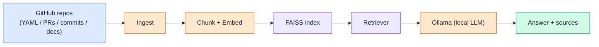
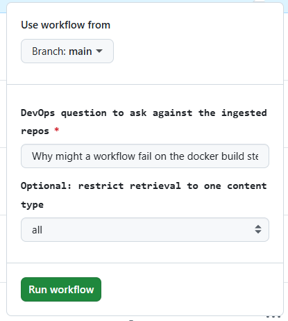
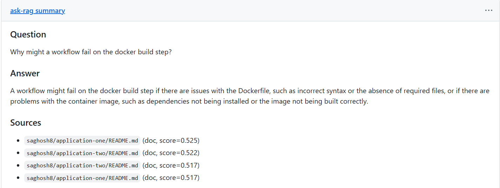

# Day 14 — RAG Project: Ask RAG Anything

📦 **Project repo:** [ai-devops-release-assistant](https://github.com/saghosh8/ai-devops-release-assistant)

This day builds directly on top of the Day 7 mini project — same repo, no rewrite. Days 8–13 covered RAG concept by concept (chunking, embeddings, vector databases, retrieval). Today those pieces get wired into the existing assistant so it can answer questions grounded in **real repos**, not a scripted demo.

---

## Problem Statement

A DevOps assistant that only knows what's in its prompt is limited to whatever you paste in by hand. This project pulls real, live content — workflow YAMLs, pull requests, commits, and README docs — from actual GitHub repos, embeds it, indexes it in FAISS, and retrieves the most relevant chunks to ground an answer generated locally by Ollama. Ask it something like *"why would the release workflow fail on the docker build step?"* and it answers using what's actually in those repos, with sources cited — not a guess.

---

## What Changed From the Sample-Data Version

Early builds of this pipeline ingested from a small folder of fixture data (`sample_repo_data/`) — enough to prove the pipeline worked, but not representative of a real project. That's been replaced:

- `ingest.py` now pulls live from the GitHub REST API — workflow YAMLs, PR titles/bodies, commit messages, and README — instead of reading local JSON/Markdown fixtures
- Ingestion targets **3 real repos**: [`release-automation`](https://github.com/saghosh8/release-automation), `application-one`, and `application-two`
- Retrieval and embedding logic (Days 10–12) didn't need to change — they operate on `Document` objects regardless of where those came from, which is the point of keeping ingestion behind one interface

---

## What You Need

- **Ollama** installed (or let the GitHub Actions workflow install and run it for you — no local setup required)
- A **GitHub token** with read access to the 3 target repos — the built-in Actions token only reads within the same repo, so a personal access token (`GH_PAT` secret, Contents + Pull requests read-only) is needed if those repos are private. Public repos work unauthenticated (lower rate limit)
- That's it — no paid API key, since generation runs on a local model via Ollama

---

## Running It — via GitHub Actions (no local setup)

1. If the 3 target repos are private, create a fine-grained PAT (Contents + Pull requests, read-only) and add it as a repo secret named `GH_PAT`
2. **Actions tab → "Ask RAG Anything" → Run workflow**
3. Type a question — e.g. *"what does the release workflow do on merge to the release branch?"*
4. Optionally restrict the answer to one content type (`yaml`, `pr`, `commit`, `doc`) using the filter input
5. Open the completed run — the answer and its sources are in the **Summary**

The first run builds the FAISS index from scratch (pass `--rebuild-index` is already the default in the workflow); later runs can reuse a cached index if you wire that up yourself.

---

# Input → Output

**Input** (typed into the `question` field when running the workflow):

**Output** (rendered automatically in the GitHub Actions run Summary — answer plus cited sources like `release-automation/.github/workflows/prod_cd.yml` or `application-one PR #12`):

---

## ⭐ Support

If you found this repository useful:

---

## 💬 Have a Query

Have a question, suggestion, or idea?

---

| 📘 Next — Day 15: AI Agents |  |
| ------------------------------ | -------------------------------------------------------------------------------------------------------------------------------------------------------------------------------------------------------------------------------------------------------------------------------- |
