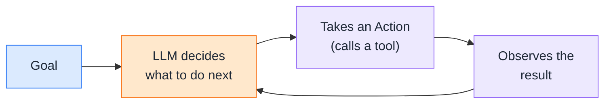
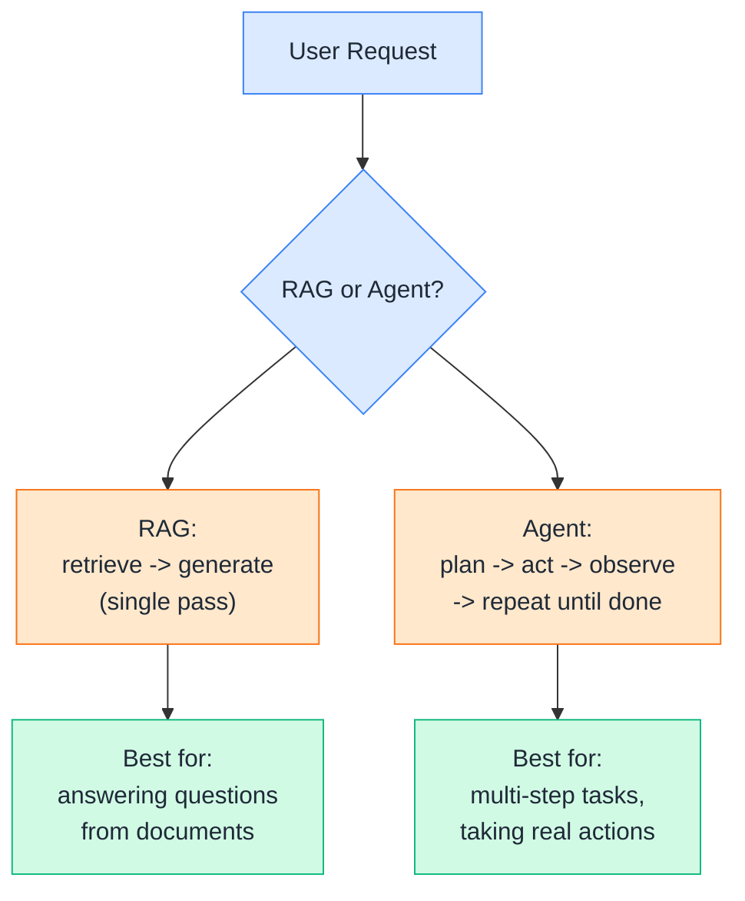
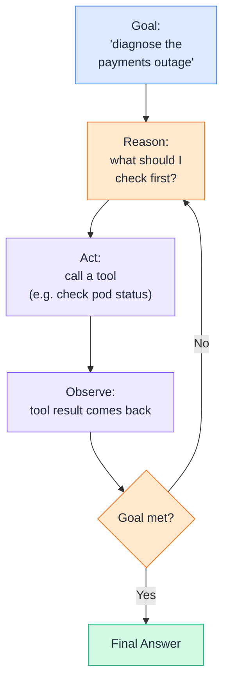
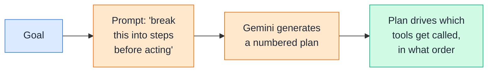
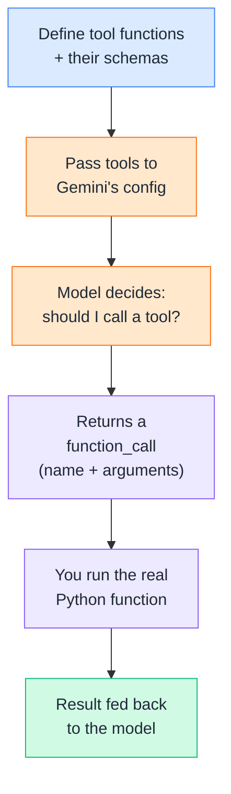
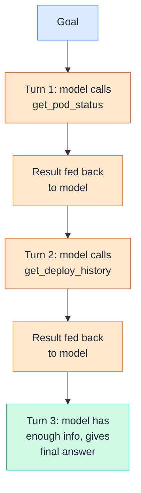
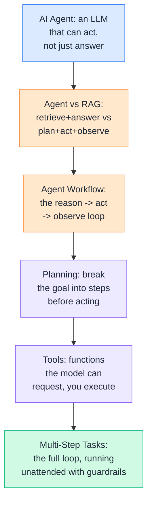

# Day 15 — AI Agents

---

## 1. What is an AI Agent?

### 📖 Theory

An **AI agent** is an LLM given the ability to *act* — not just answer a question in one shot, but decide what to do next, take an action, observe the result, and decide again. Everything you've built through Day 14 answers a question. An agent can go *do something about it*.



**DevOps analogy:** RAG is like a search engine that hands you the right documentation. An agent is more like an SRE who reads that documentation, then actually goes and runs the kubectl command, checks whether the pod came back healthy, and decides what to try next if it didn't — a loop, not a single lookup.

**DevOps example:** You ask *"why is the payments service returning 500s?"* A plain RAG system finds and summarizes the relevant runbook. An agent goes further: it queries current pod status, checks recent deploy history, correlates that with the runbook's known causes, and reports back an actual diagnosis — deciding for itself which checks to run and in what order.

> Theory-only here — Section 2 draws the line between this and everything you built in Week 2 more precisely.

---

## 2. Agent vs RAG

### 📖 Theory

RAG and agents solve different problems. RAG makes an LLM's *answers* better by grounding them in retrieved documents. Agents make an LLM's *actions* possible by giving it tools to call and a loop to decide what to call and when. They're not competitors — an agent very often *uses* RAG as one of its tools.



**DevOps examples — same question, two different systems:**

- **"What does our rollback runbook say?"** — this is a RAG question. Retrieve the chunk, generate an answer, done in one pass.
- **"Roll back the payments deployment and confirm it's healthy."** — this needs an agent. It has to run the rollback command, check pod status, maybe check logs if something looks wrong, and only then report success — a sequence of decisions, not a single lookup.

**Rule of thumb:** If the task is "find and explain information," reach for RAG. If the task is "do a sequence of things and adapt based on what happens," reach for an agent. Many real systems are both: an agent that has RAG as one of the tools it can call mid-task.

> Theory-only — the mechanics of that loop are covered next.

---

## 3. Agent Workflow

### 📖 Theory

The core agent loop, sometimes called **ReAct** (Reason + Act), repeats a simple cycle: the model reasons about what to do, takes one action, observes the result, and reasons again — continuing until the goal is met or it decides to stop.



**DevOps analogy:** This is exactly the shape of an incident response runbook — check a signal, decide what it means, act on that decision, check the next signal based on what you just learned. It's not a fixed checklist executed top to bottom; each step depends on what the previous one revealed.

**DevOps example:** Diagnosing "payments service returning 500s" might unfold as: reason ("check pod status first") → act (call `get_pod_status` tool) → observe (pods are healthy) → reason ("must be upstream — check recent deploys") → act (call `get_deploy_history` tool) → observe (a deploy went out 10 minutes ago) → reason ("that's likely the cause") → final answer. Each step's action depends on the *previous* step's result — that's what makes it a loop, not a script.

> Theory-only — Sections 4–6 build the actual pieces: how the model plans, how it calls real tools, and how the loop runs across multiple steps.

---

## 4. Planning

### 🧪 Practical

**Planning** is the "reason" half of the loop — before (or between) taking actions, the model breaks a goal down into steps. You can prompt for this explicitly, asking the model to lay out its plan before it starts acting.



**DevOps example:** For the goal *"diagnose why the payments service is returning 500s,"* a good plan front-loads the cheapest, most likely checks first (pod health, recent deploys) before expensive or narrow ones (full log analysis) — the same instinct a senior engineer uses when triaging, rather than randomly checking everything at once.

**🧪 Try it yourself**

```python
from google import genai

client = genai.Client()

def make_plan(goal):
    prompt = f"""You are an SRE assistant. Break the following goal into a short,
ordered list of concrete diagnostic steps. Keep it to 3-5 steps.

Goal: {goal}

Respond as a numbered list only."""
    response = client.models.generate_content(model="gemini-2.5-flash", contents=prompt)
    return response.text

plan = make_plan("Diagnose why the payments service is returning 500 errors.")
print(plan)
```

Example output:
```
1. Check current pod status for the payments deployment.
2. Review recent deployment history for the past hour.
3. If pods are healthy, check upstream dependency health (database, cache).
4. Correlate any recent deploy with the time errors started appearing.
5. Summarize the likely root cause based on findings.
```

👉 This plan isn't executed blindly step-by-step — it's a starting outline. As you'll see in Section 6, the agent re-evaluates after every observation, so the plan can change mid-flight if step 1 reveals something the plan didn't anticipate.

---

## 5. Tools

### 🧪 Practical

**Tools** are the functions an agent is allowed to call — each with a name, a description, and defined parameters, so the model knows *what* it can do and *when* it makes sense to reach for it. Gemini's function calling is what turns "the model wants to check pod status" into an actual Python function running on your machine.



**DevOps example:** A `get_pod_status(service)` tool wraps a real `kubectl get pods` call. A `get_deploy_history(service)` tool wraps your CI system's API. The model never runs these directly — it only *requests* them by name and arguments; your code decides whether and how to actually execute them, which is exactly where you'd add guardrails (e.g., read-only tools only, no destructive actions without human approval).

**🧪 Try it yourself**

```python
from google import genai
from google.genai import types

client = genai.Client()

# --- Real functions the agent can call ---
def get_pod_status(service: str) -> dict:
    # In a real tool, this would call kubectl or the k8s API
    return {"service": service, "status": "Running", "restarts": 0}

def get_deploy_history(service: str) -> dict:
    return {"service": service, "last_deploy": "10 minutes ago", "version": "v2.14.1"}

pod_status_tool = {
    "name": "get_pod_status",
    "description": "Gets the current pod status for a given service.",
    "parameters": {
        "type": "object",
        "properties": {"service": {"type": "string", "description": "Service name"}},
        "required": ["service"],
    },
}
deploy_history_tool = {
    "name": "get_deploy_history",
    "description": "Gets the most recent deployment info for a given service.",
    "parameters": {
        "type": "object",
        "properties": {"service": {"type": "string", "description": "Service name"}},
        "required": ["service"],
    },
}

tools = types.Tool(function_declarations=[pod_status_tool, deploy_history_tool])
config = types.GenerateContentConfig(tools=[tools])

response = client.models.generate_content(
    model="gemini-2.5-flash",
    contents="The payments service is returning 500s. Check its pod status first.",
    config=config,
)

call = response.candidates[0].content.parts[0].function_call
print(f"Model wants to call: {call.name}({dict(call.args)})")
```

Example output:
```
Model wants to call: get_pod_status({'service': 'payments'})
```

👉 The model doesn't run `get_pod_status` — it just *asks* for it. Your code is the one that actually executes `get_pod_status("payments")` and decides what to send back. That boundary is the entire safety model of tool-calling: the LLM proposes, your code disposes.

---

## 6. Multi-Step Tasks

### 🧪 Practical

This is where planning, tools, and the agent loop from Section 3 all come together — running the full reason → act → observe cycle across *multiple* turns until the goal is actually resolved.



**DevOps example:** A single-turn tool call tells you pods are healthy — but that alone doesn't diagnose anything. The value of *multi-step* is the model taking that observation ("pods are fine") and deciding on its own to check the next most likely cause ("must be upstream — check deploy history") without a human manually feeding it the next question each time.

**🧪 Try it yourself**

```python
from google import genai
from google.genai import types
import json

client = genai.Client()

def get_pod_status(service: str) -> dict:
    return {"service": service, "status": "Running", "restarts": 0}

def get_deploy_history(service: str) -> dict:
    return {"service": service, "last_deploy": "10 minutes ago", "version": "v2.14.1"}

available_functions = {
    "get_pod_status": get_pod_status,
    "get_deploy_history": get_deploy_history,
}

tools = types.Tool(function_declarations=[
    {
        "name": "get_pod_status",
        "description": "Gets the current pod status for a given service.",
        "parameters": {"type": "object", "properties": {"service": {"type": "string"}}, "required": ["service"]},
    },
    {
        "name": "get_deploy_history",
        "description": "Gets the most recent deployment info for a given service.",
        "parameters": {"type": "object", "properties": {"service": {"type": "string"}}, "required": ["service"]},
    },
])
config = types.GenerateContentConfig(tools=[tools])

contents = [{"role": "user", "parts": [{"text":
    "Diagnose why the payments service is returning 500 errors. "
    "Check pod status and recent deploys, then give a root-cause summary."}]}]

for step in range(5):  # safety cap on loop iterations
    response = client.models.generate_content(model="gemini-2.5-flash", contents=contents, config=config)
    part = response.candidates[0].content.parts[0]

    if part.function_call:
        call = part.function_call
        print(f"[step {step+1}] calling: {call.name}({dict(call.args)})")
        result = available_functions[call.name](**call.args)

        contents.append({"role": "model", "parts": [{"function_call": call}]})
        contents.append({"role": "user", "parts": [{
            "function_response": {"name": call.name, "response": result}
        }]})
    else:
        print(f"[step {step+1}] final answer:\n{response.text}")
        break
```

Example output:
```
[step 1] calling: get_pod_status({'service': 'payments'})
[step 2] calling: get_deploy_history({'service': 'payments'})
[step 3] final answer:
Pods are healthy with zero restarts, but a deployment (v2.14.1) went out
10 minutes ago — right before the 500s started. This strongly suggests
the new deploy introduced the issue. Recommend rolling back to the
previous version and monitoring error rates.
```

👉 This loop, running unattended for multiple steps, is the entire difference between a chatbot and an agent. The `range(5)` cap is a deliberate guardrail, not an afterthought — always bound how many steps an agent can take on its own, so a confused model can't loop forever calling tools.

---

## Quick Recap (Day 15)



---

## ⭐ Support

If you found this repository useful:

[](https://github.com/saghosh8/AI-For-DevOps)
<a href="https://github.com/saghosh8/AI-For-DevOps/fork">
  
</a>

---

## 💬 Have a Query

Have a question, suggestion, or idea?

[](https://github.com/saghosh8/AI-For-DevOps/discussions/3)

---

| 📘 Next — Day 16: Function Calling / Tool Use | [](https://github.com/saghosh8/AI-For-DevOps/blob/main/Week%203%20%E2%80%94%20Agents%2C%20Security%20%26%20Production/Day%2016%20%E2%80%94%20Function%20Calling%20%26%20Tool%20Use.md) |
| -------------------------------------------- | ------------------------------------------------------------------------------------------------------------------------------------------------------------------------------------------------------- |
