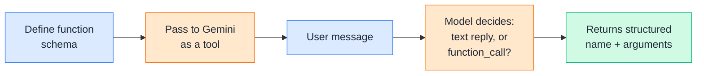
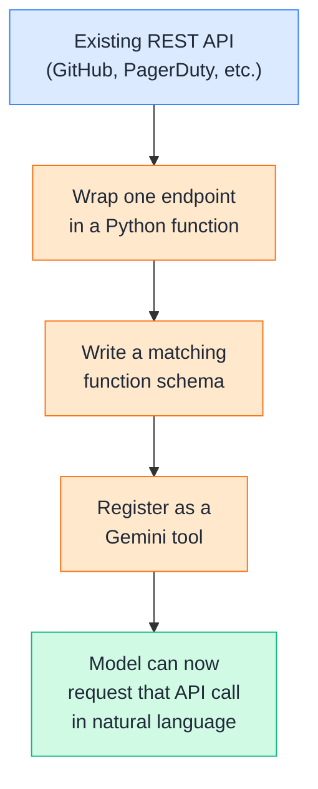
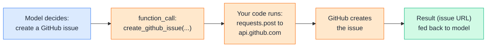
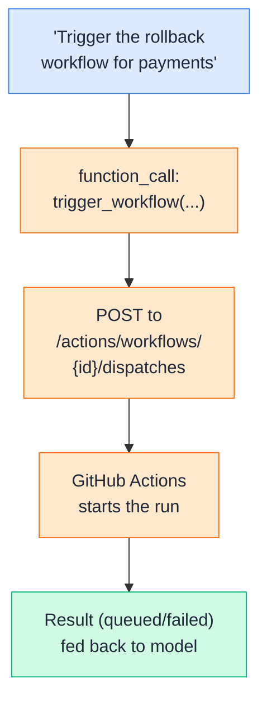
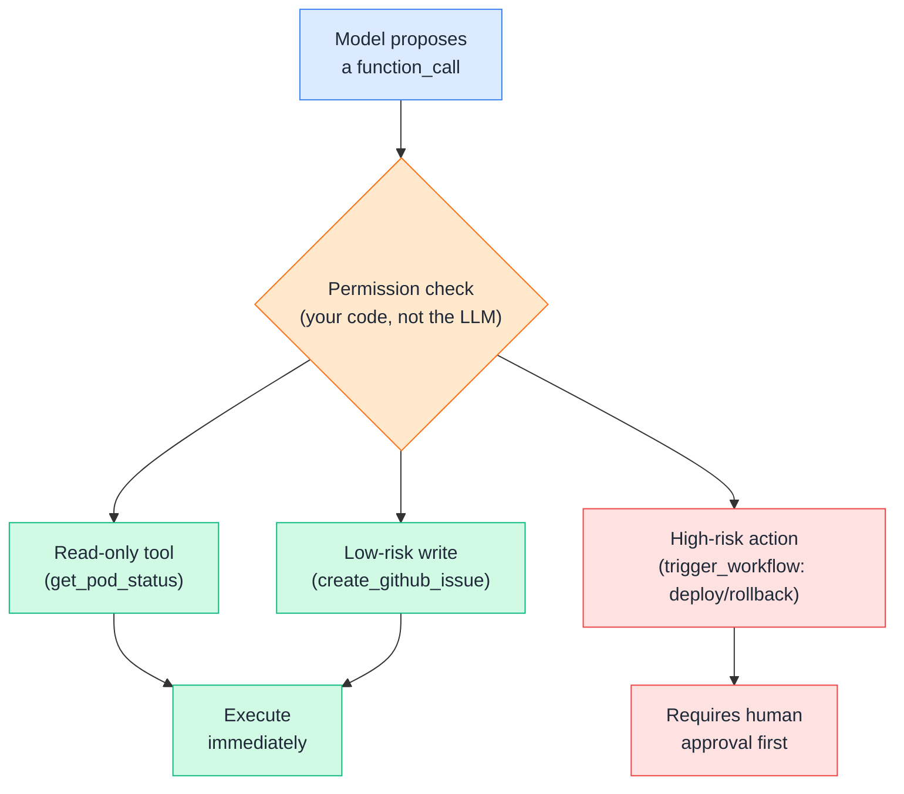
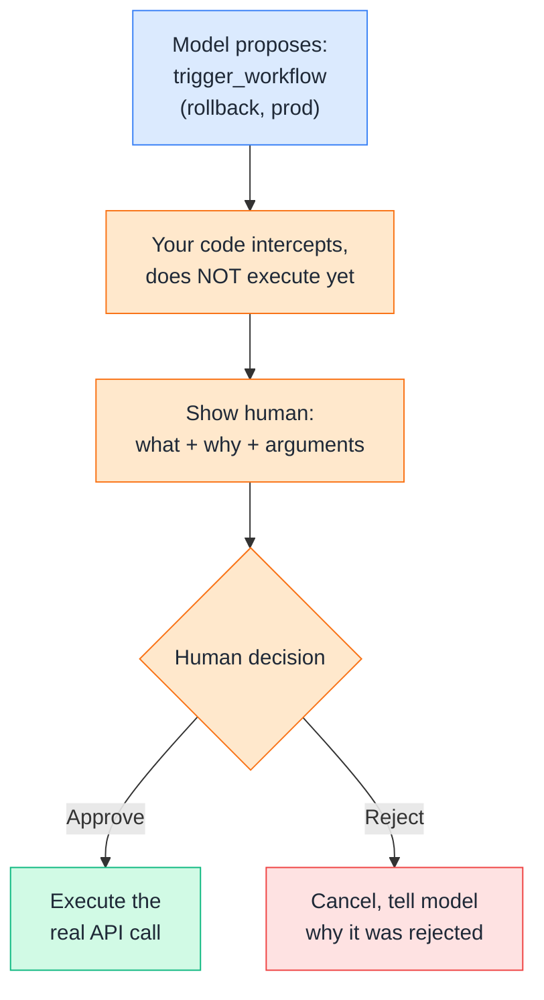
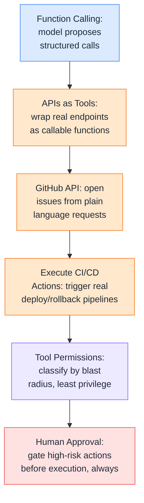

# Day 16 — Function Calling / Tool Use

---

## 1. Function Calling

### 📖 Theory

**Function calling** is the mechanism from Day 15 you're now applying for real: you describe a function's name, purpose, and parameters to Gemini, and the model — instead of just replying in text — can respond with a structured request to call that function, with arguments it inferred from the conversation.



**DevOps analogy:** It's the difference between a chatbot that can only *describe* how to restart a service, and one that can actually fill out the correct API call — service name, environment, replica count — ready for your code to execute. The model becomes a natural-language-to-structured-call translator.

**DevOps example:** Today's build target is a tool-using DevOps assistant that can query and act on a real external system — GitHub — going from *"open an issue about this bug"* in plain English to an actual, correctly-formed API call your code can run.

> Theory-only here — Section 2 shows what "a tool" really is under the hood: usually just a wrapper around an API call.

---

## 2. APIs as Tools

### 📖 Theory

Most tools an agent calls aren't custom logic — they're thin wrappers around existing REST APIs you already use every day: GitHub, PagerDuty, Jira, your cloud provider. The "tool" is really just: a schema describing the API call, plus a Python function that makes the actual HTTP request.



**DevOps analogy:** This is exactly what an internal developer platform (IDP) does — it takes raw cloud and CI/CD APIs and exposes them as simple, self-service actions ("deploy," "rollback," "scale") that engineers use without touching the underlying API directly. Turning an API into a tool for an LLM is the same idea, just with a model as the "user" of that self-service layer.

**DevOps example:** You already have a Python function that calls the GitHub API to open an issue. Turning it into a tool is mostly just writing an accurate schema around a function you'd have written anyway — the API integration work isn't new, only the layer that lets an LLM decide when to call it is.

> Theory-only — Section 3 builds exactly this, wrapping a real GitHub API endpoint.

---

## 3. GitHub API

### 🧪 Practical

Wiring up the GitHub API as a tool means writing a real function that calls `api.github.com`, then describing that function to Gemini so it can be requested naturally — *"open an issue about the failing health check."*



**DevOps example:** An on-call engineer tells the assistant *"the health check for payments-service is flapping, file an issue."* The model extracts the title and body, calls the tool, and a real GitHub issue appears — tagged, assigned, and linked — without the engineer leaving their terminal or chat window to open a browser tab.

**🧪 Try it yourself**

```python
from google import genai
from google.genai import types
import requests
import os

client = genai.Client()
GITHUB_TOKEN = os.environ["GITHUB_TOKEN"]

def create_github_issue(owner: str, repo: str, title: str, body: str) -> dict:
    url = f"https://api.github.com/repos/{owner}/{repo}/issues"
    headers = {
        "Authorization": f"token {GITHUB_TOKEN}",
        "Accept": "application/vnd.github.v3+json",
    }
    response = requests.post(url, headers=headers, json={"title": title, "body": body})
    if response.status_code == 201:
        data = response.json()
        return {"status": "created", "url": data["html_url"], "number": data["number"]}
    return {"status": "failed", "code": response.status_code, "message": response.text}

create_issue_tool = {
    "name": "create_github_issue",
    "description": "Creates a new issue in a GitHub repository.",
    "parameters": {
        "type": "object",
        "properties": {
            "owner": {"type": "string", "description": "Repository owner/org"},
            "repo": {"type": "string", "description": "Repository name"},
            "title": {"type": "string", "description": "Issue title"},
            "body": {"type": "string", "description": "Issue description"},
        },
        "required": ["owner", "repo", "title", "body"],
    },
}

tools = types.Tool(function_declarations=[create_issue_tool])
config = types.GenerateContentConfig(tools=[tools])

response = client.models.generate_content(
    model="gemini-2.5-flash",
    contents=(
        "The health check for payments-service in the acme-org/payments repo "
        "is flapping every few minutes. Open an issue about it."
    ),
    config=config,
)

call = response.candidates[0].content.parts[0].function_call
print(f"Model wants to call: {call.name}({dict(call.args)})")
```

Example output:
```
Model wants to call: create_github_issue({'owner': 'acme-org', 'repo': 'payments', 'title': 'Health check flapping every few minutes', 'body': 'The health check for payments-service is intermittently failing every few minutes and needs investigation.'})
```

👉 Notice the model never actually *ran* `requests.post` — it only proposed the call with well-formed arguments. Whether to actually execute it against a real, live repository is entirely your code's decision, which is exactly the concern Sections 5 and 6 address.

---

## 4. Execute CI/CD Actions

### 🧪 Practical

Beyond opening issues, the same pattern extends to *triggering pipelines* — calling GitHub's `workflow_dispatch` API to kick off a CI/CD run, like a deploy or a rollback job, straight from a natural-language request.



**DevOps example:** Your `rollback.yml` workflow already accepts a `service` and `version` input via `workflow_dispatch`. Wiring this up as a tool means an on-call engineer can say *"roll back payments to v2.14.0"* and the assistant fires the exact same pipeline they'd otherwise trigger manually from the Actions tab — same audit trail, same workflow, just a different entry point.

**🧪 Try it yourself**

```python
from google import genai
from google.genai import types
import requests
import os

client = genai.Client()
GITHUB_TOKEN = os.environ["GITHUB_TOKEN"]

def trigger_workflow(owner: str, repo: str, workflow_id: str, ref: str, inputs: dict) -> dict:
    url = f"https://api.github.com/repos/{owner}/{repo}/actions/workflows/{workflow_id}/dispatches"
    headers = {
        "Authorization": f"token {GITHUB_TOKEN}",
        "Accept": "application/vnd.github.v3+json",
    }
    payload = {"ref": ref, "inputs": inputs}
    response = requests.post(url, headers=headers, json=payload)
    if response.status_code == 204:
        return {"status": "workflow_triggered", "workflow": workflow_id, "ref": ref}
    return {"status": "failed", "code": response.status_code, "message": response.text}

trigger_workflow_tool = {
    "name": "trigger_workflow",
    "description": "Triggers a GitHub Actions workflow via workflow_dispatch.",
    "parameters": {
        "type": "object",
        "properties": {
            "owner": {"type": "string"},
            "repo": {"type": "string"},
            "workflow_id": {"type": "string", "description": "Workflow filename, e.g. rollback.yml"},
            "ref": {"type": "string", "description": "Branch or tag to run on"},
            "inputs": {"type": "object", "description": "Key-value inputs the workflow expects"},
        },
        "required": ["owner", "repo", "workflow_id", "ref", "inputs"],
    },
}

tools = types.Tool(function_declarations=[trigger_workflow_tool])
config = types.GenerateContentConfig(tools=[tools])

response = client.models.generate_content(
    model="gemini-2.5-flash",
    contents="Roll back the payments service to version v2.14.0 on the main branch.",
    config=config,
)

call = response.candidates[0].content.parts[0].function_call
print(f"Model wants to call: {call.name}({dict(call.args)})")
```

Example output:
```
Model wants to call: trigger_workflow({'owner': 'acme-org', 'repo': 'payments', 'workflow_id': 'rollback.yml', 'ref': 'main', 'inputs': {'service': 'payments', 'version': 'v2.14.0'}})
```

👉 Opening an issue is low-stakes — worst case, someone closes a bad one. Triggering a real rollback is not. This is exactly where "the model can technically do this" and "the model should be allowed to do this unsupervised" start to diverge, which is what the next two sections are about.

---

## 5. Tool Permissions

### 📖 Theory

**Tool permissions** are the guardrails your code enforces around what an agent is *allowed* to do — separate from what it's technically *capable* of requesting. The model proposing a function call is not the same as that call being safe to run.



**DevOps analogy:** This is identical to IAM policy design — not every service account gets `*:*` permissions. A monitoring dashboard gets read-only access to metrics; a deploy pipeline gets write access to its own namespace, nothing more. An LLM agent should be scoped the exact same way: the *narrowest* set of tools and permissions that lets it do its job.

**DevOps examples:**

- **Tiered risk, not a single on/off switch:** `get_pod_status` and `get_deploy_history` are read-only — safe to auto-execute every time. `create_github_issue` is low-risk and reversible — probably fine to auto-execute too. `trigger_workflow` can deploy or roll back production — that one needs a stronger gate.
- **Least privilege applies to the token, too:** The GitHub token your tool functions use should itself be scoped down — a fine-grained PAT limited to specific repos and specific permissions (issues: write, actions: write), not a token with full org admin access, regardless of what the LLM decides to request.

**Rule of thumb:** Classify every tool by blast radius before you ever wire it up: read-only, reversible write, or irreversible/production-impacting. That classification is what should decide whether a call executes immediately or needs a human in the loop first — covered next.

> Theory here — Section 6 implements the actual approval gate for high-risk tools.

---

## 6. Human Approval

### 🧪 Practical

For high-risk tools, the agent shouldn't execute the moment it decides to — it should *propose* the action, pause, and wait for a human to explicitly confirm before your code actually runs it.



**DevOps example:** This is the same pattern as a production deploy requiring a manual "Approve" click in a CI/CD pipeline's protected environment — the pipeline is fully capable of running unattended, but the org has deliberately inserted a human checkpoint before anything touches production, regardless of how confident the automation is.

**🧪 Try it yourself**

```python
from google import genai
from google.genai import types

client = genai.Client()

# Reuse trigger_workflow() from Section 4
HIGH_RISK_TOOLS = {"trigger_workflow"}

def request_human_approval(tool_name, args):
    print(f"\n⚠️  APPROVAL REQUIRED")
    print(f"Tool: {tool_name}")
    print(f"Arguments: {args}")
    decision = input("Approve this action? (yes/no): ").strip().lower()
    return decision == "yes"

def handle_function_call(call):
    args = dict(call.args)
    if call.name in HIGH_RISK_TOOLS:
        if not request_human_approval(call.name, args):
            return {"status": "rejected_by_human"}
    # Only reaches here if low-risk, or high-risk AND approved
    return trigger_workflow(**args)

tools = types.Tool(function_declarations=[trigger_workflow_tool])  # from Section 4
config = types.GenerateContentConfig(tools=[tools])

response = client.models.generate_content(
    model="gemini-2.5-flash",
    contents="Roll back the payments service to version v2.14.0 on the main branch.",
    config=config,
)

call = response.candidates[0].content.parts[0].function_call
result = handle_function_call(call)
print(result)
```

Example output:
```
⚠️  APPROVAL REQUIRED
Tool: trigger_workflow
Arguments: {'owner': 'acme-org', 'repo': 'payments', 'workflow_id': 'rollback.yml', 'ref': 'main', 'inputs': {'service': 'payments', 'version': 'v2.14.0'}}
Approve this action? (yes/no): yes
{'status': 'workflow_triggered', 'workflow': 'rollback.yml', 'ref': 'main'}
```

👉 The `input()` prompt here is a stand-in — in a real system this approval step would be a Slack button, a PR review, or an approval dashboard, not a blocking terminal prompt. The important structural point is the same either way: **the gate lives in your code, between the model's proposal and the real-world action, and the model never gets to skip it.**

---

## Quick Recap (Day 16)



---

## ⭐ Support

If you found this repository useful:

[](https://github.com/saghosh8/AI-For-DevOps)
<a href="https://github.com/saghosh8/AI-For-DevOps/fork">
  
</a>

---

## 💬 Have a Query

Have a question, suggestion, or idea?

[](https://github.com/saghosh8/AI-For-DevOps/discussions/3)

---

| 📘 Next — Day 17: AI + DevOps | [](https://github.com/saghosh8/AI-For-DevOps/blob/saghosh8-patch-7-Day-15/Week%203%20%E2%80%94%20Agents%2C%20Security%20%26%20Production/Day%2017%20%E2%80%94%20AI%20%2B%20DevOps.md) |
| ----------------------------------------------- | ---------------------------------------------------------------------------------------------------------------------------------------------------------------------------------------------------------------- |
