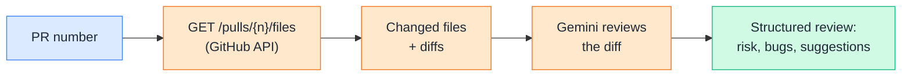
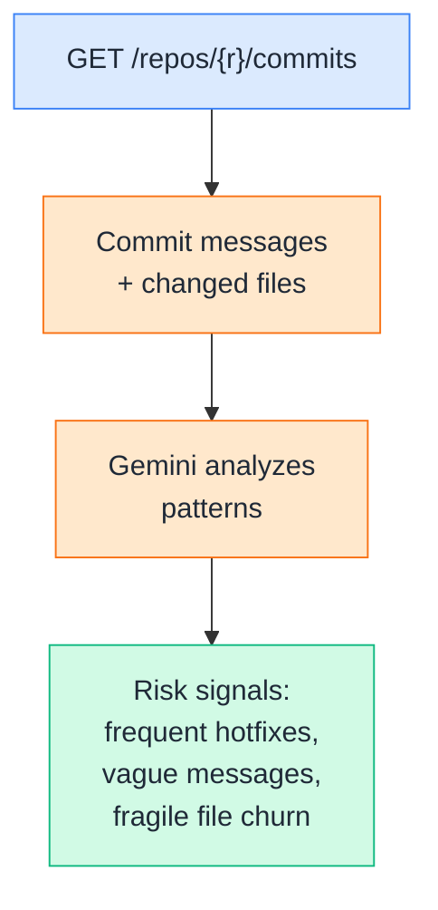
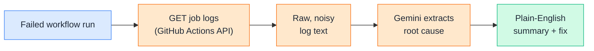
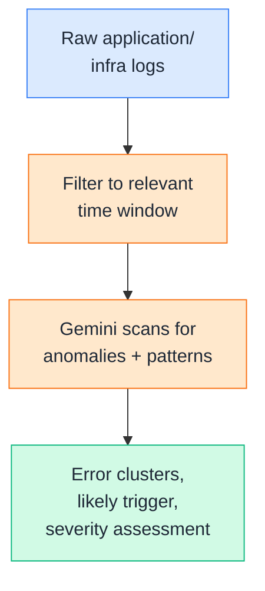
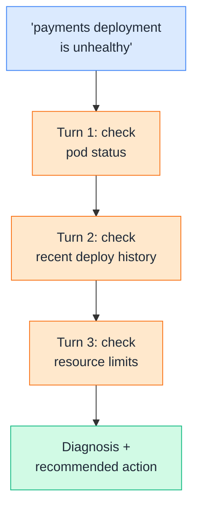
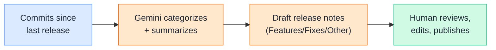
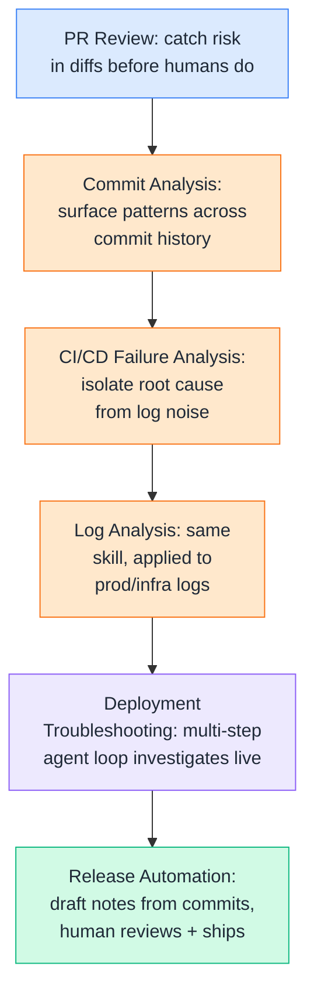

# Day 17 — AI + DevOps

---

## 1. AI-Powered PR Review

### 🧪 Practical

This is where everything from Weeks 1–2 lands on a real, everyday DevOps task: pulling a pull request's actual diff via the GitHub API, and having Gemini review it for risk, bugs, and missing tests — before a human reviewer even opens it.



**DevOps example:** A PR touching `deploy.sh` and a Terraform file is inherently higher-risk than one touching a README. An AI reviewer that reads the *actual diff* — not just the PR title — can flag "this removes a `terraform plan` step before apply" the moment the PR opens, instead of a human catching it (or not) during a rushed end-of-day review.

**🧪 Try it yourself**

```python
from google import genai
import requests
import os

client = genai.Client()
GITHUB_TOKEN = os.environ["GITHUB_TOKEN"]

def get_pr_files(owner, repo, pr_number):
    url = f"https://api.github.com/repos/{owner}/{repo}/pulls/{pr_number}/files"
    headers = {"Authorization": f"token {GITHUB_TOKEN}", "Accept": "application/vnd.github.v3+json"}
    response = requests.get(url, headers=headers)
    return response.json()

def review_pr(owner, repo, pr_number):
    files = get_pr_files(owner, repo, pr_number)
    diff_summary = "\n\n".join(
        f"File: {f['filename']} (+{f['additions']}/-{f['deletions']})\n{f.get('patch', '')[:2000]}"
        for f in files
    )
    prompt = f"""You are a senior DevOps engineer reviewing a pull request.
Identify: (1) potential bugs, (2) risky infrastructure/deploy changes,
(3) missing tests, (4) an overall risk level (LOW/MEDIUM/HIGH).

Diff:
{diff_summary}

Respond concisely, using short bullet points per category."""
    response = client.models.generate_content(model="gemini-2.5-flash", contents=prompt)
    return response.text

print(review_pr("acme-org", "payments", 482))
```

Example output:
```
Risk level: MEDIUM

Bugs:
- New retry loop in payment_client.py has no max attempt cap — could retry forever on a persistent failure.

Risky changes:
- deploy.sh now skips `terraform plan` before `terraform apply` on the staging path.

Missing tests:
- No test added for the new retry behavior.
```

👉 This doesn't replace human review — it front-loads it. A human reviewer starting from "here's what's risky and why" moves faster and catches more than one starting from a blank diff.

---

## 2. Commit Analysis

### 🧪 Practical

**Commit analysis** looks at commit history itself — messages, file patterns, authorship, frequency — to surface things a human skimming `git log` would miss: a service with unusually risky recent changes, or a pattern of commits touching the same fragile file over and over.



**DevOps example:** Ten commits in two days all touching `payment_client.py`, several messages just saying "fix" or "wip" — that pattern alone, surfaced automatically, is a strong signal the payments service needs a closer look *before* the next deploy, not after an incident forces the question.

**🧪 Try it yourself**

```python
from google import genai
import requests
import os

client = genai.Client()
GITHUB_TOKEN = os.environ["GITHUB_TOKEN"]

def get_recent_commits(owner, repo, count=15):
    url = f"https://api.github.com/repos/{owner}/{repo}/commits"
    headers = {"Authorization": f"token {GITHUB_TOKEN}", "Accept": "application/vnd.github.v3+json"}
    response = requests.get(url, headers=headers, params={"per_page": count})
    return response.json()

def analyze_commits(owner, repo):
    commits = get_recent_commits(owner, repo)
    summary = "\n".join(
        f"- {c['commit']['message'].splitlines()[0]} (by {c['commit']['author']['name']})"
        for c in commits
    )
    prompt = f"""Review this recent commit history for a service. Flag any concerning
patterns: vague commit messages, repeated hotfixes to the same area, or signs
of rushed/unreviewed changes.

Commits:
{summary}

Respond with a short bullet list of concerns, or 'No concerning patterns' if none."""
    response = client.models.generate_content(model="gemini-2.5-flash", contents=prompt)
    return response.text

print(analyze_commits("acme-org", "payments"))
```

Example output:
```
- 4 of the last 15 commits are labeled "fix" or "hotfix" with no further detail — suggests reactive, unreviewed patching rather than planned changes.
- 3 commits in the last 24 hours touch the same retry-handling code — possible sign of an unresolved underlying issue being patched repeatedly.
```

👉 This kind of pattern is easy for a human to miss scrolling through `git log`, but jumps out immediately once you ask the question directly — which is exactly the kind of task LLMs are well-suited to.

---

## 3. CI/CD Failure Analysis

### 🧪 Practical

When a pipeline fails, the raw log is often long, noisy, and full of red herrings. This step fetches the actual failed job's logs and asks Gemini to identify the real root cause — separating the actual failure from unrelated warning noise around it.



**DevOps example:** A failed CI run might print 400 lines of test output, dependency install logs, and framework warnings, with the *actual* failure — a single assertion error three screens up — easy to miss on a quick scroll. Having the model isolate and summarize just that root cause turns a multi-minute log dive into a one-line answer.

**🧪 Try it yourself**

```python
from google import genai

client = genai.Client()

def analyze_ci_failure(log_text):
    prompt = f"""This is a CI/CD pipeline failure log. Identify the ROOT CAUSE of the
failure (ignore unrelated warnings/noise), and suggest a likely fix.

Log:
{log_text[-4000:]}

Respond in two short sections: "Root cause:" and "Suggested fix:"."""
    response = client.models.generate_content(model="gemini-2.5-flash", contents=prompt)
    return response.text

# In practice, this log comes from the GitHub Actions job logs API
sample_log = """
Installing dependencies... done
Running test suite...
test_payment_flow.py::test_successful_charge PASSED
test_payment_flow.py::test_retry_on_timeout FAILED
AssertionError: expected 3 retry attempts, got 1
DeprecationWarning: 'datetime.utcnow()' is deprecated
Process completed with exit code 1.
"""

print(analyze_ci_failure(sample_log))
```

Example output:
```
Root cause:
test_retry_on_timeout failed because the retry logic only attempted 1 retry
instead of the expected 3 — likely a recent change to the retry loop's
max-attempts value or an early-exit condition being triggered.

Suggested fix:
Check the retry configuration in the code under test; confirm the max-attempts
value wasn't accidentally reduced in a recent commit. The DeprecationWarning
is unrelated noise and did not cause the failure.
```

👉 Explicitly telling the model to ignore unrelated warnings is doing real work here — without that instruction, models will sometimes latch onto the most alarming-sounding line in the log rather than the one that actually caused the failure.

---

## 4. Log Analysis

### 🧪 Practical

Beyond CI logs, the same pattern applies to production application and infrastructure logs — feeding raw, high-volume log output to Gemini to surface anomalies, error clusters, or the likely trigger event, faster than manually grepping through thousands of lines.



**DevOps example:** A spike of `connection reset by peer` errors buried among thousands of routine `INFO` lines is exactly the kind of needle-in-a-haystack pattern that's tedious to `grep` for manually but trivial to describe in a prompt — "find anything unusual in this window" — letting the model do the first pass of triage before a human digs in.

**🧪 Try it yourself**

```python
from google import genai

client = genai.Client()

def analyze_logs(log_lines):
    log_text = "\n".join(log_lines)
    prompt = f"""Analyze these application logs from a 5-minute window. Identify any
error clusters, anomalies, or patterns that suggest what's going wrong.
Ignore routine INFO-level noise unless it's relevant context.

Logs:
{log_text}

Respond with: severity (LOW/MEDIUM/HIGH), what's happening, and likely cause."""
    response = client.models.generate_content(model="gemini-2.5-flash", contents=prompt)
    return response.text

sample_logs = [
    "INFO 10:01:03 request received /checkout",
    "INFO 10:01:03 request completed 200 OK",
    "ERROR 10:01:47 connection reset by peer: db-primary",
    "ERROR 10:01:49 connection reset by peer: db-primary",
    "ERROR 10:01:52 connection reset by peer: db-primary",
    "WARN  10:01:53 falling back to read replica",
    "INFO 10:02:10 request completed 200 OK",
]

print(analyze_logs(sample_logs))
```

Example output:
```
Severity: HIGH

What's happening: A cluster of "connection reset by peer" errors targeting
db-primary occurred within a 5-second window (10:01:47-10:01:52), followed
by an automatic failover to a read replica.

Likely cause: Primary database connection instability or a brief network
partition. The read-replica fallback likely prevented full downtime, but
the underlying db-primary connectivity issue needs investigation.
```

👉 This is the same underlying skill as CI failure analysis — separating signal from noise — just applied to a different log source. The prompt shape barely changes; what changes is the volume and structure of the input.

---

## 5. Deployment Troubleshooting

### 🧪 Practical

This section pulls together the agent pattern from Days 15–16: rather than a single-pass analysis, the model runs a multi-step diagnostic loop, calling real tools (pod status, deploy history) to actually investigate a deployment problem instead of guessing from a static log dump alone.



**DevOps example:** "The deployment is unhealthy" could mean a dozen different things — bad image, failed health check, resource limits, a bad config change. Rather than asking a human to manually run each check in sequence, the agent runs the same investigative loop an experienced engineer would, adapting which check to run next based on what the previous one revealed.

**🧪 Try it yourself**

```python
from google import genai
from google.genai import types

client = genai.Client()

def get_pod_status(service: str) -> dict:
    return {"service": service, "status": "CrashLoopBackOff", "restarts": 14}

def get_deploy_history(service: str) -> dict:
    return {"service": service, "last_deploy": "6 minutes ago", "version": "v2.15.0"}

def get_resource_limits(service: str) -> dict:
    return {"service": service, "memory_limit": "256Mi", "memory_usage_at_crash": "251Mi"}

available_functions = {
    "get_pod_status": get_pod_status,
    "get_deploy_history": get_deploy_history,
    "get_resource_limits": get_resource_limits,
}

tool_schemas = [
    {"name": "get_pod_status", "description": "Gets pod status for a service.",
     "parameters": {"type": "object", "properties": {"service": {"type": "string"}}, "required": ["service"]}},
    {"name": "get_deploy_history", "description": "Gets recent deploy info for a service.",
     "parameters": {"type": "object", "properties": {"service": {"type": "string"}}, "required": ["service"]}},
    {"name": "get_resource_limits", "description": "Gets memory/CPU limits and usage for a service.",
     "parameters": {"type": "object", "properties": {"service": {"type": "string"}}, "required": ["service"]}},
]
config = types.GenerateContentConfig(tools=[types.Tool(function_declarations=tool_schemas)])

contents = [{"role": "user", "parts": [{"text":
    "The payments deployment is unhealthy. Investigate and give a root-cause diagnosis."}]}]

for step in range(6):
    response = client.models.generate_content(model="gemini-2.5-flash", contents=contents, config=config)
    part = response.candidates[0].content.parts[0]
    if part.function_call:
        call = part.function_call
        result = available_functions[call.name](**dict(call.args))
        print(f"[step {step+1}] {call.name}({dict(call.args)}) -> {result}")
        contents.append({"role": "model", "parts": [{"function_call": call}]})
        contents.append({"role": "user", "parts": [{"function_response": {"name": call.name, "response": result}}]})
    else:
        print(f"\nDiagnosis:\n{response.text}")
        break
```

Example output:
```
[step 1] get_pod_status({'service': 'payments'}) -> {'status': 'CrashLoopBackOff', 'restarts': 14}
[step 2] get_deploy_history({'service': 'payments'}) -> {'last_deploy': '6 minutes ago', 'version': 'v2.15.0'}
[step 3] get_resource_limits({'service': 'payments'}) -> {'memory_limit': '256Mi', 'memory_usage_at_crash': '251Mi'}

Diagnosis:
The pod is CrashLoopBackOff with 14 restarts, starting right after v2.15.0
deployed 6 minutes ago. Memory usage (251Mi) is right at the 256Mi limit,
suggesting the new version increased memory usage enough to trigger OOMKills.
Recommend either raising the memory limit or rolling back to the previous
version while investigating the memory increase in v2.15.0.
```

👉 Note this reuses the exact multi-step tool-calling loop from Day 15, Section 6 — the pattern doesn't change, only the tools plugged into it. That reusability is the whole point of building agents around a clean tool interface.

---

## 6. Release Automation

### 🧪 Practical

The final piece: using the commit history already pulled in Section 2 to automatically draft release notes — turning a list of raw commit messages into a clean, categorized summary a human can review and publish in seconds instead of writing from scratch.



**DevOps example:** 20 commits since the last tag, with messages ranging from clear ("add retry logic for payment timeouts") to cryptic ("fix stuff", "wip 2"). A generated draft groups the clear ones under sensible headings and flags the vague ones for the release manager to clarify — saving the tedious part while keeping a human as the final check before anything ships.

**🧪 Try it yourself**

```python
from google import genai

client = genai.Client()

def draft_release_notes(commit_messages, version):
    commits_text = "\n".join(f"- {m}" for m in commit_messages)
    prompt = f"""Draft release notes for version {version} from these commit messages.
Group into: Features, Fixes, Other. If a commit message is too vague to
categorize confidently, list it under "Needs clarification" instead of guessing.

Commits:
{commits_text}

Format as clean Markdown with headings."""
    response = client.models.generate_content(model="gemini-2.5-flash", contents=prompt)
    return response.text

commits = [
    "add retry logic for payment timeouts",
    "fix null pointer in checkout validation",
    "bump terraform provider version",
    "fix stuff",
    "add rate limiting to /api/charge endpoint",
]

print(draft_release_notes(commits, "v2.15.0"))
```

Example output:
```
## v2.15.0

### Features
- Added retry logic for payment timeouts
- Added rate limiting to the /api/charge endpoint

### Fixes
- Fixed a null pointer exception in checkout validation

### Other
- Bumped Terraform provider version

### Needs clarification
- "fix stuff" — please provide more detail before publishing
```

👉 Notice the model explicitly refused to guess what "fix stuff" meant, flagging it instead of inventing a plausible-sounding description. That's the release-automation equivalent of Section 3's "ignore unrelated noise" instruction — telling the model what *not* to do is often as important as what to do.

---

## Quick Recap (Day 17)



---

## ⭐ Support

If you found this repository useful:

[](https://github.com/saghosh8/AI-For-DevOps)
<a href="https://github.com/saghosh8/AI-For-DevOps/fork">
  
</a>

---

## 💬 Have a Query

Have a question, suggestion, or idea?

[](https://github.com/saghosh8/AI-For-DevOps/discussions/3)

---

| 📘 Next — Day 18: AI Security | [](https://github.com/saghosh8/AI-For-DevOps/blob/main/Week%203%20%E2%80%94%20Agents%2C%20Security%20%26%20Production/Day%2018%20%E2%80%94%20AI%20Security.md) |
| --------------------------------------- | ------------------------------------------------------------------------------------------------------------------------------------------------------------------------------------------------- |
