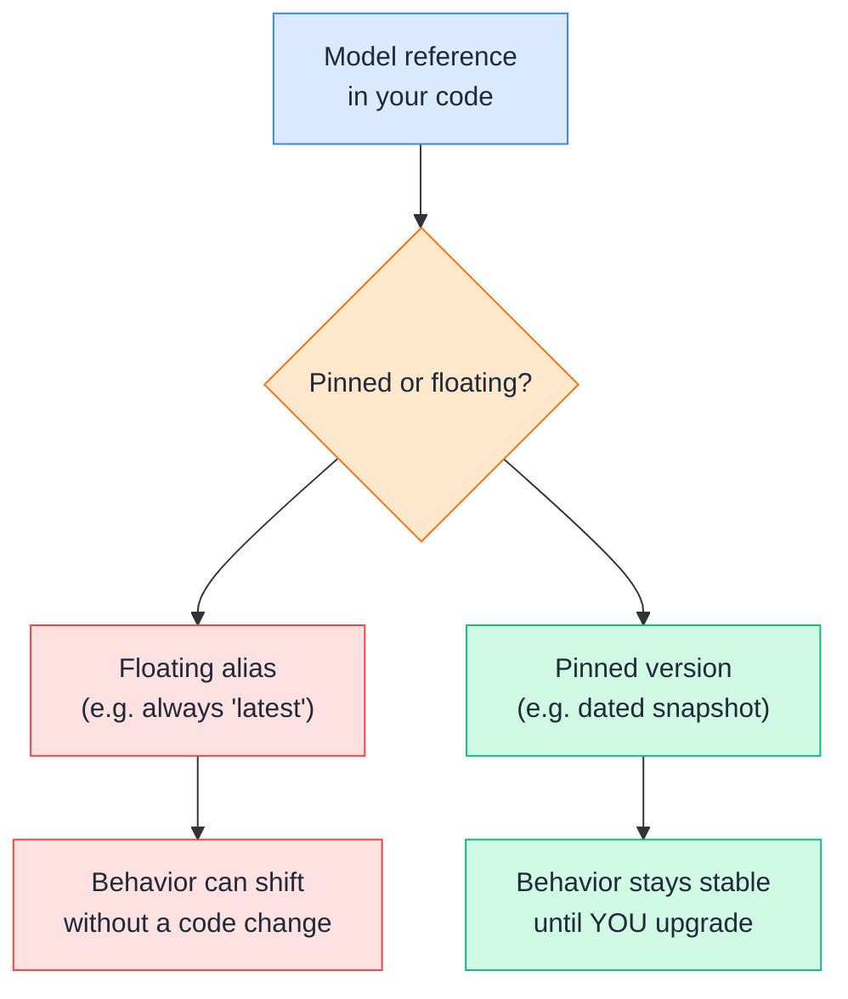
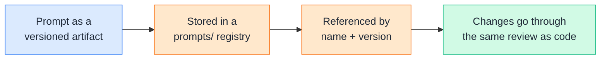
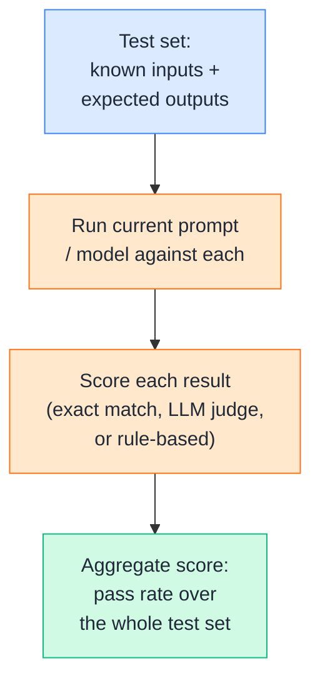
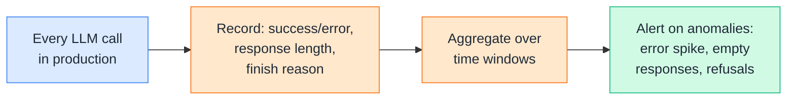
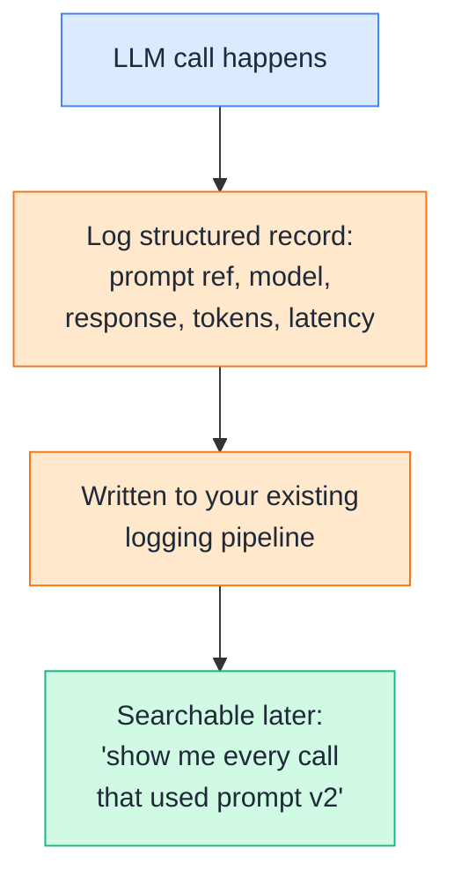
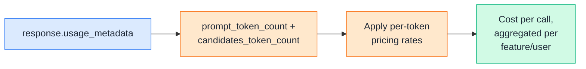
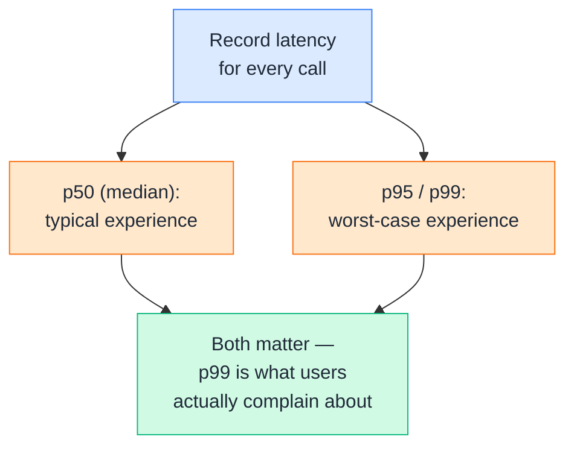
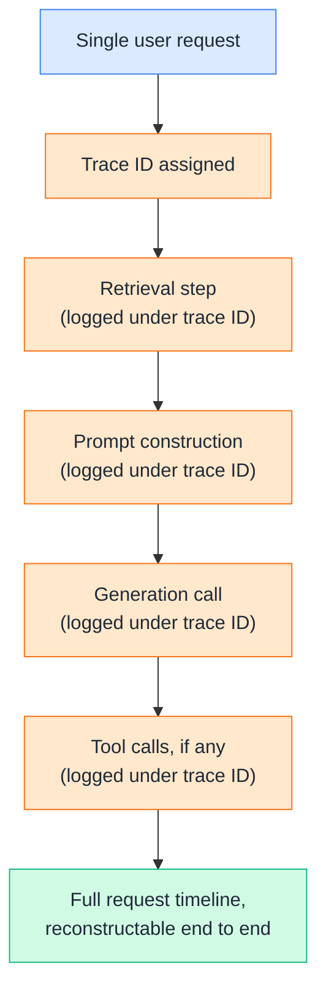
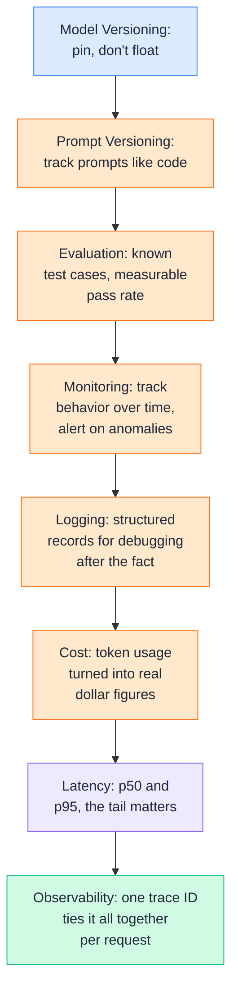

# Day 19 — LLMOps

---

## 1. Model Versioning

### 📖 Theory

**Model versioning** means treating which exact model your system calls as a deliberate, tracked decision — not something that silently changes underneath you. Model providers regularly ship new versions with different behavior, latency, and cost, even under a name that looks unchanged.



**DevOps analogy:** This is exactly the `latest` Docker tag problem — `python:latest` in a Dockerfile means your build can silently change behavior the day upstream publishes a new image, with no diff in your own repo to explain why. Pinning a model version is the same discipline as pinning `python:3.11.9` instead of `python:latest`.

**DevOps example:** Your CI failure analyzer (Day 17) was tuned and tested against one model's behavior. If your code just calls `"gemini-2.5-flash"` with no further tracking, an upstream model update could shift response formatting or reasoning style — and the first sign might be a subtly wrong root-cause diagnosis in production, with nothing in your own commit history explaining why.

**Key practices:**
- Record which exact model string powered a given deployment — in config, not scattered across code — the same way you'd track a container image tag.
- Re-run your evaluation suite (Section 3) against a new model version *before* switching to it in production, treating a model upgrade like any other dependency bump.
- Keep a rollback path: if a new model version regresses quality, you should be able to revert to the previous one as easily as rolling back a bad deploy.

> Theory-only here — Section 3 covers exactly how you'd verify a model version's behavior before trusting it.

---

## 2. Prompt Versioning

### 🧪 Practical

**Prompt versioning** treats prompts the same way you treat code — tracked, diffable, and tied to a specific release — instead of as strings scattered inline through your codebase where a silent edit can change behavior with no record of why.



**DevOps example:** The `build_prompt()` function from Day 13 and the CI-failure-analysis prompt from Day 17 are both just f-strings today. Six months from now, after several people have tweaked wording to fix various edge cases, nobody will remember why a specific instruction is there — unless each change was a tracked, reviewable diff, the same way a change to `deploy.sh` would be.

**🧪 Try it yourself**

```python
import json
from datetime import datetime, timezone

class PromptRegistry:
    """Minimal versioned prompt store — swap for a database or Git-tracked
    JSON file in a real system."""
    def __init__(self, path="prompts.json"):
        self.path = path
        try:
            with open(path) as f:
                self.store = json.load(f)
        except FileNotFoundError:
            self.store = {}

    def add_version(self, name, template, notes=""):
        self.store.setdefault(name, [])
        version = len(self.store[name]) + 1
        self.store[name].append({
            "version": version,
            "template": template,
            "notes": notes,
            "created_at": datetime.now(timezone.utc).isoformat(),
        })
        with open(self.path, "w") as f:
            json.dump(self.store, f, indent=2)
        return version

    def get(self, name, version=None):
        versions = self.store.get(name, [])
        if not versions:
            raise KeyError(f"No prompt named '{name}'")
        return versions[version - 1] if version else versions[-1]

registry = PromptRegistry()
v1 = registry.add_version(
    "ci_failure_analysis",
    "Identify the ROOT CAUSE of this failure, ignoring unrelated warnings...",
    notes="Initial version from Day 17",
)
v2 = registry.add_version(
    "ci_failure_analysis",
    "Identify the ROOT CAUSE of this failure. Explicitly ignore unrelated "
    "warnings/deprecation notices. If multiple failures appear, report only the first...",
    notes="Added explicit multi-failure handling after seeing v1 latch onto the wrong error",
)

latest = registry.get("ci_failure_analysis")
print(f"Using version {latest['version']}: {latest['notes']}")
```

Example output:
```
Using version 2: Added explicit multi-failure handling after seeing v1 latch onto the wrong error
```

👉 The `notes` field here is doing real work — it's the commit message equivalent for a prompt change. Without it, "why does this prompt say that?" becomes an unanswerable question the moment the person who wrote it moves to a different project.

---

## 3. Evaluation

### 🧪 Practical

**Evaluation** means running your prompt or pipeline against a fixed set of known test cases with expected outcomes — so a "does this still work?" question has a measurable answer instead of a vibe-check from reading a few sample outputs.



**DevOps example:** Before switching the CI-failure-analyzer to a new prompt version or a new model, running it against 20 real historical CI failures with known root causes gives you a pass rate — "18/20 correctly identified the root cause" — instead of shipping the change and hoping it's still accurate the next time a pipeline actually fails.

**🧪 Try it yourself**

```python
from google import genai

client = genai.Client()

test_cases = [
    {
        "log": "AssertionError: expected 3 retry attempts, got 1",
        "expected_keyword": "retry",
    },
    {
        "log": "ConnectionRefusedError: could not connect to db-staging:5432",
        "expected_keyword": "connect",
    },
]

def analyze(log_text):
    prompt = f"Identify the root cause of this CI failure in one sentence:\n{log_text}"
    response = client.models.generate_content(model="gemini-2.5-flash", contents=prompt)
    return response.text

def evaluate(test_cases):
    passed = 0
    for case in test_cases:
        result = analyze(case["log"]).lower()
        is_correct = case["expected_keyword"] in result
        passed += is_correct
        print(f"{'✅' if is_correct else '❌'}  expected '{case['expected_keyword']}' -> {result[:70]}...")
    print(f"\nPass rate: {passed}/{len(test_cases)}")

evaluate(test_cases)
```

Example output:
```
✅  expected 'retry' -> the root cause is that the retry logic only attempted 1 retry inst...
✅  expected 'connect' -> the root cause is the application being unable to connect to the ...

Pass rate: 2/2
```

👉 This test set should grow every time a real failure slips through in production — each miss becomes a new regression test, the same way a production bug becomes a new unit test in traditional software.

---

## 4. Monitoring

### 🧪 Practical

**Monitoring** means tracking the health of your LLM system's *behavior* over time in production — error rates, refusal rates, unusually short or malformed responses — the same categories of signal you'd track for any production service, applied to LLM calls specifically.



**DevOps example:** A sudden rise in Gemini responses ending with `finish_reason: SAFETY` or `MAX_TOKENS` instead of `STOP` for your PR-review tool is a real signal something changed — a new kind of PR content triggering safety filters, or `max_output_tokens` set too low for larger diffs — the same way an HTTP 5xx spike alerts you to a backend regression.

**🧪 Try it yourself**

```python
from google import genai
from collections import Counter

client = genai.Client()

def call_and_monitor(prompt, metrics):
    try:
        response = client.models.generate_content(model="gemini-2.5-flash", contents=prompt)
        finish_reason = response.candidates[0].finish_reason.name
        metrics["finish_reasons"][finish_reason] += 1
        metrics["successes"] += 1
        return response.text
    except Exception as e:
        metrics["errors"] += 1
        metrics["error_types"][type(e).__name__] += 1
        raise

metrics = {"successes": 0, "errors": 0, "finish_reasons": Counter(), "error_types": Counter()}

prompts = [
    "Summarize: the payments deploy failed due to a memory limit.",
    "Summarize: the checkout service is returning 500s intermittently.",
]
for p in prompts:
    call_and_monitor(p, metrics)

print(f"Successes: {metrics['successes']}, Errors: {metrics['errors']}")
print(f"Finish reasons: {dict(metrics['finish_reasons'])}")
```

Example output:
```
Successes: 2, Errors: 0
Finish reasons: {'STOP': 2}
```

👉 In a real system, `metrics` would flow into your existing monitoring stack (Prometheus, Datadog) rather than a local dict — the point is that `finish_reason` and error type are exactly the kind of structured signal worth exporting as metrics, not just something buried in a raw log line.

---

## 5. Logging

### 🧪 Practical

**Logging** for LLM calls means capturing enough structured detail — prompt (or a reference to its version), model, response, token counts, latency — to actually debug a bad output after the fact, the same discipline as structured application logging, just with LLM-specific fields.



**DevOps example:** A user reports the release-notes generator (Day 17) miscategorized a commit. Without structured logs, you're guessing what prompt version and model produced that output. With them, you can pull the exact record — prompt version 3, `gemini-2.5-flash`, these exact input commits — and reproduce the issue precisely, the same way you'd pull a specific request's trace ID to debug an API bug.

**🧪 Try it yourself**

```python
from google import genai
import json
import time
from datetime import datetime, timezone

client = genai.Client()

def logged_generate(prompt, prompt_name="unnamed", prompt_version=None):
    start = time.time()
    response = client.models.generate_content(model="gemini-2.5-flash", contents=prompt)
    latency_ms = round((time.time() - start) * 1000)

    log_record = {
        "timestamp": datetime.now(timezone.utc).isoformat(),
        "prompt_name": prompt_name,
        "prompt_version": prompt_version,
        "model": "gemini-2.5-flash",
        "prompt_tokens": response.usage_metadata.prompt_token_count,
        "output_tokens": response.usage_metadata.candidates_token_count,
        "latency_ms": latency_ms,
        "finish_reason": response.candidates[0].finish_reason.name,
    }
    print(json.dumps(log_record))  # in production: send to your logging pipeline
    return response.text

logged_generate(
    "Summarize: payments deploy failed due to a memory limit increase in v2.15.0",
    prompt_name="ci_failure_analysis",
    prompt_version=2,
)
```

Example output:
```
{"timestamp": "2026-09-12T10:15:32.481Z", "prompt_name": "ci_failure_analysis", "prompt_version": 2, "model": "gemini-2.5-flash", "prompt_tokens": 18, "output_tokens": 42, "latency_ms": 743, "finish_reason": "STOP"}
```

👉 Notice this deliberately logs the raw output text separately (via the `return`) from the structured metadata printed as JSON — you generally want response *content* and response *metadata* in your logs, but treated as distinct concerns, since one may need different retention or redaction rules than the other (see Day 18's PII handling).

---

## 6. Cost

### 🧪 Practical

**Cost** tracking means turning token usage into actual dollar figures per call, so you know which prompts, features, or users are driving spend — the same instinct as tagging cloud resources by team so a bill doesn't arrive as an unexplained lump sum.



**DevOps example:** If your log-analysis tool (Day 17) is being called on every single log line instead of batched windows, cost tracking is what surfaces that as a real number — "$340 last week on log analysis alone" — turning an abstract inefficiency into a business case for batching, the same way an unexpectedly large cloud bill surfaces an oversized, idle EC2 instance.

**🧪 Try it yourself**

```python
from google import genai

client = genai.Client()

# Illustrative rates only — always check current provider pricing docs,
# since rates change and vary by model.
PRICE_PER_1K_INPUT_TOKENS = 0.000075
PRICE_PER_1K_OUTPUT_TOKENS = 0.0003

def generate_with_cost(prompt):
    response = client.models.generate_content(model="gemini-2.5-flash", contents=prompt)
    usage = response.usage_metadata
    cost = (
        (usage.prompt_token_count / 1000) * PRICE_PER_1K_INPUT_TOKENS
        + (usage.candidates_token_count / 1000) * PRICE_PER_1K_OUTPUT_TOKENS
    )
    return response.text, cost

text, cost = generate_with_cost("Summarize: the checkout service is returning 500s under load.")
print(f"Cost: ${cost:.6f}")
```

Example output:
```
Cost: $0.000019
```

👉 A single call looks trivially cheap — the real value of tracking this is aggregation over volume: 100,000 calls a month at even a fraction of a cent each adds up to a real, forecastable line item, which is exactly the kind of number a platform team needs before an LLM feature ships broadly.

---

## 7. Latency

### 🧪 Practical

**Latency** tracking means measuring how long calls actually take in production — not just average, but the slow tail — since a user-facing feature's experience is usually defined by its worst cases, not its median.



**DevOps example:** The multi-step deployment-troubleshooting agent from Day 17 makes 3+ sequential model calls per diagnosis. If each call has a p95 latency of 2 seconds, the full diagnosis could take 6+ seconds at the tail — worth knowing *before* an on-call engineer is staring at a spinner during an actual incident, wondering if the tool has hung.

**🧪 Try it yourself**

```python
from google import genai
import time

client = genai.Client()

def timed_generate(prompt):
    start = time.perf_counter()
    response = client.models.generate_content(model="gemini-2.5-flash", contents=prompt)
    elapsed_ms = (time.perf_counter() - start) * 1000
    return response.text, elapsed_ms

def percentile(values, p):
    values = sorted(values)
    index = int(len(values) * p / 100)
    return values[min(index, len(values) - 1)]

latencies = []
prompts = [
    "Summarize: payments deploy failed.",
    "Summarize: checkout returning 500s.",
    "Summarize: db connection pool exhausted.",
]
for p in prompts:
    _, elapsed = timed_generate(p)
    latencies.append(elapsed)

print(f"Latencies (ms): {[round(l) for l in latencies]}")
print(f"p50: {percentile(latencies, 50):.0f}ms, p95: {percentile(latencies, 95):.0f}ms")
```

Example output:
```
Latencies (ms): [612, 745, 1203]
p50: 745ms, p95: 1203ms
```

👉 A three-sample p95 isn't statistically meaningful — this is illustrating the *calculation*, not a real production sample size. In practice you'd compute this over thousands of real calls, which is exactly why this belongs in the same pipeline as monitoring (Section 4), not a one-off script.

---

## 8. Observability

### 📖 Theory

**Observability** is what ties Sections 4–7 together: the ability to trace a single request end-to-end — through retrieval, prompt construction, generation, and any tool calls — so when something goes wrong, you can reconstruct exactly what happened, not just that *something* happened.



**DevOps analogy:** This is distributed tracing (OpenTelemetry, Jaeger) applied to an LLM pipeline instead of a microservice call chain — a single user request to the Day 13 RAG assistant touches retrieval, prompt construction, and generation, each of which can independently go wrong; without a shared trace ID linking them, debugging means guessing which stage actually failed.

**DevOps example:** The multi-step agent from Day 15 makes several sequential Gemini calls, each potentially calling a different tool. Without a single trace ID tying every call in that loop together, a bad final diagnosis is nearly impossible to debug — was retrieval wrong, was a tool's mocked data stale, or did the model reason poorly given otherwise-correct inputs? A proper trace answers this in seconds instead of hours.

**Rule of thumb:** Every request into your LLM system should get one ID at the very top, threaded through every log line, metric, and tool call that request triggers. This single practice is usually what separates "we have logs" from "we can actually debug production incidents" — the difference isn't more data, it's connected data.

> Theory-only — observability isn't a new tool to write, it's the connective discipline across everything built in Sections 4–7.

---

## Quick Recap (Day 19)



---

## ⭐ Support

If you found this repository useful:

[](https://github.com/saghosh8/AI-For-DevOps)
<a href="https://github.com/saghosh8/AI-For-DevOps/fork">
  
</a>

---

## 💬 Have a Query

Have a question, suggestion, or idea?

[](https://github.com/saghosh8/AI-For-DevOps/discussions/3)

---

| 📘 Next — Day 20: MCP + Modern AI Architecture | [](https://github.com/saghosh8/AI-For-DevOps/blob/saghosh8-patch-7/Week%203%20%E2%80%94%20Agents%2C%20Security%20%26%20Production/Day%2020%20%E2%80%94%20MCP%20%2B%20Modern%20AI%20Architecture.md) |
| ------------------------------------------------ | ------------------------------------------------------------------------------------------------------------------------------------------------------------------------------------------------------------- |
