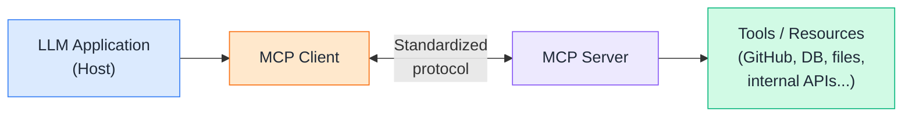
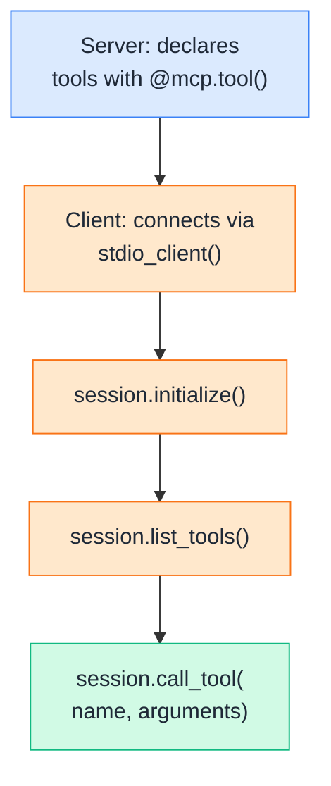
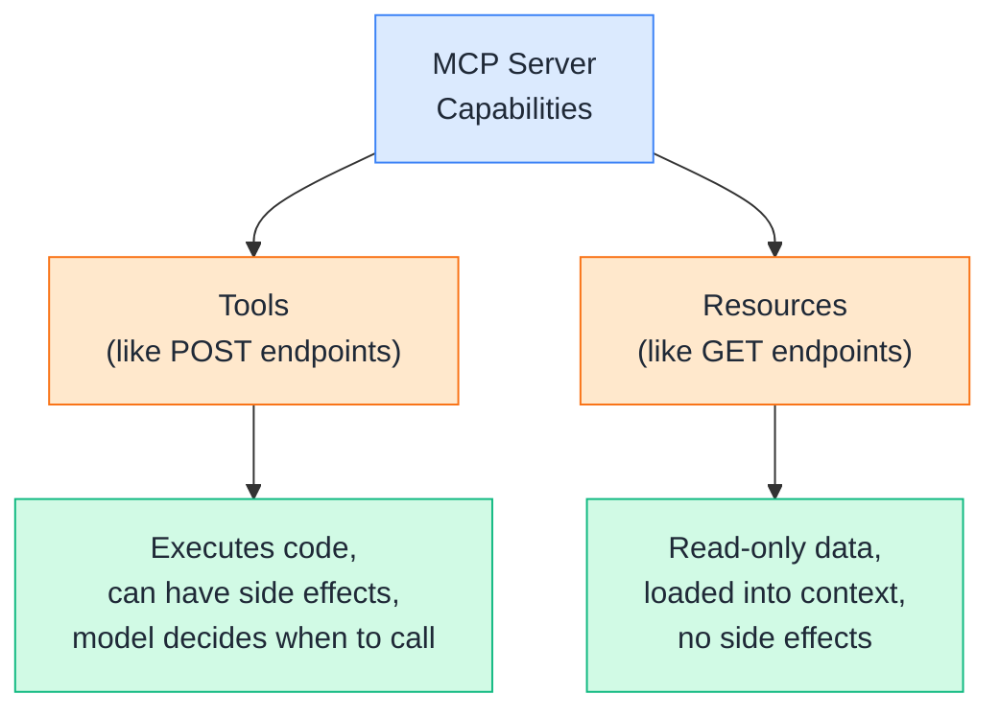
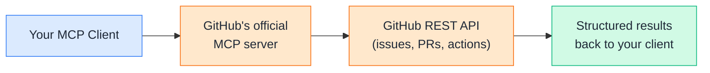
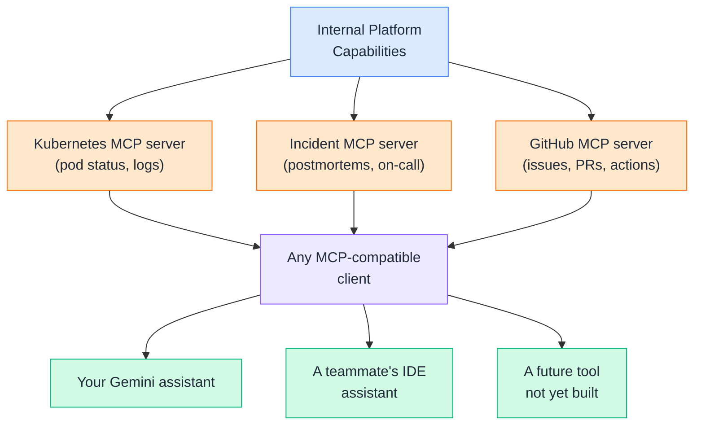
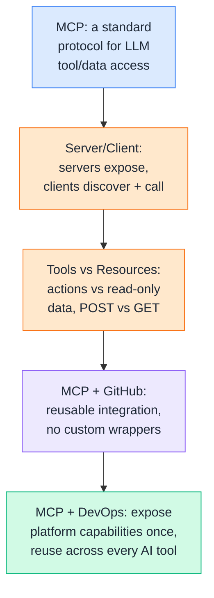

# Day 20 — MCP + Modern AI Architecture

---

## 1. What is MCP?

### 📖 Theory

**MCP (Model Context Protocol)** is an open, standardized protocol for connecting LLM applications to external tools and data — instead of every project writing its own custom integration code for GitHub, Slack, a database, etc., MCP defines one common interface that any compliant server or client can speak.



**DevOps analogy:** MCP is to LLM tool integrations what a standard REST/OpenAPI contract is to microservices — before it, every service had to write bespoke client code for every other service it talked to. After it, any client that speaks the standard can talk to any server that implements it, without custom glue code per pairing.

**DevOps example:** Every custom `create_github_issue` and `trigger_workflow` function you hand-wrote in Day 16 was solving a problem MCP solves generically — expose an action, describe its schema, let any MCP-compatible client discover and call it. Instead of writing that wrapper once per project, you write an MCP *server* once, and every MCP-compatible client (this course's Gemini-based assistant, Claude, or any other) can use it without changes.

> Theory-only here — Section 2 builds the actual server and client pieces from this diagram.

---

## 2. MCP Server / Client

### 🧪 Practical

An **MCP server** exposes capabilities (tools, resources); an **MCP client** connects to a server, discovers what it offers, and calls it. This section builds a minimal DevOps-flavored server, then a client that talks to it — mirroring the official Python SDK's own quickstart pattern.



**DevOps example:** Once this server exists, it doesn't just serve *your* Gemini-based assistant — any MCP-compatible tool your team already uses (an IDE assistant, a different chatbot, a teammate's own script) can connect to the same server and get the same pod-status and deploy-history capabilities, without anyone re-implementing them.

**🧪 Try it yourself**

```python
# devops_server.py — a minimal MCP server
from mcp.server.fastmcp import FastMCP

mcp = FastMCP("devops-tools")

@mcp.tool()
def get_pod_status(service: str) -> dict:
    """Gets the current pod status for a given service."""
    return {"service": service, "status": "Running", "restarts": 0}

@mcp.tool()
def get_deploy_history(service: str) -> dict:
    """Gets the most recent deployment info for a given service."""
    return {"service": service, "last_deploy": "10 minutes ago", "version": "v2.14.1"}

if __name__ == "__main__":
    mcp.run()
```

```python
# client.py — connects to devops_server.py and calls a tool
import asyncio
from mcp import ClientSession, StdioServerParameters
from mcp.client.stdio import stdio_client

async def main():
    server_params = StdioServerParameters(command="python", args=["devops_server.py"])

    async with stdio_client(server_params) as (read, write):
        async with ClientSession(read, write) as session:
            await session.initialize()

            tools = await session.list_tools()
            print("Available tools:", [t.name for t in tools.tools])

            result = await session.call_tool("get_pod_status", {"service": "payments"})
            print("Result:", result.content)

asyncio.run(main())
```

Example output:
```
Available tools: ['get_pod_status', 'get_deploy_history']
Result: [TextContent(type='text', text='{"service": "payments", "status": "Running", "restarts": 0}')]
```

👉 Compare this to Day 16's `types.Tool(function_declarations=[...])` — the shape is nearly identical (name, description, schema, a real function behind it). What MCP adds is that this server now runs as an *independent process*, callable by any client that speaks the protocol, not just the one script you wrote it inside.

---

## 3. Tools vs. Resources

### 📖 Theory

MCP servers expose two (and technically three, including prompts) different kinds of capability, and the distinction matters: **tools** perform actions and can have side effects; **resources** expose read-only data meant to be loaded into context, without triggering anything.



**DevOps analogy:** This maps almost exactly onto REST verbs — a **tool** is a `POST`/`PUT` (it *does* something: triggers a workflow, opens an issue), a **resource** is a `GET` (it *returns* something: current config, a runbook's contents, a status page). Treating a "get pod status" check as a tool works, but exposing static reference material — like a runbook's text — as a resource is a better fit for what it actually is: context to load, not an action to take.

**DevOps example:** In the server from Section 2, `get_pod_status` is arguably borderline — it doesn't change anything, but it does execute a live check each call, so a tool is reasonable. Something like your `rollback-runbook.md` content, by contrast, is a clear resource: static, read-only reference material the model should be able to load into context without "deciding" to call a function.

**🧪 Try it yourself**

```python
# Extending devops_server.py with a resource
from mcp.server.fastmcp import FastMCP

mcp = FastMCP("devops-tools")

@mcp.tool()
def get_pod_status(service: str) -> dict:
    """Gets the current pod status for a given service."""
    return {"service": service, "status": "Running", "restarts": 0}

@mcp.resource("runbook://rollback")
def get_rollback_runbook() -> str:
    """Returns the current rollback runbook as plain text."""
    return (
        "Rollback procedure: use `kubectl rollout undo deployment/<service>` "
        "to revert to the previous version."
    )

if __name__ == "__main__":
    mcp.run()
```

👉 Notice the resource is registered with a URI (`runbook://rollback`), not a function-call schema — clients read it directly (`session.read_resource(...)`) rather than "calling" it with arguments the way they'd call a tool. That distinction — action vs. reference material — is what tells a client, and the model, how each capability is meant to be used.

---

## 4. MCP + GitHub

### 🧪 Practical

GitHub already publishes an official MCP server, meaning you don't have to hand-write the wrappers from Day 16 at all — connecting to it gives your assistant standardized access to issues, PRs, and workflows out of the box.



**DevOps example:** Instead of maintaining `create_github_issue` and `trigger_workflow` as bespoke functions per project, pointing an MCP client at GitHub's server gives every project using MCP the same GitHub capabilities — issue creation, PR reading, workflow dispatch — for free, and any future GitHub API additions show up automatically as the server is updated, without your code changing at all.

**🧪 Try it yourself**

```python
# Connecting to GitHub's MCP server (requires the server running/configured,
# e.g. via the GitHub MCP server's own setup instructions and a GitHub token)
import asyncio
from mcp import ClientSession, StdioServerParameters
from mcp.client.stdio import stdio_client
import os

async def main():
    server_params = StdioServerParameters(
        command="github-mcp-server",   # the official server's executable
        args=["stdio"],
        env={"GITHUB_PERSONAL_ACCESS_TOKEN": os.environ["GITHUB_TOKEN"]},
    )

    async with stdio_client(server_params) as (read, write):
        async with ClientSession(read, write) as session:
            await session.initialize()

            tools = await session.list_tools()
            print("GitHub tools available:", [t.name for t in tools.tools][:5], "...")

            result = await session.call_tool(
                "create_issue",
                {"owner": "acme-org", "repo": "payments",
                 "title": "Health check flapping", "body": "Investigating intermittent failures."},
            )
            print("Result:", result.content)

asyncio.run(main())
```

Example output:
```
GitHub tools available: ['create_issue', 'list_pull_requests', 'get_pull_request', 'create_pull_request', 'list_workflows'] ...
Result: [TextContent(type='text', text='{"status": "created", "url": "https://github.com/acme-org/payments/issues/91"}')]
```

👉 This is the exact same `create_github_issue` behavior from Day 16, Section 3 — but you didn't write a single line of GitHub API integration code to get it. That's the concrete payoff of MCP: reusable, maintained integrations instead of bespoke wrappers per project.

---

## 5. MCP + DevOps

### 📖 Theory

Zooming out: MCP's real value for a DevOps team isn't any one server — it's that internal platform capabilities (deploy status, incident data, runbooks, infra state) can be exposed *once*, as MCP servers, and then reused across every AI tool your team adopts, instead of re-integrated per tool.



**DevOps analogy:** This is the same architectural shift as moving from point-to-point integrations to an internal API gateway or platform layer — instead of every team's tool separately learning how to talk to Kubernetes, your incident tracker, and GitHub, each of those systems exposes one well-defined MCP interface, and every AI tool in your org becomes a client of it.

**DevOps examples:**

- A team builds one **Kubernetes MCP server** wrapping `kubectl` read operations. It gets used by an SRE's chat assistant, a Slack bot, and a CI pipeline's automated health check — three different consumers, one maintained integration.
- Applying **Day 18's security lessons directly**: an MCP server is itself a piece of your supply chain (OWASP's LLM03) — pin server versions, review what a third-party MCP server can actually access before connecting to it, and apply the same role-based tool filtering (Day 18, Section 4) to which MCP servers a given user's session is even allowed to connect to.

**Rule of thumb:** If you find yourself hand-writing the same kind of tool wrapper across multiple AI projects — like this course did with GitHub across Days 16 and 17 — that's the signal it's worth becoming an MCP server instead of staying a one-off function.

---

## Quick Recap (Day 20)



---

## ⭐ Support

If you found this repository useful:

[](https://github.com/saghosh8/AI-For-DevOps)
<a href="https://github.com/saghosh8/AI-For-DevOps/fork">
  
</a>

---

## 💬 Have a Query

Have a question, suggestion, or idea?

[](https://github.com/saghosh8/AI-For-DevOps/discussions/3)

---

| 📘 Next — Day 21: Final Project | [](http://github.com/saghosh8/AI-For-DevOps/blob/main/Week%203%20%E2%80%94%20Agents%2C%20Security%20%26%20Production/Day%2021%20%E2%80%94%20Final%20Project%20%2B%20Interview.md) |
| ------------------------------------------ | ------------------------------------------------------------------------------------------------------------------------------------------------------------------------------------------------------- |
