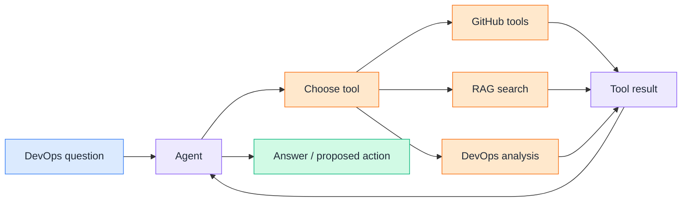
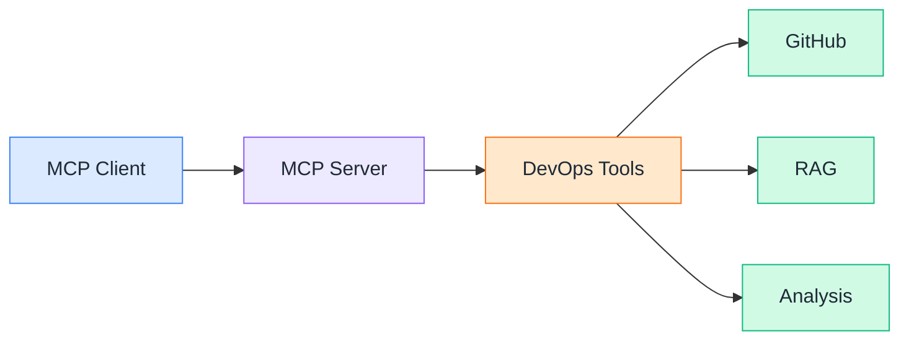

# Day 21 — Final Project: AI DevOps Release Agent

📦 Project repo: [ai-devops-release-assistant](https://github.com/saghosh8/ai-devops-release-assistant)

This is the final evolution of the project we started on Day 7 and extended with RAG on Day 14. Today, the assistant becomes an agent — it can reason about a DevOps problem, choose the right tools, investigate real GitHub data, use the RAG knowledge base when needed, and propose actions with a human-approval gate.

This is not a new project. The same repository has evolved across all three milestones:

**Day 7 → LLM Assistant → Day 14 → RAG Assistant → Day 21 → DevOps Agent**

---

## Problem Statement

A DevOps assistant that can answer questions is useful.

A RAG assistant that can search repository knowledge is better.

But real DevOps problems often require multiple steps:

> "Why did the latest deployment fail?"

To answer that properly, we may need to:

* Inspect the latest workflow run
* Find the failed job
* Read the logs
* Look at recent commits
* Check the related pull request
* Search repository history
* Correlate all of that information
* Decide what should happen next

A fixed prompt or fixed RAG pipeline isn't enough.

The Day 21 project introduces an **agentic workflow** where the model can decide which tools it needs to investigate the problem.



---

## From Day 14 to Day 21

On Day 14, the pipeline was fixed:

```text
GitHub repos
     ↓
Ingest
     ↓
Chunk + Embed
     ↓
FAISS
     ↓
Retrieve
     ↓
Ollama
     ↓
Answer + Sources
```

The agent changes this from a fixed pipeline into a decision-making loop:

```text
User question
     ↓
   Agent
     ↓
What information do I need?
     ↓
Choose a tool
     ↓
Run tool
     ↓
Inspect result
     ↓
Choose next tool
     ↓
...
     ↓
Final answer
```

The important difference is:

**RAG retrieves information. An agent decides what to do.**

---

## What Changed From Day 14

The existing RAG implementation is not removed.

It becomes one capability available to the agent.

### Day 14

The user asks a question and the RAG pipeline performs retrieval.

### Day 21

The agent decides whether repository history is useful and can call the RAG retrieval capability as one of its tools.

The project also adds:

* A manual agent planning loop
* Real GitHub API tools
* Workflow and job investigation
* Pull request investigation
* Commit analysis
* CI failure analysis
* Log analysis
* Deployment troubleshooting
* Security checks
* Human approval for write operations
* Cost and latency tracking
* Prompt versioning
* Evaluation data
* MCP server

The result is no longer just a chatbot or RAG demo.

It is a **DevOps investigation agent**.

---

## The Tools

The agent can work with real GitHub data through tools such as:

### GitHub tools

* Workflow runs
* Workflow jobs
* Workflow logs
* Pull requests
* Commits
* Issues
* Workflow reruns
* Issue comments

### RAG

* Repository history search
* YAML retrieval
* PR retrieval
* Commit retrieval
* Documentation retrieval

### Analysis

* PR risk scoring
* Revert/fix-streak detection
* Failed-job + log correlation
* Error-signature extraction
* Run + commit + PR correlation

The agent chooses the tools based on the question rather than following one hard-coded sequence.

---

## Security: The Agent Cannot Blindly Trust Tool Results

GitHub content is external input.

A pull request description, commit message, issue, or workflow log could contain text designed to manipulate the model.

Therefore, tool results are treated as **untrusted input**.

The project adds:

* Secret detection
* PII detection
* Redaction
* Prompt-injection detection
* Tool-result sanitization
* Scope guardrails

There is also a human-approval gate for write operations.

```text
Agent
  ↓
Proposes write action
  ↓
Human approval
  ├── Reject → Stop
  └── Approve
        ↓
     Execute
```

The principle is simple:

**Read automatically. Write with approval.**

---

## Production Considerations

The final project also introduces basic LLMOps concepts.

The assistant tracks:

* Model
* Prompt version
* Latency
* Token usage
* Estimated cost
* Tool calls
* Evaluation results

This allows us to move beyond:

> "The AI gave a good answer."

and start asking:

> "How much did this request cost?"

> "How long did it take?"

> "Which tools did the agent use?"

> "Which prompt version produced the answer?"

> "Did the agent produce the expected result?"

---

## MCP

The Day 21 project also exposes its DevOps tools through **Model Context Protocol (MCP)**.

This allows MCP-compatible clients to use the same DevOps capabilities without rebuilding every integration.



Run the MCP server locally:

```bash
python -m devops_assistant.mcp_server
```

---

## What You Need

* A GitHub account
* A Gemini API key
* A GitHub token with the required repository permissions
* Python 3.11+
* The project repository

For the RAG capability:

* Ollama
* A local embedding model
* Access to the target repositories

If you run the project through GitHub Actions, the workflows can handle the required setup without requiring the full environment locally.

---

## Running It — via GitHub Actions

The project includes a **Run Agent** workflow.

1. Add `GEMINI_API_KEY` to the repository's Actions secrets.
2. Add the required GitHub token if the agent needs access to other repositories.
3. Go to the **Actions** tab.
4. Select **Run Agent**.
5. Click **Run workflow**.
6. Enter a DevOps question.
7. Select the target repository.
8. Open the completed workflow.

Example question:

```text
Why did the latest workflow run fail?
```

Another example:

```text
Investigate the latest failed deployment and tell me what changed before it failed.
```

The workflow output shows the agent's investigation and tool calls.

---

## Running It Locally

Install the Day 21 dependencies:

```bash
pip install -r requirements-agent.txt
```

Configure the required environment variables:

```bash
export GEMINI_API_KEY="..."
export GITHUB_TOKEN="..."
```

Run the agent:

```bash
python -m devops_assistant agent \
  "why did the latest workflow run fail?"
```

For a detailed tool-call trace:

```bash
python -m devops_assistant agent \
  "investigate the latest failed workflow" \
  --verbose
```

To automatically approve write actions:

```bash
python -m devops_assistant agent \
  "rerun the failed workflow" \
  --approve-writes
```

For JSON output:

```bash
python -m devops_assistant agent \
  "investigate the latest failed workflow" \
  --json
```

---

# Input → Output

### Input

```text
Why did the latest deployment fail?
```

### Agent investigation

```text
1. Inspect latest workflow run
2. Find failed job
3. Read workflow logs
4. Analyze error signatures
5. Inspect recent commits
6. Check related PR
7. Search repository history if needed
8. Correlate findings
```

### Output

The final response contains:

* Summary
* Root cause
* Evidence
* Relevant workflow/job
* Related commit or PR
* Recommended next step
* Proposed action, if applicable

---

## Day 7 → Day 14 → Day 21

This project now represents the complete journey:

```text
Day 7
LLM
 ↓
Structured DevOps Assistant
 ↓
Day 14
RAG
 ↓
Grounded DevOps Assistant
 ↓
Day 21
Agent + Tools + Security + MCP
 ↓
AI DevOps Release Agent
```

The same project.

The same repository.

Each stage adds a new capability instead of throwing away the previous implementation.

---

## ⭐ Support

If you found this repository useful:

<a href="https://github.com/saghosh8/AI-For-DevOps">
  
</a>
<a href="https://github.com/saghosh8/AI-For-DevOps/fork">
  
</a>

---

## 💬 Have a Query

Have a question, suggestion, or idea?

<a href="https://github.com/saghosh8/AI-For-DevOps/discussions/3">
  
</a>

---
